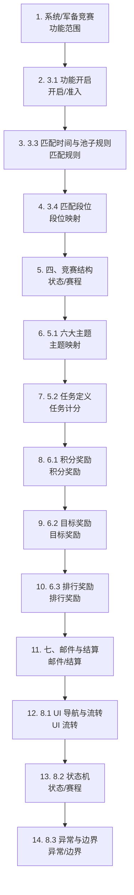

# 功能数据流审核产物

## 构建清单

- input_json: `输出/wiki_armrace_reviewable/candidate_feature_flow.json`
- input_json_sha256: `6fe46c3f821d2bf45a04d2976cd92239fd438057a2ed113cf153e2aca7ece68b`
- schema_version: `feature_flow.v1`
- renderer_version: `deterministic_renderer@0.7.1`
- renderer_mode: `deterministic`
- ai_used_in_rendering: `false`
- ai_calls: `0`
- generated_at: `2026-06-25T02:27:55.152039+00:00`

## 1. 功能总览

- 功能 ID: `feature-17751c8a`
- 功能名称: 系统/军备竞赛
- 数据流状态: `REVIEW_REQUIRED`

## 2. 审核阅读结论

- 当前结论: `REVIEW_REQUIRED`。该产物是待人工审核的业务理解草稿，不是审核通过稿。
- 已形成规则/行为表达的节点数: 14。
- 缺失行为规则表达式的节点数: 0。
- 参考信息节点数: 14。这些节点只补充背景或配置依赖，不作为规则缺失阻塞。
- 规则来源标记: `RULE_PACK_DERIVED` 表示表达式由项目 rule pack 按来源文本匹配生成，仍需人工确认。

## 3. 功能主流程图

说明: 该图表达工具当前理解的主流程顺序；边关系仍为 `NEEDS_REVIEW`，不代表因果已确认。

## 4. 主流程步骤审核

| 步骤 | 节点 | 来源事实 | 人工审核点 | 来源 |
|---:|---|---|---|---|
| 1 | 系统/军备竞赛 | 候选功能入口，需要人工审核来源事实后才能进入用例生成。 | 确认来源事实是否支持工具理解；不支持时标出应删、应改或缺失的信息。 | L1 |
| 2.1 | 3.1 功能开启 | 服务器达到指定开服天数后开启功能, 精确天数以 CActvOnline 实际配置为准。 | 确认开启条件、参与等级和段位前置是否与来源一致。 | L26-L29 |
| 2.2 | 3.1 功能开启 | 玩家参与条件由 CActvOnline.LevelVal 控制; | 确认开启条件、参与等级和段位前置是否与来源一致。 | L26-L29 |
| 2.3 | 3.1 功能开启 | CArmsRaceRank 控制匹配等级区间。 | 确认开启条件、参与等级和段位前置是否与来源一致。 | L26-L29 |
| 2.4 | 3.1 功能开启 | 文本和配置互证最低参与等级为灯塔 7 级。 | 确认开启条件、参与等级和段位前置是否与来源一致。 | L26-L29 |
| 3.1 | 3.3 匹配时间与池子规则 | 功能达开启条件后, 等服务器第二天 UTC 0 点开始匹配。 | 确认匹配开始时间、入池条件、池容量和每日结算规则是否准确。 | L34-L37 |
| 3.2 | 3.3 匹配时间与池子规则 | 只有在线玩家参与匹配; | 确认匹配开始时间、入池条件、池容量和每日结算规则是否准确。 | L34-L37 |
| 3.3 | 3.3 匹配时间与池子规则 | 未在线者上线后再入池。 | 确认匹配开始时间、入池条件、池容量和每日结算规则是否准确。 | L34-L37 |
| 3.4 | 3.3 匹配时间与池子规则 | 池子上限 20 人。 | 确认匹配开始时间、入池条件、池容量和每日结算规则是否准确。 | L34-L37 |
| 3.5 | 3.3 匹配时间与池子规则 | 优先补未满小组, 满员后开新池; | 确认匹配开始时间、入池条件、池容量和每日结算规则是否准确。 | L34-L37 |
| 3.6 | 3.3 匹配时间与池子规则 | 无可匹配玩家时池内仅玩家本人。 | 确认匹配开始时间、入池条件、池容量和每日结算规则是否准确。 | L34-L37 |
| 3.7 | 3.3 匹配时间与池子规则 | 每日 UTC 0 点结算前一日并开新一轮匹配。 | 确认匹配开始时间、入池条件、池容量和每日结算规则是否准确。 | L34-L37 |
| 4.1 | 3.4 匹配段位 | Type 1 阶段段位用于积分奖励, 共 11 档: [7,9], [10,12], [13,14], [15,16], [17,18], [19,20], [21,22], [23,24], [25,26], [27,28], [29,30]。 | 确认等级区间、段位档位和奖励适用关系是否准确。 | L38-L41 |
| 4.2 | 3.4 匹配段位 | Type 2 轮次段位用于目标奖励, 1 档 [7,30]。 | 确认等级区间、段位档位和奖励适用关系是否准确。 | L38-L41 |
| 5.1 | 四、竞赛结构 | 1 循环 = 7 阶段, 每阶段 = 6 轮, 每轮持续 4 小时。 | 确认赛程顺序、时间点、刷新动作和状态变化是否准确。 | L42-L45 |
| 5.2 | 四、竞赛结构 | 第 1 阶段第 1 轮在功能开启当天 UTC 0 点开启; | 确认赛程顺序、时间点、刷新动作和状态变化是否准确。 | L42-L45 |
| 5.3 | 四、竞赛结构 | 第 7 阶段在功能开启后第 7 天 UTC 24 点结束。 | 确认赛程顺序、时间点、刷新动作和状态变化是否准确。 | L42-L45 |
| 5.4 | 四、竞赛结构 | 每轮在 UTC 0/4/8/12/16/20 切换主题。 | 确认赛程顺序、时间点、刷新动作和状态变化是否准确。 | L42-L45 |
| 5.5 | 四、竞赛结构 | CArmRaceStage 共 42 行, 主题 id 1-6 乱序编排。 | 确认赛程顺序、时间点、刷新动作和状态变化是否准确。 | L42-L45 |
| 6.1 | 5.1 六大主题 | KindID / 主题 key / 含义 / IncludeTask / Recommend | 确认主题、任务集合和推荐任务映射是否准确。 | L48-L60 |
| 6.2 | 5.1 六大主题 | 1 / ArmRace_text_2 / 英雄养成 / 101,102,701 / 102 | 确认主题、任务集合和推荐任务映射是否准确。 | L48-L60 |
| 6.3 | 5.1 六大主题 | 2 / ArmRace_text_3 / 城市建设 / 201,202,701 / 202 | 确认主题、任务集合和推荐任务映射是否准确。 | L48-L60 |
| 6.4 | 5.1 六大主题 | 3 / ArmRace_text_4 / 士兵提升 / 301,302-311,701 / 302-311 | 确认主题、任务集合和推荐任务映射是否准确。 | L48-L60 |
| 6.5 | 5.1 六大主题 | 4 / ArmRace_text_5 / 科技研发 / 401,402,701 / 402 | 确认主题、任务集合和推荐任务映射是否准确。 | L48-L60 |
| 6.6 | 5.1 六大主题 | 5 / ArmRace_text_6 / 船只养成 / 502,503,511-540,701 / 511-540 | 确认主题、任务集合和推荐任务映射是否准确。 | L48-L60 |
| 6.7 | 5.1 六大主题 | 6 / ArmRace_text_7 / 无人机/神器 / 601,602,701 / 601 | 确认主题、任务集合和推荐任务映射是否准确。 | L48-L60 |
| 6.8 | 5.1 六大主题 | 每主题都含通用任务 701(购买含宝石礼包, 30 积分)。士兵和船只主题使用分级任务。 | 确认主题、任务集合和推荐任务映射是否准确。 | L48-L60 |
| 7.1 | 5.2 任务定义 | 关键字段: ClassID 是通用任务类型 id, Count 与 Params 定义完成阈值和额外参数, Point 是完成 1 次给的积分, Group 控制折叠分组, Icon / QuestDes 控制图标和描述。 | 确认任务完成条件、计分字段和特殊任务限制是否准确。 | L61-L66 |
| 7.2 | 5.2 任务定义 | 任务积分约束: 购买礼包获取宝石任务 701 不计入主题类型但可得积分; 只有通过购买礼包获取的宝石才能获取积分。 | 确认任务完成条件、计分字段和特殊任务限制是否准确。 | L61-L66 |
| 8.1 | 6.1 积分奖励 | RewardID=2, 结构为 6 主题 x 11 段位 x 3 档, 共 198 行。 | 确认积分奖励阈值、领取结果和补发规则是否准确。 | L71-L74 |
| 8.2 | 6.1 积分奖励 | 玩家本轮积分达到 PointsDemand 阈值即可领取, 领取给目标积分道具 Point 和 giftid 奖励。 | 确认积分奖励阈值、领取结果和补发规则是否准确。 | L71-L74 |
| 8.3 | 6.1 积分奖励 | 轮次结束未领的由系统邮件补发。 | 确认积分奖励阈值、领取结果和补发规则是否准确。 | L71-L74 |
| 9.1 | 6.2 目标奖励 | RewardID=1, 3 档, 全段位通用 CompetitionRank=2001。 | 确认目标奖励档位、累计条件和奖励内容是否准确。 | L75-L78 |
| 9.2 | 6.2 目标奖励 | 玩家本阶段累计目标积分道具达到 2/8/18 即可领取 giftid 1417000/1417001/1417002。 | 确认目标奖励档位、累计条件和奖励内容是否准确。 | L75-L78 |
| 10.1 | 6.3 排行奖励 | RewardID=3, 5 档排名区间: [1], [2], [3], [4,5], [6,20]。 | 确认排名区间、最低积分门槛和发奖规则是否准确。 | L79-L82 |
| 10.2 | 6.3 排行奖励 | 每日阶段积分总量在匹配池内排名, 每阶段 UTC 0 点结算并邮件发放。 | 确认排名区间、最低积分门槛和发奖规则是否准确。 | L79-L82 |
| 10.3 | 6.3 排行奖励 | 至少获得 1 积分才有排名奖励; | 确认排名区间、最低积分门槛和发奖规则是否准确。 | L79-L82 |
| 10.4 | 6.3 排行奖励 | 0 积分无排名奖励。 | 确认排名区间、最低积分门槛和发奖规则是否准确。 | L79-L82 |
| 11.1 | 七、邮件与结算 | 积分宝箱和目标宝箱未手动领取时, 活动刷新通过 CActvOnline.MailUseActvID 邮件补发。 | 确认邮件补发、排行邮件和结算顺序是否准确。 | L83-L86 |
| 11.2 | 七、邮件与结算 | 排行榜奖励每日结算使用邮件 id 18000017。 | 确认邮件补发、排行邮件和结算顺序是否准确。 | L83-L86 |
| 11.3 | 七、邮件与结算 | 结算顺序: 积分奖励, 目标奖励, 排名奖励。 | 确认邮件补发、排行邮件和结算顺序是否准确。 | L83-L86 |
| 12.1 | 8.1 UI 导航与流转 | 常规活动主界面点击军备竞赛页签进入主界面。 | 确认入口、按钮、弹窗、领取和跳转行为是否准确。 | L89-L92 |
| 12.2 | 8.1 UI 导航与流转 | 主界面支持货币区图标跳通用货币获取弹窗、规则 tips、日历按钮打开竞赛主题说明、目标奖励宝箱领取或查看、积分奖励宝箱领取、任务跳转、查看更多任务扩展弹窗、排行榜头像查看玩家主页、排名奖励宝箱 tips、返回上级界面。 | 确认入口、按钮、弹窗、领取和跳转行为是否准确。 | L89-L92 |
| 13.1 | 8.2 状态机 | 活动整体: 未开启 -> 服务器达开服天数 + 玩家灯塔 7 级 -> 次日 UTC 0 点匹配 -> 7 阶段 x 6 轮循环 -> 第 7 天 UTC 24 点结束。 | 确认赛程顺序、时间点、刷新动作和状态变化是否准确。 | L93-L96 |
| 13.2 | 8.2 状态机 | 每日 UTC 0 点结算前一日并开新一轮匹配。 | 确认赛程顺序、时间点、刷新动作和状态变化是否准确。 | L93-L96 |
| 13.3 | 8.2 状态机 | 轮次刷新会切换下一轮主题并重置本轮积分奖励宝箱, 目标积分道具不重置。 | 确认赛程顺序、时间点、刷新动作和状态变化是否准确。 | L93-L96 |
| 14.1 | 8.3 异常与边界 | 排行榜第一名积分为 0 时进度条显示 0%。 | 确认边界显示、排序、隐藏和无奖励规则是否准确。 | L97-L100 |
| 14.2 | 8.3 异常与边界 | 积分相同时先达到者排前。 | 确认边界显示、排序、隐藏和无奖励规则是否准确。 | L97-L100 |
| 14.3 | 8.3 异常与边界 | 多人积分均为 0 时随机排序且无排名奖励。 | 确认边界显示、排序、隐藏和无奖励规则是否准确。 | L97-L100 |
| 14.4 | 8.3 异常与边界 | 玩家积分为 0 时无排行奖励且不显示奖励宝箱图标。 | 确认边界显示、排序、隐藏和无奖励规则是否准确。 | L97-L100 |
| 14.5 | 8.3 异常与边界 | 玩家未加入联盟时隐藏联盟代号。 | 确认边界显示、排序、隐藏和无奖励规则是否准确。 | L97-L100 |
| 14.6 | 8.3 异常与边界 | 未自定义头像显示默认头像。 | 确认边界显示、排序、隐藏和无奖励规则是否准确。 | L97-L100 |
| 14.7 | 8.3 异常与边界 | 第三阶段奖励完成后目标进度条 b 锁定第三阶段值。 | 确认边界显示、排序、隐藏和无奖励规则是否准确。 | L97-L100 |
| 14.8 | 8.3 异常与边界 | 倒计时不足 1 小时或分钟时补 00。 | 确认边界显示、排序、隐藏和无奖励规则是否准确。 | L97-L100 |
| 14.9 | 8.3 异常与边界 | 无可匹配玩家时池内仅玩家本人。 | 确认边界显示、排序、隐藏和无奖励规则是否准确。 | L97-L100 |

## 5. 节点行为理解

### 3.1 功能开启

- 类型: 开启/准入
- 来源: L26-L29
- 来源事实:
  - 服务器达到指定开服天数后开启功能, 精确天数以 CActvOnline 实际配置为准。
  - 玩家参与条件由 CActvOnline.LevelVal 控制;
  - CArmsRaceRank 控制匹配等级区间。
  - 文本和配置互证最低参与等级为灯塔 7 级。
- 工具理解:
  - 输入/依赖: CActvOnline.TriggerVal; CActvOnline.LevelVal; CArmsRaceRank.Rank; 玩家灯塔等级
  - 行为: 判断功能开启与玩家参与资格
  - 状态变化: 满足条件后玩家可进入功能和后续匹配
  - 输出: 准入结果; 玩家等级段位映射前置条件
- 人工审核: 确认开启条件、参与等级和段位前置是否与来源一致。

### 3.2 跨服匹配分组

- 类型: 跨服分组
- 来源: L30-L33
- 来源事实:
  - 跨服匹配分组由全局表 CCrossServerGroup 控制。军备竞赛当前未在 CCrossServerGroup 配置正式跨服分组, 即当前无活动专属跨服分组规则。
- 工具理解:
  - 输入/依赖: CCrossServerGroup
  - 行为: 判断是否存在活动专属跨服分组
  - 状态变化: 确认当前无活动专属跨服分组
  - 输出: 分组规则结论
- 人工审核: 确认跨服分组结论是否与当前配置来源一致。

### 3.3 匹配时间与池子规则

- 类型: 匹配规则
- 来源: L34-L37
- 来源事实:
  - 功能达开启条件后, 等服务器第二天 UTC 0 点开始匹配。
  - 只有在线玩家参与匹配;
  - 未在线者上线后再入池。
  - 池子上限 20 人。
  - 优先补未满小组, 满员后开新池;
  - 无可匹配玩家时池内仅玩家本人。
  - 每日 UTC 0 点结算前一日并开新一轮匹配。
- 工具理解:
  - 输入/依赖: 功能开启状态; 服务器时间; 玩家在线状态; 匹配池人数
  - 行为: 按时间、在线状态和池容量分配匹配池
  - 状态变化: 玩家进入匹配池或单人池
  - 输出: 匹配池成员; 每日新匹配轮次
- 人工审核: 确认匹配开始时间、入池条件、池容量和每日结算规则是否准确。

### 3.4 匹配段位

- 类型: 段位映射
- 来源: L38-L41
- 来源事实:
  - Type 1 阶段段位用于积分奖励, 共 11 档: [7,9], [10,12], [13,14], [15,16], [17,18], [19,20], [21,22], [23,24], [25,26], [27,28], [29,30]。
  - Type 2 轮次段位用于目标奖励, 1 档 [7,30]。
- 工具理解:
  - 输入/依赖: 玩家等级; CArmsRaceRank.Type; CArmsRaceRank.Rank
  - 行为: 将玩家等级映射到阶段段位或轮次段位
  - 状态变化: 得到奖励段位档位
  - 输出: Type1 段位档; Type2 段位档
- 人工审核: 确认等级区间、段位档位和奖励适用关系是否准确。

### 四、竞赛结构

- 类型: 状态/赛程
- 来源: L42-L45
- 来源事实:
  - 1 循环 = 7 阶段, 每阶段 = 6 轮, 每轮持续 4 小时。
  - 第 1 阶段第 1 轮在功能开启当天 UTC 0 点开启;
  - 第 7 阶段在功能开启后第 7 天 UTC 24 点结束。
  - 每轮在 UTC 0/4/8/12/16/20 切换主题。
  - CArmRaceStage 共 42 行, 主题 id 1-6 乱序编排。
- 工具理解:
  - 输入/依赖: CArmRaceStage.StageID; CArmRaceStage.RoundID; CArmRaceStage.Time
  - 行为: 推进 7 阶段 x 6 轮赛程
  - 状态变化: 阶段、轮次、主题按 UTC 时间切换
  - 输出: 当前阶段; 当前轮次; 当前主题
- 人工审核: 确认赛程顺序、时间点、刷新动作和状态变化是否准确。

### 5.1 六大主题

- 类型: 主题映射
- 来源: L48-L60
- 来源事实:
  - KindID / 主题 key / 含义 / IncludeTask / Recommend
  - 1 / ArmRace_text_2 / 英雄养成 / 101,102,701 / 102
  - 2 / ArmRace_text_3 / 城市建设 / 201,202,701 / 202
  - 3 / ArmRace_text_4 / 士兵提升 / 301,302-311,701 / 302-311
  - 4 / ArmRace_text_5 / 科技研发 / 401,402,701 / 402
  - 5 / ArmRace_text_6 / 船只养成 / 502,503,511-540,701 / 511-540
  - 6 / ArmRace_text_7 / 无人机/神器 / 601,602,701 / 601
  - 每主题都含通用任务 701(购买含宝石礼包, 30 积分)。士兵和船只主题使用分级任务。
- 工具理解:
  - 输入/依赖: CArmsRaceKind.IncludeTask; CArmsRaceKind.Recommend
  - 行为: 映射主题到任务集合和推荐任务
  - 状态变化: 当前轮次主题确定
  - 输出: 主题任务集合; 推荐任务
- 人工审核: 确认主题、任务集合和推荐任务映射是否准确。

### 5.2 任务定义

- 类型: 任务计分
- 来源: L61-L66
- 来源事实:
  - 关键字段: ClassID 是通用任务类型 id, Count 与 Params 定义完成阈值和额外参数, Point 是完成 1 次给的积分, Group 控制折叠分组, Icon / QuestDes 控制图标和描述。
  - 任务积分约束: 购买礼包获取宝石任务 701 不计入主题类型但可得积分; 只有通过购买礼包获取的宝石才能获取积分。
- 工具理解:
  - 输入/依赖: CArmsRaceTask.Count; CArmsRaceTask.Params; CArmsRaceTask.Point
  - 行为: 判断任务完成并累加本轮积分
  - 状态变化: 本轮积分变化
  - 输出: 积分增量; 任务完成状态
- 人工审核: 确认任务完成条件、计分字段和特殊任务限制是否准确。

### 6.1 积分奖励

- 类型: 积分奖励
- 来源: L71-L74
- 来源事实:
  - RewardID=2, 结构为 6 主题 x 11 段位 x 3 档, 共 198 行。
  - 玩家本轮积分达到 PointsDemand 阈值即可领取, 领取给目标积分道具 Point 和 giftid 奖励。
  - 轮次结束未领的由系统邮件补发。
- 工具理解:
  - 输入/依赖: RewardID=2; Class; CompetitionRank; Stage; PointsDemand; Point; Reward
  - 行为: 按本轮积分阈值判断积分奖励领取
  - 状态变化: 积分奖励可领或已补发
  - 输出: 目标积分道具 Point; giftid 奖励; 补发邮件
- 人工审核: 确认积分奖励阈值、领取结果和补发规则是否准确。

### 6.2 目标奖励

- 类型: 目标奖励
- 来源: L75-L78
- 来源事实:
  - RewardID=1, 3 档, 全段位通用 CompetitionRank=2001。
  - 玩家本阶段累计目标积分道具达到 2/8/18 即可领取 giftid 1417000/1417001/1417002。
- 工具理解:
  - 输入/依赖: RewardID=1; CompetitionRank=2001; 目标积分道具累计值
  - 行为: 按阶段累计目标积分判断目标奖励领取
  - 状态变化: 目标奖励可领
  - 输出: giftid 1417000/1417001/1417002
- 人工审核: 确认目标奖励档位、累计条件和奖励内容是否准确。

### 6.3 排行奖励

- 类型: 排行奖励
- 来源: L79-L82
- 来源事实:
  - RewardID=3, 5 档排名区间: [1], [2], [3], [4,5], [6,20]。
  - 每日阶段积分总量在匹配池内排名, 每阶段 UTC 0 点结算并邮件发放。
  - 至少获得 1 积分才有排名奖励;
  - 0 积分无排名奖励。
- 工具理解:
  - 输入/依赖: RewardID=3; 每日阶段积分总量; 匹配池排名
  - 行为: 按每日排名区间和最低积分判断排行奖励
  - 状态变化: 排行奖励结算
  - 输出: 排行奖励邮件; 无奖励结论
- 人工审核: 确认排名区间、最低积分门槛和发奖规则是否准确。

### 七、邮件与结算

- 类型: 邮件/结算
- 来源: L83-L86
- 来源事实:
  - 积分宝箱和目标宝箱未手动领取时, 活动刷新通过 CActvOnline.MailUseActvID 邮件补发。
  - 排行榜奖励每日结算使用邮件 id 18000017。
  - 结算顺序: 积分奖励, 目标奖励, 排名奖励。
- 工具理解:
  - 输入/依赖: 未领取奖励状态; CActvOnline.MailUseActvID; 排行邮件 id
  - 行为: 按结算顺序补发或发放奖励
  - 状态变化: 奖励结算完成
  - 输出: 补发邮件; 排行奖励邮件
- 人工审核: 确认邮件补发、排行邮件和结算顺序是否准确。

### 8.1 UI 导航与流转

- 类型: UI 流转
- 来源: L89-L92
- 来源事实:
  - 常规活动主界面点击军备竞赛页签进入主界面。
  - 主界面支持货币区图标跳通用货币获取弹窗、规则 tips、日历按钮打开竞赛主题说明、目标奖励宝箱领取或查看、积分奖励宝箱领取、任务跳转、查看更多任务扩展弹窗、排行榜头像查看玩家主页、排名奖励宝箱 tips、返回上级界面。
- 工具理解:
  - 输入/依赖: 玩家点击入口/按钮; 当前界面状态
  - 行为: 执行界面跳转、弹窗、领取、查看
  - 状态变化: 界面或弹窗发生变化
  - 输出: 主界面; tips; 奖励弹窗; 任务跳转
- 人工审核: 确认入口、按钮、弹窗、领取和跳转行为是否准确。

### 8.2 状态机

- 类型: 状态/赛程
- 来源: L93-L96
- 来源事实:
  - 活动整体: 未开启 -> 服务器达开服天数 + 玩家灯塔 7 级 -> 次日 UTC 0 点匹配 -> 7 阶段 x 6 轮循环 -> 第 7 天 UTC 24 点结束。
  - 每日 UTC 0 点结算前一日并开新一轮匹配。
  - 轮次刷新会切换下一轮主题并重置本轮积分奖励宝箱, 目标积分道具不重置。
- 工具理解:
  - 输入/依赖: CArmRaceStage.StageID; CArmRaceStage.RoundID; CArmRaceStage.Time
  - 行为: 推进 7 阶段 x 6 轮赛程
  - 状态变化: 阶段、轮次、主题按 UTC 时间切换
  - 输出: 当前阶段; 当前轮次; 当前主题
- 人工审核: 确认赛程顺序、时间点、刷新动作和状态变化是否准确。

### 8.3 异常与边界

- 类型: 异常/边界
- 来源: L97-L100
- 来源事实:
  - 排行榜第一名积分为 0 时进度条显示 0%。
  - 积分相同时先达到者排前。
  - 多人积分均为 0 时随机排序且无排名奖励。
  - 玩家积分为 0 时无排行奖励且不显示奖励宝箱图标。
  - 玩家未加入联盟时隐藏联盟代号。
  - 未自定义头像显示默认头像。
  - 第三阶段奖励完成后目标进度条 b 锁定第三阶段值。
  - 倒计时不足 1 小时或分钟时补 00。
  - 无可匹配玩家时池内仅玩家本人。
- 工具理解:
  - 输入/依赖: 玩家积分; 排名; 头像/联盟状态; 倒计时
  - 行为: 处理边界显示和奖励资格
  - 状态变化: 边界状态得到确定结果
  - 输出: 0 分奖励结论; 排序规则; 显示隐藏结果
- 人工审核: 确认边界显示、排序、隐藏和无奖励规则是否准确。

## 6. 缺口与阻塞项

未发现行为规则节点缺少可执行表达式。当前仍需人工确认主干流程顺序，以及第 4/5 节的工具理解是否被来源事实支持。

## 7. 参考信息

以下节点只作为背景、配置依赖或来源索引保留，不按规则缺失处理。

| 节点 | 类型 | 当前用途 | 摘要 | 来源 |
|---|---|---|---|---|
| 军备竞赛(Arms Race) · V1.0 | 参考事实 | 保留来源事实作为参考信息 | 军备竞赛(Arms Race) · V1.0；> 三层关系: H活动_军备竞赛配置(运行时实现,5 sheet) ← 本页(设计意图) ← 58-军备竞赛.xlsx(策划案原文)。；> 文档版本: V1.2(2026-06-16), 未锁定。原 6 项待补已清零, 待评审后锁定。 | L3-L7 |
| 一、一句话定位 | 功能定义 | 识别功能定位和可审核范围 | 一、一句话定位；军备竞赛是一个 7 天为一循环的长线积分玩法活动: 玩家每日参与, 完成多类养成任务获积分; 每 4 小时刷新一轮竞赛主题(共 7 阶段 x 6 轮), 按积分领取积分奖励 / 目标奖励, 并按每日积分总量与匹配池内玩家排名竞争排行奖励。 | L8-L11 |
| 二、系统组成 | 配置参考 | 记录配置依赖，不直接推断行为 | 二、系统组成；TABLE_ROW: Sheet \|\| 行数 \|\| 职责 \|\| 关键字段；TABLE_ROW: CArmRaceStage \|\| 42 \|\| 赛程编排: 7 阶段 x 6 轮, 每轮 4 小时, 指定主题 \|\| StageID / RoundID / Time / ArmsRaceKindID；TABLE_ROW: CArmsRaceKind… | L12-L23 |
| 六、奖励体系 | 奖励配置参考 | 保留奖励或跨表配置关系作为参考信息 | 六、奖励体系；三类奖励由 RewardID 区分。CompetitionRank 字段语义随 RewardID 变化。 | L67-L70 |
| 九、实现 vs 构想差异 | 奖励配置参考 | 保留奖励或跨表配置关系作为参考信息 | 九、实现 vs 构想差异；实际配置与策划案构想差异: 匹配段位使用独立 CArmsRaceRank 表; 主题数从 5 类变为 6 类; 任务数远多于示例且包含通用 701; Reward 增加 Class 字段并使用 giftid; CompetitionRank 同字段两义; Kind 增加 Banner 和 Recommend; Task 增加 Ic… | L101-L104 |
| 十、待补清单 | 参考事实 | 保留来源事实作为参考信息 | 十、待补清单；无。 | L105-L108 |
| 十一、关联 | 参考事实 | 保留来源事实作为参考信息 | 十一、关联；实现层配置: H活动_军备竞赛配置。活动调度: H活动配置 CActvOnline。任务类型路由: R任务配置 与 任务功能。奖励反查: J奖励配置 与 Gift礼包配置。解锁中枢: CUnlockConfig。本地化: ArmRace_* 文本 key。 | L109-L114 |
| H活动_军备竞赛配置 · 字段字典 · V1.0 | 配置参考 | 记录配置依赖，不直接推断行为 | H活动_军备竞赛配置 · 字段字典 · V1.0；> 完整字段字典, 5 sheet。设计意图见 军备竞赛。字段可见性: ￥ / ￥=s 服务端, ￥=c 客户端, # 注释列。5 sheet 字段均为服务端。表头约定: row1 中文名, row2 英文 id, row3 可见性, row4 类型, row5-7 注释, r8 起为数据。 | L117-L120 |
| 一、5 sheet 总览 | 配置参考 | 记录配置依赖，不直接推断行为 | 一、5 sheet 总览；TABLE_ROW: Sheet \|\| 行列 \|\| 用途；TABLE_ROW: CArmRaceStage \|\| 49x6, 42 数据行 \|\| 赛程编排: 7 阶段 x 6 轮, 每轮 4h 指定主题；TABLE_ROW: CArmsRaceKind \|\| 13x6, 6 数据行 \|\| 6 大竞赛主题, 各含任务 / 推荐 / … | L121-L132 |
| 二、跨表关系 | 奖励配置参考 | 保留奖励或跨表配置关系作为参考信息 | 二、跨表关系；CArmRaceStage 通过 ArmsRaceKindID 指向 CArmsRaceKind。CArmsRaceKind 通过 IncludeTask 指向 CArmsRaceTask。CArmsRaceTask 通过 ClassID 指向 R任务配置任务类型枚举, Params 可能指向建筑 / 科研 / 士兵 / 货船 / 道具 id… | L133-L136 |
| 三、CArmRaceStage 字段 | 配置参考 | 记录配置依赖，不直接推断行为 | 三、CArmRaceStage 字段；字段: ID, ContentID, StageID, RoundID, Time, ArmsRaceKindID。StageID 为 1-7, RoundID 为 1-6, Time 为 UTC 开始点 0/4/8/12/16/20, ArmsRaceKindID 指向主题 id 1-6。；完整主题编排: 阶段1 =… | L137-L142 |
| 四、CArmsRaceKind 字段 | 配置参考 | 记录配置依赖，不直接推断行为 | 四、CArmsRaceKind 字段；字段: ID, ContentID, ClassDes, IncludeTask, Recommend, Banner。主题 id 1-6 分别为英雄养成、城市建设、士兵提升、科技研发、船只养成、无人机/神器。Banner 路径模式为 Assets/NewGameDemo/Res/UI/Textures/ArmsRac… | L143-L146 |
| 五、CArmsRaceTask 字段 | 配置参考 | 记录配置依赖，不直接推断行为 | 五、CArmsRaceTask 字段；字段: ID, ClassID, Count, Params, QuestDes, Point, Icon, Group。任务样本: 101 招募 1 次英雄 400 分; 102 单次最低消耗 2000 英雄经验 10 分; 201 提升 1 点建筑战力 10 分; 202 使用 1 分钟建筑加速 100 分; 30… | L147-L152 |
| 六、CArmsRaceReward 字段 | 配置参考 | 记录配置依赖，不直接推断行为 | 六、CArmsRaceReward 字段；字段: ID, RewardID, Class, CompetitionRank, Stage, Point, PointsDemand, Reward, Value。RewardID=1 目标奖励 3 行: 1000 Stage1 PointsDemand2 Reward1417000; 1001 Stage2 … | L153-L156 |

## 附录 A. 行为流程表

| 流程 | 类型 | 起点状态 | 终点状态 | 审核状态 | 来源 | JSON |
|---|---|---|---|---|---|---|
| 主干行为流程候选 | main_behavior_flow | 功能未开启 | 奖励结算完成或边界状态已处理 | REVIEW_REQUIRED | L1 | `FLOW-MAIN-BEHAVIOR` |
| 来源顺序审核流程 | source_order_review | 来源文档已载入 | 来源事实等待审核 | SUPPORTED | L1 | `FLOW-SOURCE-ORDER` |

## 附录 B. 节点索引

| 节点 | 节点类型 | 类型 | 人工审核依据 | 表达式状态 | 审核状态 | 来源 | JSON |
|---|---|---|---|---|---|---|---|
| 系统/军备竞赛 | FEATURE | 功能范围 | 第 7 节参考信息 | N/A | CANDIDATE | L1 | `NODE-FEATURE-17751C8A` |
| 军备竞赛(Arms Race) · V1.0 | REVIEW_ITEM | 参考事实 | 第 7 节参考信息 | REFERENCE_ONLY | SUPPORTED | L3-L7 | `NODE-01-ARMS-RACE-V1-0` |
| 一、一句话定位 | FEATURE | 功能定义 | 第 7 节参考信息 | REFERENCE_ONLY | SUPPORTED | L8-L11 | `NODE-02-SECTION-02-C8F1FBC7` |
| 二、系统组成 | CONFIG | 配置参考 | 第 7 节参考信息 | REFERENCE_ONLY | SUPPORTED | L12-L23 | `NODE-03-SECTION-03-CB399716` |
| 3.1 功能开启 | RULE_GATE | 开启/准入 | 第 4/5 节来源事实与工具理解 | RULE_PACK_DERIVED | REVIEW_REQUIRED | L26-L29 | `NODE-05-3-1` |
| 3.2 跨服匹配分组 | RULE_GATE | 跨服分组 | 第 4/5 节来源事实与工具理解 | RULE_PACK_DERIVED | REVIEW_REQUIRED | L30-L33 | `NODE-06-3-2` |
| 3.3 匹配时间与池子规则 | RULE_GATE | 匹配规则 | 第 4/5 节来源事实与工具理解 | RULE_PACK_DERIVED | REVIEW_REQUIRED | L34-L37 | `NODE-07-3-3` |
| 3.4 匹配段位 | RULE_GATE | 段位映射 | 第 4/5 节来源事实与工具理解 | RULE_PACK_DERIVED | REVIEW_REQUIRED | L38-L41 | `NODE-08-3-4` |
| 四、竞赛结构 | STATE | 状态/赛程 | 第 4/5 节来源事实与工具理解 | RULE_PACK_DERIVED | REVIEW_REQUIRED | L42-L45 | `NODE-09-SECTION-09-86711CB1` |
| 5.1 六大主题 | CONFIG | 主题映射 | 第 4/5 节来源事实与工具理解 | RULE_PACK_DERIVED | REVIEW_REQUIRED | L48-L60 | `NODE-11-5-1` |
| 5.2 任务定义 | RULE_GATE | 任务计分 | 第 4/5 节来源事实与工具理解 | RULE_PACK_DERIVED | REVIEW_REQUIRED | L61-L66 | `NODE-12-5-2` |
| 六、奖励体系 | CONFIG | 奖励配置参考 | 第 7 节参考信息 | REFERENCE_ONLY | SUPPORTED | L67-L70 | `NODE-13-SECTION-13-A04D6A7C` |
| 6.1 积分奖励 | RULE_GATE | 积分奖励 | 第 4/5 节来源事实与工具理解 | RULE_PACK_DERIVED | REVIEW_REQUIRED | L71-L74 | `NODE-14-6-1` |
| 6.2 目标奖励 | RULE_GATE | 目标奖励 | 第 4/5 节来源事实与工具理解 | RULE_PACK_DERIVED | REVIEW_REQUIRED | L75-L78 | `NODE-15-6-2` |
| 6.3 排行奖励 | RULE_GATE | 排行奖励 | 第 4/5 节来源事实与工具理解 | RULE_PACK_DERIVED | REVIEW_REQUIRED | L79-L82 | `NODE-16-6-3` |
| 七、邮件与结算 | STATE | 邮件/结算 | 第 4/5 节来源事实与工具理解 | RULE_PACK_DERIVED | REVIEW_REQUIRED | L83-L86 | `NODE-17-SECTION-17-62A95E5B` |
| 8.1 UI 导航与流转 | ACTION | UI 流转 | 第 4/5 节来源事实与工具理解 | RULE_PACK_DERIVED | REVIEW_REQUIRED | L89-L92 | `NODE-19-8-1-UI` |
| 8.2 状态机 | STATE | 状态/赛程 | 第 4/5 节来源事实与工具理解 | RULE_PACK_DERIVED | REVIEW_REQUIRED | L93-L96 | `NODE-20-8-2` |
| 8.3 异常与边界 | RULE_GATE | 异常/边界 | 第 4/5 节来源事实与工具理解 | RULE_PACK_DERIVED | REVIEW_REQUIRED | L97-L100 | `NODE-21-8-3` |
| 九、实现 vs 构想差异 | CONFIG | 奖励配置参考 | 第 7 节参考信息 | REFERENCE_ONLY | SUPPORTED | L101-L104 | `NODE-22-VS` |
| 十、待补清单 | REVIEW_ITEM | 参考事实 | 第 7 节参考信息 | REFERENCE_ONLY | SUPPORTED | L105-L108 | `NODE-23-SECTION-23-F56DC62F` |
| 十一、关联 | REVIEW_ITEM | 参考事实 | 第 7 节参考信息 | REFERENCE_ONLY | SUPPORTED | L109-L114 | `NODE-24-SECTION-24-2109EC82` |
| H活动_军备竞赛配置 · 字段字典 · V1.0 | CONFIG | 配置参考 | 第 7 节参考信息 | REFERENCE_ONLY | SUPPORTED | L117-L120 | `NODE-26-H-_-V1-0` |
| 一、5 sheet 总览 | CONFIG | 配置参考 | 第 7 节参考信息 | REFERENCE_ONLY | SUPPORTED | L121-L132 | `NODE-27-5-SHEET` |
| 二、跨表关系 | CONFIG | 奖励配置参考 | 第 7 节参考信息 | REFERENCE_ONLY | SUPPORTED | L133-L136 | `NODE-28-SECTION-28-D9061E47` |
| 三、CArmRaceStage 字段 | CONFIG | 配置参考 | 第 7 节参考信息 | REFERENCE_ONLY | SUPPORTED | L137-L142 | `NODE-29-CARMRACESTAGE` |
| 四、CArmsRaceKind 字段 | CONFIG | 配置参考 | 第 7 节参考信息 | REFERENCE_ONLY | SUPPORTED | L143-L146 | `NODE-30-CARMSRACEKIND` |
| 五、CArmsRaceTask 字段 | CONFIG | 配置参考 | 第 7 节参考信息 | REFERENCE_ONLY | SUPPORTED | L147-L152 | `NODE-31-CARMSRACETASK` |
| 六、CArmsRaceReward 字段 | CONFIG | 配置参考 | 第 7 节参考信息 | REFERENCE_ONLY | SUPPORTED | L153-L156 | `NODE-32-CARMSRACEREWARD` |

## 附录 C. 机器字段索引

本附录只说明哪些节点存在机器消费字段；人工审核不要以机器表达为依据，应以第 4/5 节的来源事实为准。

| 节点 | 类型 | 机器表达状态 | 机器规则项数量 | 人工审核依据 | 来源 | JSON |
|---|---|---|---:|---|---|---|
| 3.1 功能开启 | 开启/准入 | RULE_PACK_DERIVED | 3 | 第 4/5 节来源事实与工具理解 | L26-L29 | `NODE-05-3-1` |
| 3.2 跨服匹配分组 | 跨服分组 | RULE_PACK_DERIVED | 1 | 第 4/5 节来源事实与工具理解 | L30-L33 | `NODE-06-3-2` |
| 3.3 匹配时间与池子规则 | 匹配规则 | RULE_PACK_DERIVED | 5 | 第 4/5 节来源事实与工具理解 | L34-L37 | `NODE-07-3-3` |
| 3.4 匹配段位 | 段位映射 | RULE_PACK_DERIVED | 2 | 第 4/5 节来源事实与工具理解 | L38-L41 | `NODE-08-3-4` |
| 四、竞赛结构 | 状态/赛程 | RULE_PACK_DERIVED | 3 | 第 4/5 节来源事实与工具理解 | L42-L45 | `NODE-09-SECTION-09-86711CB1` |
| 5.1 六大主题 | 主题映射 | RULE_PACK_DERIVED | 1 | 第 4/5 节来源事实与工具理解 | L48-L60 | `NODE-11-5-1` |
| 5.2 任务定义 | 任务计分 | RULE_PACK_DERIVED | 3 | 第 4/5 节来源事实与工具理解 | L61-L66 | `NODE-12-5-2` |
| 6.1 积分奖励 | 积分奖励 | RULE_PACK_DERIVED | 5 | 第 4/5 节来源事实与工具理解 | L71-L74 | `NODE-14-6-1` |
| 6.2 目标奖励 | 目标奖励 | RULE_PACK_DERIVED | 3 | 第 4/5 节来源事实与工具理解 | L75-L78 | `NODE-15-6-2` |
| 6.3 排行奖励 | 排行奖励 | RULE_PACK_DERIVED | 4 | 第 4/5 节来源事实与工具理解 | L79-L82 | `NODE-16-6-3` |
| 七、邮件与结算 | 邮件/结算 | RULE_PACK_DERIVED | 3 | 第 4/5 节来源事实与工具理解 | L83-L86 | `NODE-17-SECTION-17-62A95E5B` |
| 8.1 UI 导航与流转 | UI 流转 | RULE_PACK_DERIVED | 10 | 第 4/5 节来源事实与工具理解 | L89-L92 | `NODE-19-8-1-UI` |
| 8.2 状态机 | 状态/赛程 | RULE_PACK_DERIVED | 5 | 第 4/5 节来源事实与工具理解 | L93-L96 | `NODE-20-8-2` |
| 8.3 异常与边界 | 异常/边界 | RULE_PACK_DERIVED | 9 | 第 4/5 节来源事实与工具理解 | L97-L100 | `NODE-21-8-3` |

## 附录 D. 关系边表

| From | 关系 | Trigger | To | 审核状态 | 来源 | JSON |
|---|---|---|---|---|---|---|
| NODE-FEATURE-17751C8A | NEEDS_REVIEW | configured_main_flow_candidate | NODE-05-3-1 | REVIEW_REQUIRED | L1 L26-L29 | `EDGE-MAIN-01` |
| NODE-05-3-1 | NEEDS_REVIEW | configured_main_flow_candidate | NODE-07-3-3 | REVIEW_REQUIRED | L26-L29 L34-L37 | `EDGE-MAIN-02` |
| NODE-07-3-3 | NEEDS_REVIEW | configured_main_flow_candidate | NODE-08-3-4 | REVIEW_REQUIRED | L34-L37 L38-L41 | `EDGE-MAIN-03` |
| NODE-08-3-4 | NEEDS_REVIEW | configured_main_flow_candidate | NODE-09-SECTION-09-86711CB1 | REVIEW_REQUIRED | L38-L41 L42-L45 | `EDGE-MAIN-04` |
| NODE-09-SECTION-09-86711CB1 | NEEDS_REVIEW | configured_main_flow_candidate | NODE-11-5-1 | REVIEW_REQUIRED | L42-L45 L48-L60 | `EDGE-MAIN-05` |
| NODE-11-5-1 | NEEDS_REVIEW | configured_main_flow_candidate | NODE-12-5-2 | REVIEW_REQUIRED | L48-L60 L61-L66 | `EDGE-MAIN-06` |
| NODE-12-5-2 | NEEDS_REVIEW | configured_main_flow_candidate | NODE-14-6-1 | REVIEW_REQUIRED | L61-L66 L71-L74 | `EDGE-MAIN-07` |
| NODE-14-6-1 | NEEDS_REVIEW | configured_main_flow_candidate | NODE-15-6-2 | REVIEW_REQUIRED | L71-L74 L75-L78 | `EDGE-MAIN-08` |
| NODE-15-6-2 | NEEDS_REVIEW | configured_main_flow_candidate | NODE-16-6-3 | REVIEW_REQUIRED | L75-L78 L79-L82 | `EDGE-MAIN-09` |
| NODE-16-6-3 | NEEDS_REVIEW | configured_main_flow_candidate | NODE-17-SECTION-17-62A95E5B | REVIEW_REQUIRED | L79-L82 L83-L86 | `EDGE-MAIN-10` |
| NODE-17-SECTION-17-62A95E5B | NEEDS_REVIEW | configured_main_flow_candidate | NODE-19-8-1-UI | REVIEW_REQUIRED | L83-L86 L89-L92 | `EDGE-MAIN-11` |
| NODE-19-8-1-UI | NEEDS_REVIEW | configured_main_flow_candidate | NODE-20-8-2 | REVIEW_REQUIRED | L89-L92 L93-L96 | `EDGE-MAIN-12` |
| NODE-20-8-2 | NEEDS_REVIEW | configured_main_flow_candidate | NODE-21-8-3 | REVIEW_REQUIRED | L93-L96 L97-L100 | `EDGE-MAIN-13` |
| NODE-FEATURE-17751C8A | NEXT | source_order | NODE-01-ARMS-RACE-V1-0 | SUPPORTED | L3-L7 | `EDGE-SOURCE-01` |
| NODE-01-ARMS-RACE-V1-0 | NEXT | source_order | NODE-02-SECTION-02-C8F1FBC7 | SUPPORTED | L8-L11 | `EDGE-SOURCE-02` |
| NODE-02-SECTION-02-C8F1FBC7 | NEXT | source_order | NODE-03-SECTION-03-CB399716 | SUPPORTED | L12-L23 | `EDGE-SOURCE-03` |
| NODE-03-SECTION-03-CB399716 | NEXT | source_order | NODE-05-3-1 | SUPPORTED | L26-L29 | `EDGE-SOURCE-05` |
| NODE-05-3-1 | NEXT | source_order | NODE-06-3-2 | SUPPORTED | L30-L33 | `EDGE-SOURCE-06` |
| NODE-06-3-2 | NEXT | source_order | NODE-07-3-3 | SUPPORTED | L34-L37 | `EDGE-SOURCE-07` |
| NODE-07-3-3 | NEXT | source_order | NODE-08-3-4 | SUPPORTED | L38-L41 | `EDGE-SOURCE-08` |
| NODE-08-3-4 | NEXT | source_order | NODE-09-SECTION-09-86711CB1 | SUPPORTED | L42-L45 | `EDGE-SOURCE-09` |
| NODE-09-SECTION-09-86711CB1 | NEXT | source_order | NODE-11-5-1 | SUPPORTED | L48-L60 | `EDGE-SOURCE-11` |
| NODE-11-5-1 | NEXT | source_order | NODE-12-5-2 | SUPPORTED | L61-L66 | `EDGE-SOURCE-12` |
| NODE-12-5-2 | NEXT | source_order | NODE-13-SECTION-13-A04D6A7C | SUPPORTED | L67-L70 | `EDGE-SOURCE-13` |
| NODE-13-SECTION-13-A04D6A7C | NEXT | source_order | NODE-14-6-1 | SUPPORTED | L71-L74 | `EDGE-SOURCE-14` |
| NODE-14-6-1 | NEXT | source_order | NODE-15-6-2 | SUPPORTED | L75-L78 | `EDGE-SOURCE-15` |
| NODE-15-6-2 | NEXT | source_order | NODE-16-6-3 | SUPPORTED | L79-L82 | `EDGE-SOURCE-16` |
| NODE-16-6-3 | NEXT | source_order | NODE-17-SECTION-17-62A95E5B | SUPPORTED | L83-L86 | `EDGE-SOURCE-17` |
| NODE-17-SECTION-17-62A95E5B | NEXT | source_order | NODE-19-8-1-UI | SUPPORTED | L89-L92 | `EDGE-SOURCE-19` |
| NODE-19-8-1-UI | NEXT | source_order | NODE-20-8-2 | SUPPORTED | L93-L96 | `EDGE-SOURCE-20` |
| NODE-20-8-2 | NEXT | source_order | NODE-21-8-3 | SUPPORTED | L97-L100 | `EDGE-SOURCE-21` |
| NODE-21-8-3 | NEXT | source_order | NODE-22-VS | SUPPORTED | L101-L104 | `EDGE-SOURCE-22` |
| NODE-22-VS | NEXT | source_order | NODE-23-SECTION-23-F56DC62F | SUPPORTED | L105-L108 | `EDGE-SOURCE-23` |
| NODE-23-SECTION-23-F56DC62F | NEXT | source_order | NODE-24-SECTION-24-2109EC82 | SUPPORTED | L109-L114 | `EDGE-SOURCE-24` |
| NODE-24-SECTION-24-2109EC82 | NEXT | source_order | NODE-26-H-_-V1-0 | SUPPORTED | L117-L120 | `EDGE-SOURCE-26` |
| NODE-26-H-_-V1-0 | NEXT | source_order | NODE-27-5-SHEET | SUPPORTED | L121-L132 | `EDGE-SOURCE-27` |
| NODE-27-5-SHEET | NEXT | source_order | NODE-28-SECTION-28-D9061E47 | SUPPORTED | L133-L136 | `EDGE-SOURCE-28` |
| NODE-28-SECTION-28-D9061E47 | NEXT | source_order | NODE-29-CARMRACESTAGE | SUPPORTED | L137-L142 | `EDGE-SOURCE-29` |
| NODE-29-CARMRACESTAGE | NEXT | source_order | NODE-30-CARMSRACEKIND | SUPPORTED | L143-L146 | `EDGE-SOURCE-30` |
| NODE-30-CARMSRACEKIND | NEXT | source_order | NODE-31-CARMSRACETASK | SUPPORTED | L147-L152 | `EDGE-SOURCE-31` |
| NODE-31-CARMSRACETASK | NEXT | source_order | NODE-32-CARMSRACEREWARD | SUPPORTED | L153-L156 | `EDGE-SOURCE-32` |

## 附录 E. 确认项 / 阻塞项

| 项目 | 类型 | 影响 | 审核状态 | 来源 | JSON |
|---|---|---|---|---|---|
| 确认主干行为流程是否成立 | main_flow_confirmation | 如果主干流程理解错误，下游用例路径会整体偏移。 | REVIEW_REQUIRED | L1 | `REVIEW-MAIN-FLOW` |
| 确认 14 个规则/行为表达式是否符合来源文档 | derived_rule_confirmation | 如果派生表达式与文档不一致，下游用例前置条件、步骤和断言会失真。 | REVIEW_REQUIRED | L26-L29 L30-L33 L34-L37 L38-L41 L42-L45 L48-L60 L61-L66 L71-L74 L75-L78 L79-L82 L83-L86 L89-L92 L93-L96 L97-L100 | `REVIEW-DERIVED-RULES` |

## 附录 F. 自动化消费预览

| 节点 | 可自动化状态 | 行为意图 | 断言意图 | 数据需求 | JSON |
|---|---|---|---|---|---|
| 8.1 UI 导航与流转 | NEEDS_BINDING | 8-1-ui | assert_state_changed assert_expected_output | 玩家点击入口/按钮 当前界面状态 | `NODE-19-8-1-UI` |
