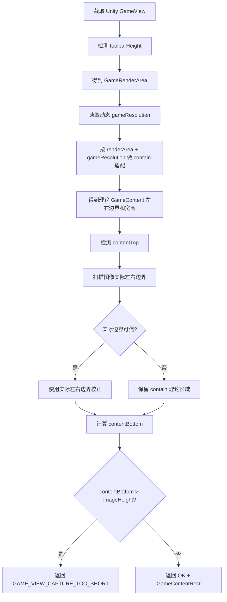

# AutoSmoke GameContent 抗分辨率与窗口拉伸修改方案

## 1. 背景

AutoSmoke IDE 需要在 Unity Editor 的 Game 窗口中稳定截取真实游戏画面区域，也就是 `GameContent`。

该区域后续会作为以下能力的基础输入：

- UI 元素识别
- 用例步骤点击
- 弹窗识别
- 引导识别
- Loading / 卡死 / 空页面检测
- 页面关系图记录
- 自动化测试报告截图

因此 `GameContent` 截图必须在以下情况下保持稳定：

- 切换不同游戏分辨率，例如 `1170x2532`、`720x1560`、`1080x2340`
- Unity Game 窗口横向拉宽
- Unity Game 窗口纵向拉高
- Unity Game 窗口变窄
- Unity Game 窗口变矮
- GameView 左右出现黑边
- GameView 上下出现黑边
- GameView 顶部工具栏高度变化

本方案只修改 AutoSmoke IDE / 工具侧代码，不修改游戏业务运行代码。

## 2. 当前问题

当前文件：

`E:\zdcs\AutoSmoke\core_engine\game_content_locator.py`

原有定位逻辑核心流程是：

1. 获取 Unity GameView 截图。
2. 检测顶部 Unity GameView 工具栏高度。
3. 根据渲染区域高度和设计分辨率比例，预估 `contentWidth`。
4. 检测 `contentTop`。
5. 如果 `contentTop > toolbarHeight`，则使用 `imageHeight - contentTop` 重新反推 `contentWidth`。

问题出在第 5 步。

原逻辑类似：

```python
actual_content_height = height - content_top
recomputed_width = int(actual_content_height * target_ratio)
content_left = (width - recomputed_width) // 2
content_right = content_left + recomputed_width
content_width = recomputed_width
```

这会导致一个严重问题：

当 Game 窗口被拉伸、截图高度不足、或者顶部识别位置发生偏移时，`height - content_top` 不一定等于真实游戏内容高度。

于是工具会用一个偏小的高度反推出偏小的宽度，最终导致：

- 左侧黑边可能消失
- 右侧 UI 被裁掉
- 底部 UI 可能被截断
- 大地图 / 主城场景截图和实际游戏画面不一致

### 2.1 修改后截图仍异常的新增判断

修改后截图：

`E:\zdcs\AutoSmoke\screenshots\run_20260615_154223\game_content_20260615_154223.png`

该截图尺寸为：

```text
300x649
```

本次截图 metadata 中记录：

```json
{
  "game_resolution": {
    "width": 1170,
    "height": 2532
  },
  "game_content_rect": {
    "left": 201,
    "top": 57,
    "width": 300,
    "height": 649,
    "right": 501,
    "bottom": 706
  },
  "game_view_coords": {
    "left": 309,
    "top": 73,
    "right": 1012,
    "bottom": 781,
    "width": 703,
    "height": 708
  }
}
```

从比例上看：

```text
1170 / 2532 ≈ 0.4621
300 / 649   ≈ 0.4622
```

比例本身是正确的，但截图仍然不完整，说明当前问题不是 `gameResolution` 比例错误，而是最终参与裁剪的 `GameContentRect` 太小。

更关键的是：

```text
708 - 57 = 651
651 * 1170 / 2532 ≈ 300
```

这与本次输出的 `game_content_rect.width = 300` 完全吻合。

因此可以判断：

```text
本次截图仍然走到了旧算法逻辑：
使用 imageHeight - contentTop 反推 contentWidth。
```

也就是说，仅修改 `game_content_locator.py` 还不够，还要确认 IDE 运行进程、截图接口、缓存对象是否真正使用到了新算法和最新配置。

### 2.2 metadata 与 config 不一致的问题

本次截图 metadata 记录：

```json
"game_view_coords": {
  "bottom": 781,
  "height": 708
}
```

但当前 `config.json` 中记录：

```json
"game_view_coords": {
  "bottom": 834,
  "height": 761
}
```

这说明存在配置不同步风险：

```text
重新定位已经写入了新的 config.json，
但截图模块仍然可能使用旧 mapper / 旧 capturer / 旧 game_view_coords。
```

如果截图接口继续复用旧缓存对象，即使定位算法已经修正，最终输出仍然会沿用旧坐标裁剪。

因此本问题需要同时处理两条链路：

1. `GameContent` 定位算法链路。
2. IDE 截图接口的配置刷新和缓存刷新链路。

## 3. 修改目标

修改后的定位逻辑需要满足：

| 目标 | 说明 |
|---|---|
| 分辨率动态适配 | 使用当前 `gameResolution` 作为比例来源，不写死固定分辨率 |
| 横向拉伸适配 | Game 窗口变宽时，正确识别左右黑边 |
| 纵向拉伸适配 | Game 窗口变高时，正确识别上下边界 |
| 窗口变窄适配 | Game 窗口宽度不足时，使用宽度限制模式计算内容区 |
| 窗口变矮适配 | Game 窗口高度不足时，返回明确的 `GAME_VIEW_CAPTURE_TOO_SHORT` |
| 不误裁右侧 | 禁止使用剩余高度反推并缩小内容宽度 |
| 保留调试能力 | 输出定位来源和检测结果，方便继续排查 |
| 不改游戏代码 | 只修改 AutoSmoke 工具侧定位算法 |
| 避免旧缓存 | 重新定位或截图前必须使用最新 config 和最新 locator 模块 |
| 可追踪来源 | metadata 必须记录本次截图使用的算法来源和坐标来源 |

## 4. 核心设计

### 4.1 使用 Unity GameView 的 contain 适配模型

Unity GameView 在固定目标分辨率比例下显示画面时，本质上是把游戏画面按比例放入 GameView 渲染区域。

因此 `GameContent` 应该按以下规则计算：

```text
renderRatio = renderWidth / renderHeight
targetRatio = gameResolutionWidth / gameResolutionHeight

if renderRatio > targetRatio:
    说明窗口偏宽
    内容高度 = renderHeight
    内容宽度 = renderHeight * targetRatio
    左右出现黑边

else:
    说明窗口偏窄
    内容宽度 = renderWidth
    内容高度 = renderWidth / targetRatio
    上下可能出现黑边
```

这就是标准的 aspect-fit / contain 逻辑。

### 4.2 contentTop 只负责上边界，不参与宽度反推

修改后：

- `contentTop` 只用于确定游戏画面顶部位置。
- `contentWidth` 不再由 `imageHeight - contentTop` 反推。
- `contentWidth` 由渲染区域宽高 + 目标分辨率比例计算。
- 必要时再通过图像左右边界检测进行校正。

这样可以避免窗口高度变化影响宽度计算。

### 4.3 实际图像边界作为二次校正

理论 contain 计算可能受到以下因素影响：

- Unity 工具栏高度识别误差
- GameView 面板边框
- Windows 缩放比例
- 截图工具裁剪偏差

因此保留并启用已有的：

```python
detect_content_horizontal_bounds()
```

处理方式：

1. 先按比例计算理论 `contentLeft/contentRight/contentWidth`。
2. 再从截图中扫描非黑像素，得到实际左右边界。
3. 如果实际检测宽度和理论宽度差异在可接受范围内，则采用实际边界。
4. 如果差异过大，则保留理论比例结果，避免被游戏内暗色画面、阴影、半透明遮罩误导。

当前建议阈值：

```python
width_diff_ratio <= 0.12
```

也就是实际检测宽度和理论宽度差异不超过 12% 时，允许使用图像边界校正。

## 5. 已实施代码修改

### 5.1 新增比例适配函数

文件：

`E:\zdcs\AutoSmoke\core_engine\game_content_locator.py`

新增函数：

```python
def _fit_content_rect_in_render_area(render_width: int, render_height: int, target_ratio: float) -> dict:
    """Fit the game content into the Unity Game render area while preserving aspect ratio."""
    if render_width <= 0 or render_height <= 0 or target_ratio <= 0:
        return {"left": 0, "top": 0, "width": max(0, render_width), "height": max(0, render_height)}

    render_ratio = render_width / render_height

    if render_ratio > target_ratio:
        content_height = render_height
        content_width = int(round(content_height * target_ratio))
        content_left = (render_width - content_width) // 2
        content_top = 0
        fit_mode = "height_limited"
    else:
        content_width = render_width
        content_height = int(round(content_width / target_ratio))
        content_left = 0
        content_top = (render_height - content_height) // 2
        fit_mode = "width_limited"

    return {
        "left": int(content_left),
        "top": int(content_top),
        "width": int(content_width),
        "height": int(content_height),
        "mode": fit_mode
    }
```

### 5.2 替换原 contentWidth 预计算逻辑

原逻辑：

```python
content_width = int(render_area_height * target_ratio)
horizontal_black = width - content_width
left_black = horizontal_black // 2
content_left = left_black
content_right = content_left + content_width
```

修改后：

```python
fitted_rect = _fit_content_rect_in_render_area(width, render_area_height, target_ratio)
content_left = fitted_rect["left"]
content_top_from_fit = toolbar_height + fitted_rect["top"]
content_width = fitted_rect["width"]
content_height = fitted_rect["height"]
content_right = content_left + content_width
content_width_source = f"aspect_fit:{fitted_rect.get('mode', 'unknown')}"
```

### 5.3 删除错误的剩余高度反推宽度逻辑

删除或废弃以下思路：

```python
actual_content_height = height - content_top
recomputed_width = int(actual_content_height * target_ratio)
```

修改后的原则：

```text
contentTop 不参与 contentWidth 计算
```

### 5.4 增加实际左右边界校正

新增逻辑：

```python
bounds_scan_start = min(max(content_top + 20, toolbar_height + 40), max(toolbar_height, height - 1))
detected_left, detected_right, detected_width = detect_content_horizontal_bounds(
    img_rgb,
    render_rect,
    scan_start=bounds_scan_start
)

min_valid_width = max(1, int(width * 0.2))
detected_is_valid = min_valid_width <= detected_width <= width
width_diff_ratio = abs(detected_width - content_width) / max(content_width, 1)

if detected_is_valid and width_diff_ratio <= 0.12:
    content_left = detected_left
    content_right = detected_right
    content_width = detected_width
    content_height = int(round(content_width / target_ratio))
    content_width_source = "horizontal_bounds"
else:
    保留比例适配结果
```

### 5.5 debug_info 增加定位来源

新增字段：

```python
"contentTopFromFit": int(content_top_from_fit),
"contentWidthSource": content_width_source,
"detectedHorizontalLeft": int(detected_left),
"detectedHorizontalRight": int(detected_right),
"detectedHorizontalWidth": int(detected_width)
```

用于判断当前结果来自：

- `aspect_fit:height_limited`
- `aspect_fit:width_limited`
- `horizontal_bounds`

### 5.6 IDE 缓存刷新修改方案

除定位算法外，还需要修改 IDE 截图链路，避免旧坐标继续参与裁剪。

当前 IDE 中可能存在类似全局缓存：

```python
_MAPPER = None
_CAPTURER = None
```

风险是：

```text
1. 用户点击“重新定位”
2. IDE 重新计算并写入 config.json
3. 但 _MAPPER / _CAPTURER 已经在进程中创建过
4. 后续点击“截取 GameContent”
5. 截图接口仍然使用旧 mapper / 旧 capturer
6. 最终 metadata 与 config.json 不一致
```

建议增加统一缓存清理函数：

```python
def _reset_runtime_cache():
    global _MAPPER, _CAPTURER
    _MAPPER = None
    _CAPTURER = None
```

触发时机：

| 触发点 | 处理 |
|---|---|
| 重新定位 GameView 后 | 清空 `_MAPPER`、`_CAPTURER` |
| 更新 `game_resolution` 后 | 清空 `_MAPPER`、`_CAPTURER` |
| 更新 `game_content_rect` 后 | 清空 `_MAPPER`、`_CAPTURER` |
| 点击截图接口前 | 优先从最新 `config.json` 创建 mapper |

截图接口建议不要长期复用 `_CAPTURER`，而是每次创建临时 capturer：

```python
def _new_capturer_from_latest_config():
    from 坐标截图.coordinate_mapper import CoordinateMapper
    from 坐标截图.screenshot_game_content import GameContentScreenshot

    mapper = CoordinateMapper.from_config()
    return GameContentScreenshot(mapper=mapper)
```

`/api/capture` 建议流程：

```python
@app.route("/api/capture")
def api_capture():
    capturer = _new_capturer_from_latest_config()
    result = capturer.capture()
    return jsonify(...)
```

这样可以保证每次截图都使用当前 `config.json` 中最新的：

- `game_view_coords`
- `game_content_rect`
- `game_resolution`

### 5.7 IDE 模块热更新方案

如果 IDE 服务进程长期运行，Python 可能已经 import 过旧的：

```python
core_engine.game_content_locator
```

此时即使磁盘上的 `game_content_locator.py` 已经修改，正在运行的 IDE 进程也可能继续使用旧模块。

建议方案有两个：

方案 A：开发调试阶段，修改 locator 后重启 IDE 服务。

方案 B：在重新定位接口中显式 reload。

示例：

```python
import importlib
import core_engine.game_content_locator as gc_locator

gc_locator = importlib.reload(gc_locator)
find_game_content_rect = gc_locator.find_game_content_rect
```

推荐：

```text
开发调试阶段使用 reload
正式 IDE 打包后使用版本号和启动加载
```

### 5.8 截图 metadata 增强方案

每次截图保存 metadata 时，建议增加以下字段：

```json
{
  "locator_version": "aspect_fit_v3",
  "locator_module_file": "E:/zdcs/AutoSmoke/core_engine/game_content_locator.py",
  "content_width_source": "aspect_fit:height_limited",
  "config_snapshot": {
    "game_view_coords": {},
    "game_content_rect": {},
    "game_resolution": {}
  },
  "ratio_check": {
    "target_ratio": 0.4621,
    "actual_ratio": 0.4622,
    "diff": 0.0001
  },
  "cache_policy": "capture_from_latest_config"
}
```

这样后续看到一张截图，就能直接判断：

- 本次使用的是哪个定位算法版本。
- 本次坐标来自哪个配置快照。
- 本次是理论比例裁剪还是图像边界校正。
- 本次是否可能使用了旧缓存。

### 5.9 重新定位到截图的标准流程

IDE 内部应统一为以下流程：

```text
1. 获取 Unity GameView 当前屏幕坐标
2. 获取 Unity GameView 当前分辨率
3. 截取最新 GameView 图片
4. 调用 find_game_content_rect()
5. 写入 config.json
   - game_view_coords
   - game_resolution
   - game_content_rect
   - game_content_result
6. 清空 mapper/capturer 缓存
7. 截图接口重新从 config.json 创建 mapper/capturer
8. 裁剪 GameView
9. 裁剪 GameContent
10. 保存截图和 metadata
```

禁止流程：

```text
先截图，后定位
```

禁止流程：

```text
定位写入 config 后，截图继续使用旧 mapper/capturer
```

禁止流程：

```text
截图 metadata 中的 game_view_coords 与当前 config.json 不一致，但没有标记配置来源
```

## 6. 修改后的定位流程



## 7. 不同窗口形态下的行为

### 7.1 Game 窗口横向拉宽

表现：

- 渲染区域变宽
- 游戏内容保持原比例
- 左右出现黑边

算法行为：

```text
renderRatio > targetRatio
fit_mode = height_limited
contentHeight = renderHeight
contentWidth = renderHeight * targetRatio
contentLeft = 左黑边宽度
```

结果：

- 不会把黑边截进 GameContent
- 不会裁掉右侧 UI

### 7.2 Game 窗口纵向拉高

表现：

- 渲染区域变高
- 游戏内容保持原比例
- 可能上下出现黑边，或内容区域随高度变化

算法行为：

```text
根据 renderRatio 和 targetRatio 自动判断 height_limited / width_limited
```

结果：

- 不依赖固定高度
- 不会因为窗口变高导致坐标失真

### 7.3 Game 窗口变窄

表现：

- 渲染区域宽度不足
- 内容宽度受限
- 高度由宽度反推

算法行为：

```text
renderRatio <= targetRatio
fit_mode = width_limited
contentWidth = renderWidth
contentHeight = renderWidth / targetRatio
```

结果：

- 不会出现负黑边
- 不会错误居中裁切

### 7.4 Game 窗口变矮

表现：

- 游戏内容完整高度可能无法显示
- 底部按钮栏可能超出截图范围

算法行为：

```text
contentBottom = contentTop + contentHeight
if contentBottom > imageHeight:
    status = GAME_VIEW_CAPTURE_TOO_SHORT
```

结果：

- 不强行缩小内容宽度
- 明确告诉上层截图高度不足
- IDE 可提示用户扩大 Game 窗口或自动扩大 GameViewPanel 截取范围

## 8. 与动态 gameResolution 的关系

`gameResolution` 必须作为动态输入，而不是写死 `1170x2532`。

调用方式保持：

```python
result = find_game_content_rect(
    game_view_np,
    design_width=config.get("game_resolution", {}).get("width", 1170),
    design_height=config.get("game_resolution", {}).get("height", 2532),
    debug=True,
    debug_dir=debug_dir
)
```

后续 IDE 中应提供：

- 自动读取 Unity GameView 当前分辨率
- 手动选择分辨率
- 保存项目级默认分辨率
- 每次截图前刷新当前分辨率

配置建议：

```json
{
  "game_resolution": {
    "width": 1170,
    "height": 2532,
    "source": "unity_game_view",
    "updated_at": "2026-06-15 15:30:00"
  }
}
```

## 9. 验收标准

### 9.1 基础验收

| 编号 | 场景 | 期望结果 |
|---|---|---|
| GC-001 | 默认 Game 窗口大小 | GameContent 截图完整，无黑边 |
| GC-002 | 横向拉宽 Game 窗口 | GameContent 截图完整，无左右黑边 |
| GC-003 | 纵向拉高 Game 窗口 | GameContent 截图完整，无上下黑边 |
| GC-004 | 窗口变窄 | GameContent 不裁右侧 UI |
| GC-005 | 窗口变矮 | 如果高度不足，返回 `GAME_VIEW_CAPTURE_TOO_SHORT` |
| GC-006 | 切换 `1170x2532` | 截图比例正确 |
| GC-007 | 切换其他竖屏分辨率 | 截图比例正确 |

### 9.2 视觉验收

使用以下场景截图验证：

- 主城场景
- 大地图场景
- 背包界面
- 通用弹窗
- 奖励领取弹窗
- Loading 页面
- 引导页面
- 建筑按钮呼出前
- 建筑按钮呼出后

每张截图需要检查：

| 检查项 | 通过标准 |
|---|---|
| 左边界 | 不包含 Unity 黑边或无效背景 |
| 右边界 | 不裁掉右侧按钮、图标、Debug 标签 |
| 顶部 | 不包含 Unity GameView 工具栏 |
| 底部 | 不裁掉底部按钮栏 |
| 比例 | 截图宽高比接近 `gameResolution` |
| 坐标 | Poco / UI 元素坐标映射到截图后位置正确 |

### 9.3 数据验收

`debug_info` 中需要确认：

```json
{
  "contentWidthSource": "aspect_fit:height_limited 或 aspect_fit:width_limited 或 horizontal_bounds",
  "detectedHorizontalWidth": 真实检测宽度,
  "contentWidth": 最终使用宽度,
  "expectedContentBottom": 预期底部,
  "panelImageHeight": 当前截图高度,
  "isCaptureTooShort": false
}
```

通过标准：

- 正常窗口下 `isCaptureTooShort = false`
- 窗口高度确实不足时才为 `true`
- `contentWidth` 不会因为 `contentTop` 增大而异常变小
- `contentWidthSource` 可解释当前定位来源

### 9.4 旧算法残留专项验收

针对 `game_content_20260615_154223.png` 暴露出的 `300x649` 问题，需要增加专项验收。

#### 9.4.1 禁止剩余高度反推宽度

验收公式：

```text
oldWidth = (gameViewHeight - contentTop) * targetRatio
```

如果最终：

```text
contentWidth ≈ oldWidth
```

且 metadata 中没有标明 `contentWidthSource = horizontal_bounds`，则说明旧逻辑可能仍在生效。

以本次截图为例：

```text
gameViewHeight = 708
contentTop = 57
targetRatio = 1170 / 2532

oldWidth = (708 - 57) * 1170 / 2532
         ≈ 300
```

而实际截图宽度正好是：

```text
contentWidth = 300
```

因此该截图应判定为：

```text
疑似旧算法仍在生效
```

#### 9.4.2 metadata 与 config 一致性校验

每次截图后校验：

```text
metadata.game_view_coords == config.game_view_coords
metadata.game_content_rect == config.game_content_rect
metadata.game_resolution == config.game_resolution
```

如果不一致，需要 metadata 说明原因：

```json
{
  "config_snapshot_time": "...",
  "current_config_time": "...",
  "config_source": "snapshot_before_relocate 或 latest_config"
}
```

正常情况下，截图接口应满足：

```text
metadata 中的坐标 = 截图时实际使用的坐标
```

如果 metadata 与当前 config 不一致，但又没有 snapshot 标记，应判定为：

```text
截图链路存在旧配置或旧缓存风险
```

#### 9.4.3 截图实际尺寸与 rect 一致

每次截图后校验：

```text
game_content_image.width  == metadata.game_content_rect.width
game_content_image.height == metadata.game_content_rect.height
```

如果不一致，说明：

- 裁剪后又发生了缩放；
- 或 metadata 不是最终截图使用的 rect；
- 或中间存在二次裁剪。

#### 9.4.4 重新定位后立即截图

操作：

```text
1. 点击重新定位
2. 不重启 IDE
3. 立即点击截取 GameContent
```

通过标准：

```text
截图 metadata 中的 game_view_coords 必须等于重新定位后写入 config.json 的值
```

如果仍然使用重新定位前的坐标，说明：

```text
_MAPPER / _CAPTURER 缓存未清理
```

## 10. 后续 IDE 集成建议

### 10.1 IDE 中增加 GameContent 定位面板

建议增加以下信息展示：

| 字段 | 说明 |
|---|---|
| GameView 截图尺寸 | 当前 Unity GameView 截图大小 |
| gameResolution | 当前游戏分辨率 |
| toolbarHeight | Unity GameView 工具栏高度 |
| contentWidthSource | 当前宽度来源 |
| GameContentRect | 最终游戏内容区域 |
| scaleX / scaleY | 游戏设计分辨率到截图分辨率的缩放 |
| status | OK / GAME_VIEW_CAPTURE_TOO_SHORT |

### 10.2 IDE 中增加一键校准

一键校准流程：

1. 截取当前 GameView。
2. 读取当前 GameView 分辨率。
3. 调用 `find_game_content_rect()`。
4. 输出三层调试图：
   - `debug_three_layers.png`
   - `debug_content_top_scan.png`
   - `debug_game_content_expected_rect.png`
5. 输出纯 GameContent 截图：
   - `game_content_realtime.png`
6. 在 IDE 中显示结果并允许用户确认。

### 10.3 IDE 中增加异常提示

当返回 `GAME_VIEW_CAPTURE_TOO_SHORT` 时：

```text
当前 GameView 截图高度不足，预计缺失 xx 像素。
请拉高 Unity Game 窗口，或让 IDE 自动扩大 GameViewPanel 截图区域。
```

当 `detectedHorizontalWidth` 和 `contentWidth` 差异过大时：

```text
图像边界检测结果和分辨率比例结果差异较大，已优先使用比例计算结果。
建议查看 debug_three_layers.png。
```

## 11. 风险与处理

### 11.1 暗色画面导致水平边界误判

风险：

大地图、夜晚场景、遮罩弹窗可能存在大面积暗色区域。

处理：

- 图像边界检测只作为校正，不作为唯一来源。
- 如果检测宽度和理论宽度差异超过 12%，保留比例适配结果。

### 11.2 Unity 工具栏高度检测误差

风险：

Unity 版本、主题、缩放比例不同，工具栏高度可能变化。

处理：

- 当前仍保留 `detect_toolbar_height()`。
- 后续可在 IDE 中增加手动修正值。
- 也可以通过 Unity Editor API 获取 GameView 真实视图区域，作为更高优先级来源。

### 11.3 GameView 截图本身不完整

风险：

如果第一层 GameViewPanel 截图区域本身少截了一截，任何 GameContent 算法都无法恢复缺失像素。

处理：

- 返回 `GAME_VIEW_CAPTURE_TOO_SHORT`。
- IDE 提示缺失像素。
- 自动扩大第一层截图区域后重新定位。

## 12. 推荐下一步

下一步建议做 `GameContent 定位稳定性验证工具`：

- 批量切换窗口尺寸
- 批量切换分辨率
- 每次输出 GameContent 截图和 debug_info
- 自动计算截图宽高比误差
- 自动判断是否包含黑边
- 自动判断是否裁掉底部/右侧 UI

建议输出目录：

```text
E:\zdcs\进度\GameContent定位\验证记录\
```

建议新增验证脚本：

```text
E:\zdcs\AutoSmoke\tools\validate_game_content_locator.py
```

该验证脚本只验证定位算法，不执行游戏自动化点击。
