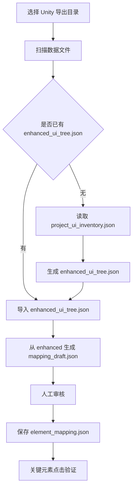

# AutoSmoke IDE 使用 enhanced_ui_tree.json 的映射生成修改方案

## 1. 目标

当前 IDE 已经可以从 `project_ui_inventory.json` 导入工程态 UI 清单，并生成大量映射候选。

当前实际结果：

```text
数据源：project_ui_inventory.json
节点：205293
可点击：14140
草稿：14052
置信度普遍：0.30
截图：缺失
页面归属：弱
中文描述：弱
```

这说明现有流程已经能生成草稿，但草稿数量太大、质量偏低，不适合人工逐条审核。

本方案目标是：

```text
在 IDE 中增加 enhanced_ui_tree.json 生成与使用流程。

project_ui_inventory.json
  -> enhanced_ui_tree.json
  -> mapping_draft
  -> 人工审核
  -> element_mapping.json
```

增强后的目标效果：

```text
草稿数量减少
关键元素优先
中文描述更清楚
页面归属更明确
clickTargetNode 更可靠
图标 visualNode / clickTargetNode 分离
可按优先级审核
可保护人工修改不被覆盖
```

## 2. 已检查的现有代码结构

### 2.1 IDE 主入口

文件：

```text
E:\zdcs\AutoSmoke\IDE\debug_panel.py
```

当前相关能力：

```text
UI树与元素映射页面
/api/ui/import
/api/mapping/import
/api/mapping/drafts
/api/mapping/drafts/<path>/save
/api/mapping/drafts/<path>/confirm
/api/mapping/drafts/<path>/reject
/api/mapping/drafts/<path>/ignore
/api/mapping/drafts/<path>/test_click
```

当前页面位置：

```text
准备 -> UI树与元素映射
```

当前前端导入按钮：

```text
导入Project
导入Current
导入Runtime
导入Pages
手工导入
```

当前问题：

```text
导入入口较多，用户需要理解 Project / Current / Runtime / Pages 的区别。
当前没有“生成 enhanced_ui_tree.json”的显式步骤。
```

### 2.2 当前导入接口 `/api/ui/import`

现有流程大致是：

```text
接收 mode/sourceDir/sourceFile
 -> 找到 JSON 文件
 -> 读取 payload
 -> 校验 payload
 -> 写入 metadata/current_ui.json
 -> 调用 ElementMappingManager.export_drafts()
 -> 返回草稿数量
```

当前问题：

```text
1. 导入后统一写 current_ui.json，容易混淆原始数据、运行态数据、增强数据。
2. 如果导入 project_ui_inventory.json，current_ui.json 实际装的是工程态清单。
3. export_drafts() 默认从 current_ui.json 读 elements 字段。
4. project_ui_inventory.json 的真实结构是 prefabs -> nodes，不是标准 elements。
5. 这个入口适合“导入当前 UI”，不适合作为 enhanced 生成主入口。
```

### 2.3 当前映射导入接口 `/api/mapping/import`

现有流程大致是：

```text
扫描 sourceDir
优先找 enhanced_ui_tree.json / current_ui_tree.json / project_ui_inventory.json / current_ui.json
读取每个 source
如果有 elements，读取 elements
如果有 prefabs，展开 prefabs.nodes
调用 mgr.generate_drafts(elements)
upsert 到 element_mapping.json
返回 summary
```

当前问题：

```text
1. 优先级写了 enhanced_ui_tree.json，但当前没有生成 enhanced 的步骤。
2. 对 enhanced_ui_tree.json 如果是 nodes 字段，当前逻辑可能无法读取。
3. project_ui_inventory.json 被直接展开生成草稿，导致草稿数量巨大。
4. 草稿直接 upsert 到 element_mapping.json，draft 与正式映射边界不清晰。
5. 没有区分“增强数据生成”“草稿生成”“正式映射确认”三件事。
```

### 2.4 映射管理器

文件：

```text
E:\zdcs\AutoSmoke\元数据\element_mapping.py
```

当前相关能力：

```text
ElementMappingManager.generate_drafts(elements)
ElementMappingManager._build_draft(e)
ElementMappingManager.generate_icon_drafts(elements)
ElementMappingManager.export_drafts()
ElementMappingManager.export_formal()
```

当前问题：

```text
1. generate_drafts() 只处理 clickable=true 的元素。
2. _build_draft() 主要根据 name/text/type/screenRect 推断。
3. 对 project_ui_inventory.json 的 componentTypes、hasButton、rectTransform、assetPath、category 等工程态字段利用不足。
4. 没有专门识别 enhanced_ui_tree.json 的字段。
5. confidence 分数偏粗，当前大量工程态草稿为 0.30。
6. clickTargetNode / visualNode 没有作为核心输出字段稳定生成。
```

### 2.5 已存在但不完整的 enhanced 生成器

文件：

```text
E:\zdcs\AutoSmoke\元数据\merged_ui_tree.py
```

当前文件说明是：

```text
读取 project_ui_inventory.json + current_ui_tree.json
合并输出 enhanced_ui_tree.json
```

当前问题：

```text
1. 代码路径里 META_DIR 显示为乱码风险，需要统一路径工具。
2. 当前强依赖 current_ui_tree.json。
3. 当前实际环境没有 current_ui_tree.json。
4. 如果没有运行态树，就无法生成 enhanced_ui_tree.json。
5. merge 主要做运行态节点匹配 prefab，没有做“工程态清洗增强”。
```

### 2.6 自动探索已预留 enhanced 读取

文件：

```text
E:\zdcs\AutoSmoke\元数据\auto_explorer.py
```

当前逻辑中已经有：

```text
优先读取 enhanced_ui_tree.json
其次 current_ui_tree.json
最后 current_ui.json
```

说明：

```text
enhanced_ui_tree.json 已经是现有架构预期的一等数据源。
现在缺的是生成、规范化、导入、草稿生成的完整链路。
```

## 3. 当前数据结构确认

当前实际存在的原始文件：

```text
E:\zdcs\AutoSmoke\元数据\project_ui_inventory.json
```

抽样确认字段：

```json
{
  "schemaVersion": 1,
  "timestamp": "2026-06-16T15:38:41.794+08:00",
  "projectPath": "E:/s1/k3client/client/Assets",
  "prefabs": [],
  "scenes": [],
  "iconCandidates": [],
  "missingScriptCount": 15,
  "noTestIdCount": 205293,
  "buttonCount": 264,
  "summary": "1795 prefabs, 0 scenes, 15 missing scripts, 205293 no-testId nodes"
}
```

Prefab 节点结构：

```json
{
  "assetPath": "Assets/.../MainPanel.prefab",
  "guid": "...",
  "rootName": "MainPanel",
  "category": "panel",
  "nodes": [
    {
      "path": "MainPanel",
      "name": "MainPanel",
      "componentTypes": ["Transform", "GameLuaBehaviour_New"],
      "text": "",
      "isUI": false,
      "hasButton": false,
      "clickable": false,
      "hasTestId": false,
      "testId": "",
      "hasMissingScript": false,
      "spriteName": "",
      "atlasName": "",
      "raycastTarget": false,
      "childCount": 2,
      "rectTransform": {}
    }
  ]
}
```

当前缺失文件：

```text
current_ui_tree.json
enhanced_ui_tree.json
```

因此本方案必须支持两种生成模式：

```text
A. 仅工程态增强：project_ui_inventory.json -> enhanced_ui_tree.json
B. 工程态 + 运行态增强：project_ui_inventory.json + current_ui_tree.json/pages/*.json -> enhanced_ui_tree.json
```

第一阶段先落地 A，后续再增强 B。

## 4. 修改后的目标数据流

### 4.1 推荐主链路



### 4.2 数据文件职责

| 文件 | 职责 | 是否人工编辑 |
|---|---|---|
| `project_ui_inventory.json` | Unity 工程态原始扫描数据 | 否 |
| `current_ui_tree.json` | Unity 当前运行态 UI 树 | 否 |
| `pages/*.json` | 页面级运行态 UI 树 | 否 |
| `enhanced_ui_tree.json` | IDE 增强后的候选元素清单 | 否 |
| `element_mapping_draft.json` | 可审核映射草稿 | 可通过 IDE 修改 |
| `element_mapping.json` | 正式元素映射库 | 只能通过 IDE 确认/保存 |

## 5. 新增模块：ui_tree_enhancer.py

建议新增文件：

```text
E:\zdcs\AutoSmoke\元数据\ui_tree_enhancer.py
```

不要继续在 `merged_ui_tree.py` 上硬改，原因是：

```text
merged_ui_tree.py 当前定位是“工程态 + 运行态合并”。
当前最急需的是“工程态清洗增强”，职责不同。
保留 merged_ui_tree.py 作为后续运行态合并模块。
```

### 5.1 模块职责

```text
读取 project_ui_inventory.json
展开 prefabs.nodes
过滤明显无用节点
识别按钮/页签/图标/弹窗/入口/道具格子
推断 pageId
推断 elementType
推断 role
生成 displayName
生成 chineseDescription
生成 suggestedTestId
生成 suggestedSemanticId
生成 clickTargetNode
生成 visualNode
计算 confidence
生成 risk/reviewHint
输出 enhanced_ui_tree.json
```

### 5.2 输入

最小输入：

```text
project_ui_inventory.json
```

可选输入：

```text
current_ui_tree.json
pages/*.json
icon_inventory.json
scene_objects.json
```

### 5.3 输出结构

```json
{
  "schemaVersion": "enhanced_ui_tree/v1",
  "generatedAt": "2026-06-16T16:30:00",
  "source": {
    "projectInventory": "E:/zdcs/AutoSmoke/元数据/project_ui_inventory.json",
    "runtimeTree": "",
    "pages": []
  },
  "summary": {
    "projectNodes": 205293,
    "rawClickable": 14140,
    "enhancedNodes": 3200,
    "draftCandidates": 900,
    "highPriority": 120,
    "missingPageId": 300,
    "missingClickTarget": 20
  },
  "nodes": []
}
```

### 5.4 单个 enhanced node 结构

```json
{
  "path": "Assets/.../BagPanel.prefab::BagPanel/Bottom/UseButton",
  "prefabPath": "Assets/.../BagPanel.prefab",
  "prefabNodePath": "BagPanel/Bottom/UseButton",
  "runtimePath": "",
  "nodeName": "UseButton",
  "text": "使用",
  "components": ["Button", "Image"],
  "componentTypes": ["Button", "Image"],
  "spriteName": "btn_yellow",
  "atlasName": "ui_common",
  "clickable": true,
  "clickableReason": "hasButton=true",
  "pageId": "BagPanel",
  "pageName": "背包界面",
  "elementType": "button",
  "role": "use_action",
  "priority": "P0",
  "displayName": "背包-使用按钮",
  "chineseDescription": "背包界面底部用于使用当前选中道具的按钮",
  "suggestedTestId": "bag.use_button",
  "suggestedSemanticId": "bag.use",
  "clickTargetNode": "Assets/.../BagPanel.prefab::BagPanel/Bottom/UseButton",
  "visualNode": "Assets/.../BagPanel.prefab::BagPanel/Bottom/UseButton",
  "confidence": 0.86,
  "reviewStatus": "pending",
  "reviewHint": "工程态高置信按钮；缺少运行态坐标，建议结构确认后做点击验证",
  "risk": ["no_runtime_path", "no_screen_rect"]
}
```

## 6. enhanced 生成规则

### 6.1 节点展开规则

从 `project_ui_inventory.json` 展开：

```text
for prefab in prefabs:
  for node in prefab.nodes:
    enhanced.path = prefab.assetPath + "::" + node.path
```

保留字段：

```text
assetPath -> prefabPath
rootName
category
node.path -> prefabNodePath
node.name -> nodeName
componentTypes -> components
text
clickable
hasButton
spriteName
atlasName
raycastTarget
rectTransform
hasMissingScript
```

### 6.2 初步过滤规则

默认进入 enhanced 的节点：

```text
clickable=true
hasButton=true
componentTypes 包含 Button/Toggle/Slider/InputField/Dropdown/EventTrigger
raycastTarget=true 且 spriteName 非空
text 命中关键动作词
name 命中关键控件词
spriteName 命中图标/道具/活动/建筑词
```

默认不进入 enhanced 的节点：

```text
isUI=false 且 clickable=false 且 spriteName/text 都为空
纯 Transform 容器
纯背景节点
childCount 很大且无点击能力的布局容器
hasMissingScript=true 且无其它可识别依据
```

注意：

```text
不要把所有 205293 节点都写入 enhanced。
enhanced_ui_tree.json 应该是“候选增强清单”，不是原始全量清单。
```

### 6.3 元素类型推断

| 条件 | elementType |
|---|---|
| hasButton=true 或 componentTypes 包含 Button | `button` |
| name 包含 Tab/Toggle 或 componentTypes 包含 Toggle | `tab` |
| spriteName 非空且 clickable=true | `interactive_icon` |
| spriteName 非空且 clickable=false | `display_icon` |
| text 非空且不可点击 | `text` |
| path/name 包含 Item/Cell/Grid 且有 sprite | `item_cell` |
| path/name 包含 Reward | `reward_item` |
| path/name 包含 Close | `close_button` |
| path/name 包含 Mask/Blocker | `mask` |
| 无法判断但 clickable=true | `clickable_unknown` |

### 6.4 role 推断

| 条件 | role |
|---|---|
| text/name 包含 关闭/Close/X | `close_popup` |
| text/name 包含 确定/Confirm/OK | `confirm` |
| text/name 包含 取消/Cancel | `cancel` |
| text/name 包含 使用/Use | `use_action` |
| text/name 包含 领取/Reward/Get/Claim | `claim_reward` |
| text/name 包含 前往/Go | `go_to` |
| text/name 包含 返回/Back | `back` |
| name 包含 Tab | `switch_tab` |
| spriteName/name 包含 item | `open_item_tip_or_select` |
| spriteName/name 包含 activity | `open_activity` |
| spriteName/name 包含 building | `open_building_menu` |
| 其它 Button | `normal_action` |

### 6.5 pageId 推断

优先级：

```text
1. prefab.rootName
2. prefab.assetPath 文件名
3. prefab.category
4. prefabNodePath 第一段
5. name/path 中的 Panel/Dialog/View/Window/Page 片段
6. unknown
```

示例：

```text
Assets/.../BagPanel.prefab -> BagPanel
Assets/.../RewardPopup.prefab -> RewardPopup
Root/DeepUI/DialogUI/BagPanel/... -> BagPanel
```

### 6.6 中文描述生成

优先使用：

```text
页面中文名 + 可见文本 + 元素类型 + role
```

示例：

```text
pageId=BagPanel
text=使用
elementType=button
role=use_action

displayName=背包-使用按钮
chineseDescription=背包界面中用于使用当前选中道具的按钮
```

没有 text 时：

```text
pageId + nodeName 翻译 + spriteName 推断
```

示例：

```text
nodeName=btnTabInfo
displayName=疑似信息页签按钮
chineseDescription=根据节点名 btnTabInfo 推断为信息页签，缺少可见文本和截图，需要人工确认
```

### 6.7 优先级分层

| priority | 条件 | 处理 |
|---|---|---|
| P0 | 关闭、确定、取消、使用、领取、前往、返回 | 第一轮必须审核 |
| P1 | 底部入口、右侧活动入口、页签、背包/商店/邮件/任务 | 第二轮审核 |
| P2 | 道具格子、奖励格子、活动图标、建筑菜单按钮 | 第三轮审核 |
| P3 | 普通按钮、未知可点击节点 | 需要筛选后审核 |
| LOW | 调试面板、工具面板、疑似测试按钮 | 默认低优先级 |
| IGNORE_CANDIDATE | 背景、容器、装饰 | 默认不生成草稿或建议忽略 |

### 6.8 置信度规则

基础分：

```text
0.30：工程态可点击节点
```

加分：

```text
hasButton=true：+0.20
text 非空：+0.20
pageId 非 unknown：+0.10
role 是 P0 动作：+0.10
spriteName 有业务含义：+0.05
nodeName 有业务含义：+0.05
clickTargetNode 已生成：+0.05
```

减分：

```text
无 runtimePath：-0.05
无 screenRect：-0.05
pageId=unknown：-0.10
nodeName 为 cont/item/node/clone/root：-0.10
疑似 debug/editor/test：-0.20
hasMissingScript=true：-0.20
```

建议分布：

```text
P0 通用按钮：0.75 - 0.90
普通按钮：0.55 - 0.75
图标/格子：0.45 - 0.70
未知可点击：0.30 - 0.50
疑似调试：0.10 - 0.35
```

## 7. 修改 ElementMappingManager

文件：

```text
E:\zdcs\AutoSmoke\元数据\element_mapping.py
```

### 7.1 增加标准元素提取函数

新增：

```python
def normalize_elements_from_payload(payload, source_name=""):
    """
    兼容读取：
    - enhanced_ui_tree.json: nodes
    - current_ui_tree.json: nodes
    - current_ui.json: elements
    - project_ui_inventory.json: prefabs[].nodes
    """
```

输出统一结构：

```text
path
nodeName
name
text
components
componentTypes
type
clickable
pageId
prefabPath
prefabNodePath
runtimePath
screenRect
spriteName
atlasName
elementType
role
priority
clickTargetNode
visualNode
confidence
reviewHint
risk
```

### 7.2 generate_drafts 支持 enhanced

当前：

```text
generate_drafts(elements)
  只看 clickable=true
  再 _build_draft()
```

修改为：

```text
如果元素来自 enhanced_ui_tree：
  直接优先使用 displayName/chineseDescription/role/pageId/confidence/clickTargetNode/visualNode

如果元素来自普通 UI 树：
  使用旧 _build_draft 推断
```

### 7.3 草稿过滤改造

不要所有 clickable 都生成草稿。

新增参数：

```python
generate_drafts(elements=None, min_priority=None, include_low=False, source_type="")
```

默认策略：

```text
P0/P1/P2/P3 生成草稿
LOW 不默认进入，除非用户勾选“包含低优先级”
IGNORE_CANDIDATE 不生成草稿
```

### 7.4 草稿字段补齐

草稿必须补齐：

```text
semanticId
suggestedSemanticId
testId
suggestedTestId
displayName
chineseDescription
pageId
elementType
role
priority
path
runtimePath
prefabPath
prefabNodePath
clickTargetNode
visualNode
spriteName
atlasName
components
confidence
risk
reviewHint
reviewStatus=pending
source=auto_draft
dataSource=enhanced_ui_tree
```

## 8. 修改 IDE 后端接口

文件：

```text
E:\zdcs\AutoSmoke\IDE\debug_panel.py
```

### 8.1 新增接口：生成 enhanced

新增：

```text
POST /api/ui/enhance
```

请求：

```json
{
  "sourceDir": "E:/zdcs/AutoSmoke/元数据",
  "mode": "project_only",
  "overwrite": true
}
```

返回：

```json
{
  "success": true,
  "enhancedPath": "E:/zdcs/AutoSmoke/元数据/enhanced_ui_tree.json",
  "summary": {
    "projectNodes": 205293,
    "rawClickable": 14140,
    "enhancedNodes": 3200,
    "draftCandidates": 900,
    "p0": 80,
    "p1": 220,
    "p2": 600,
    "low": 300
  }
}
```

内部调用：

```python
from 元数据.ui_tree_enhancer import UITreeEnhancer
enhancer = UITreeEnhancer(source_dir=source_dir)
result = enhancer.run()
```

### 8.2 修改 `/api/ui/import`

现有 `/api/ui/import` 继续保留，但导入优先级调整为：

```text
enhanced_ui_tree.json
current_ui_tree.json
pages/*.json
current_ui.json
project_ui_inventory.json
```

如果用户选择 `mode=project`：

```text
不要直接从 project_ui_inventory.json 生成草稿。
先调用 /api/ui/enhance 生成 enhanced_ui_tree.json。
再从 enhanced_ui_tree.json 生成草稿。
```

### 8.3 修改 `/api/mapping/import`

当前逻辑：

```text
sources = enhanced/current/project/current_ui
for src in sources:
  if elements: use elements
  if prefabs: unfold prefabs.nodes
  generate_drafts
  upsert
```

建议修改：

```text
1. 如果 sourceDir 有 enhanced_ui_tree.json：只用 enhanced_ui_tree.json 生成草稿。
2. 如果没有 enhanced，但有 project_ui_inventory.json：先生成 enhanced。
3. 禁止默认直接从 project_ui_inventory.json 展开 20 万节点生成草稿。
4. 除非用户选择“高级：直接从 Project 生成草稿”。
```

原因：

```text
project_ui_inventory.json 是原始数据，不适合直接进入审核。
```

### 8.4 新增接口：enhanced 状态

新增：

```text
GET /api/ui/enhance/status
```

返回：

```json
{
  "exists": true,
  "path": "E:/zdcs/AutoSmoke/元数据/enhanced_ui_tree.json",
  "updatedAt": "2026-06-16 16:30:00",
  "summary": {
    "enhancedNodes": 3200,
    "draftCandidates": 900,
    "p0": 80,
    "p1": 220,
    "p2": 600
  },
  "sourceFiles": {
    "project_ui_inventory": true,
    "current_ui_tree": false,
    "pages": 0,
    "screenshots": 0
  }
}
```

### 8.5 修改 `/api/mapping/drafts`

增加筛选参数：

```text
priority=P0/P1/P2/P3/LOW
elementType=button/tab/interactive_icon/item_cell/reward_item
role=close_popup/confirm/use_action/claim_reward
dataSource=enhanced_ui_tree
```

前端可以直接筛：

```text
P0
通用按钮
图标
缺点击目标
低优先级
疑似调试
```

## 9. 修改 IDE 前端界面

文件：

```text
E:\zdcs\AutoSmoke\IDE\debug_panel.py
```

当前扫描页按钮过多：

```text
导入Project
导入Current
导入Runtime
导入Pages
手工导入
```

建议主界面改成：

```text
导入与生成草稿

Unity导出目录：[E:\zdcs\AutoSmoke\元数据]

[扫描文件]
[生成增强UI树]
[从增强UI树生成草稿]
[进入审核]

高级导入 v
  [导入Project]
  [导入Current]
  [导入Runtime]
  [导入Pages]
  [手工导入]
```

### 9.1 顶部状态卡

显示：

```text
原始工程清单：已发现 project_ui_inventory.json
增强UI树：未生成 / 已生成
运行态UI树：缺失 / 已发现
页面截图：缺失 / 已发现
当前审核模式：结构审核
```

### 9.2 生成增强UI树按钮

按钮：

```text
生成增强UI树
```

调用：

```text
POST /api/ui/enhance
```

完成后显示：

```text
增强完成：
原始节点 205293
原始可点击 14140
增强候选 3200
建议草稿 900
P0 80
P1 220
P2 600
低优先级 300
```

### 9.3 从增强UI树生成草稿

按钮：

```text
生成映射草稿
```

调用：

```text
POST /api/mapping/import
{
  "sourceDir": "...",
  "source": "enhanced_ui_tree.json"
}
```

显示：

```text
草稿生成完成：
待审 900
高信度 180
P0 80
缺描述 0
缺点击目标 12
疑似调试 45
```

### 9.4 审核列表增强

左侧列表增加列：

```text
状态
优先级
类型
名称
页面
信度
风险
```

筛选增加：

```text
P0
P1
P2
按钮
图标
页签
弹窗按钮
道具格子
奖励格子
疑似调试
缺点击目标
缺页面
```

### 9.5 详情区增强

右侧详情增加：

```text
dataSource
priority
elementType
clickTargetNode
visualNode
risk
evidence
prefabPath
prefabNodePath
runtimePath
```

没有截图时，中间区域不要只显示“截图高亮”，应显示：

```text
当前为结构审核模式
该元素来自 enhanced_ui_tree.json
没有运行态截图和 screenRect
可以进行结构确认
关键元素后续需要点击确认
```

## 10. enhanced 与人工审核的合并规则

重新生成 enhanced 或草稿时，必须保护人工修改。

优先级：

```text
click_confirmed
visual_confirmed
structure_confirmed
modified
manual_added
pending auto_draft
new auto_draft
ignored/rejected
```

合并规则：

```text
1. 如果 path/testId/semanticId 已有人工确认，保留人工字段。
2. 自动 enhanced 只更新技术字段，例如 prefabPath、runtimePath、risk、confidence。
3. displayName/chineseDescription/testId/semanticId 被人工改过后不自动覆盖。
4. ignored/rejected 的元素重新生成时仍保持 ignored/rejected。
5. 新元素进入 pending。
```

## 11. 不同阶段的落地顺序

### 阶段一：仅工程态 enhanced

目标：

```text
解决当前 14052 条低质量草稿难审核的问题。
```

修改内容：

```text
新增 ui_tree_enhancer.py
新增 /api/ui/enhance
修改 /api/mapping/import 默认使用 enhanced
修改 ElementMappingManager 支持 enhanced 字段
前端增加“生成增强UI树”
审核列表增加 priority/elementType 筛选
```

验收：

```text
能从 project_ui_inventory.json 生成 enhanced_ui_tree.json
enhanced 节点数明显小于 205293
草稿数明显小于 14052
P0 元素能优先显示
每个草稿有中文描述
每个可点击草稿有 clickTargetNode
低优先级调试元素不干扰主审核
```

### 阶段二：叠加运行态 UI 树

目标：

```text
补 runtimePath、screenRect、visible、pageId。
```

修改内容：

```text
让 ui_tree_enhancer.py 读取 current_ui_tree.json/pages/*.json
按 name/text/component/path 后缀匹配工程态节点
将 runtimePath/screenRect/visible/screenshotRef 合并到 enhanced node
```

验收：

```text
当前页面元素有 runtimePath
当前页面元素有 screenRect
有截图时可视觉确认
页面归属更准确
```

### 阶段三：点击验证升级

目标：

```text
关键元素从 structure_confirmed 升级到 click_confirmed。
```

修改内容：

```text
/api/mapping/drafts/<path>/test_click 改为优先使用 clickTargetNode
不再要求 screenRect 才能测试点击
Unity 内部查找 GameObject 并 EventSystem 注入点击
返回 hitGameObject/expectedGameObject/eventReceiverMatched
```

验收：

```text
P0 元素可点击验证
点击命中后状态为 click_confirmed
失败时显示原因：找不到节点/不可见/被遮挡/无事件接收器
```

## 12. 关键代码修改点清单

### 12.1 新增

```text
E:\zdcs\AutoSmoke\元数据\ui_tree_enhancer.py
```

### 12.2 修改

```text
E:\zdcs\AutoSmoke\元数据\element_mapping.py
```

修改点：

```text
新增 normalize_elements_from_payload()
generate_drafts() 支持 enhanced nodes
_build_draft() 优先使用 enhanced 字段
新增 priority/elementType/role/risk/evidence/clickTargetNode/visualNode
```

```text
E:\zdcs\AutoSmoke\IDE\debug_panel.py
```

修改点：

```text
新增 /api/ui/enhance
新增 /api/ui/enhance/status
修改 /api/ui/import 的 project 模式
修改 /api/mapping/import 的数据源优先级和读取 nodes 逻辑
修改 /api/mapping/drafts 筛选参数
修改前端扫描页按钮
修改前端审核列表和详情展示
```

### 12.3 保留

```text
E:\zdcs\AutoSmoke\元数据\merged_ui_tree.py
```

保留为后续“工程态 + 运行态合并”的补充模块。第一阶段不依赖它。

## 13. 推荐最终用户操作流程

用户在 IDE 中只需要这样操作：

```text
1. 打开 准备 -> UI树与元素映射 -> 扫描
2. 选择 Unity 导出目录：E:\zdcs\AutoSmoke\元数据
3. 点击 扫描文件
4. 点击 生成增强UI树
5. 点击 生成映射草稿
6. 点击 进入审核
7. 先筛选 P0
8. 审核关闭/确定/取消/使用/领取/前往/返回
9. 再筛选 P1/P2
10. 审核入口、页签、图标、格子
11. 保存为 element_mapping.json
12. 对关键元素执行点击确认
```

## 14. 当前最应该先改的 5 件事

```text
1. 新增 ui_tree_enhancer.py，让 project_ui_inventory.json 能生成 enhanced_ui_tree.json。
2. 修改 /api/mapping/import，默认不再直接从 project_ui_inventory.json 生成 14052 条草稿。
3. 修改 ElementMappingManager.generate_drafts()，优先吃 enhanced 的字段。
4. 前端增加“生成增强UI树”和 P0/P1/P2 筛选。
5. 点击确认接口后续改成优先用 clickTargetNode，而不是依赖 screenRect。
```

## 15. 预期效果

修改前：

```text
project_ui_inventory.json
节点：205293
可点击：14140
草稿：14052
信度：0.30 居多
用户不知道先审什么
```

修改后：

```text
project_ui_inventory.json
 -> enhanced_ui_tree.json
增强候选：约 2000-5000
映射草稿：约 500-1500
P0：几十到一百多个
高信度关键按钮：优先展示
调试/工具/装饰节点：低优先级或忽略候选
用户先审核真正影响自动点击的元素
```

## 16. 结论

当前 IDE 不需要推倒重来。

最合理的改法是在现有结构中增加一层：

```text
enhanced_ui_tree.json
```

它承担“清洗、增强、归类、中文化、优先级排序”的职责。

这样 `project_ui_inventory.json` 仍然作为原始工程扫描数据保留，`element_mapping.json` 仍然作为最终正式映射数据保留，中间通过 `enhanced_ui_tree.json` 降低人工审核成本，提高元素映射准确率。

## 17. 重要架构补充：工程态草稿只是最低优先级候选

### 17.1 核心原则

工程态扫描不能作为最终正确性的依据。

原因是：

```text
project_ui_inventory.json 来自 Unity 工程 Prefab/资源扫描。
它能说明工程里“可能存在”哪些 UI 节点。
但它不能证明这些节点当前真实显示在游戏界面上。
也不能证明点击它一定能命中正确 GameObject。
更不能证明点击后业务状态正确变化。
```

因此本项目最终可信原则必须改为：

```text
工程态生成的映射草稿 = 最低优先级候选池
IDE 连接 Unity 后，在实时界面中匹配并点击验证成功的元素 = 最高可信正式映射
```

也就是说：

```text
project_ui_inventory.json
  -> enhanced_ui_tree.json
  -> mapping_draft
```

只负责帮用户“先找到候选元素”，不能直接作为正式自动点击依据。

正式自动点击应该优先使用：

```text
click_confirmed
```

而不是：

```text
auto_draft
structure_confirmed
```

### 17.2 元素可信度分层

建议在 IDE 中明确显示元素可信等级：

| 等级 | 状态 | 来源 | 含义 | 是否可正式自动点击 |
|---|---|---|---|---|
| L0 | `auto_draft` | 工程态扫描 | 只是候选，未确认 | 否 |
| L1 | `structure_confirmed` | 人工结构审核 | 根据路径、名称、文本判断大概率正确 | 谨慎，不建议正式跑 |
| L2 | `runtime_matched` | Unity 实时 UI 树 | 当前真实界面中匹配到了对应元素 | 可进入点击验证 |
| L3 | `visual_confirmed` | Unity 截图高亮 | 人眼确认高亮位置正确 | 可用 |
| L4 | `click_confirmed` | Unity 注入点击 | 点击真实命中目标并触发预期变化 | 是，最高优先级 |

状态升级路径：

```text
auto_draft
  -> structure_confirmed
  -> runtime_matched
  -> visual_confirmed
  -> click_confirmed
```

状态降级路径：

```text
runtime_match_failed
click_failed
blocked_by_popup
not_visible
not_interactable
rejected
ignored
```

### 17.3 最终审核流程应以 Unity 实时界面为准

IDE 中最终审核不应该只看静态草稿，而应该按真实游戏界面走：

```text
1. IDE 连接 Unity
2. Unity 游戏停在某个真实界面
3. IDE 获取当前实时 UI 树
4. IDE 获取当前完整 GameContent 截图
5. IDE 识别当前 pageId / sceneId
6. IDE 从候选映射中筛出当前页面相关元素
7. IDE 将候选元素与实时 UI 树进行匹配
8. 匹配成功的元素标记 runtime_matched
9. IDE 在当前截图中高亮元素位置
10. 用户确认高亮是否正确
11. 用户点击“测试点击”
12. Unity 内部 EventSystem 注入点击
13. IDE 校验命中的 GameObject 是否等于 clickTargetNode
14. IDE 校验点击后页面/状态是否符合预期
15. 通过后升级为 click_confirmed
```

这个流程才是用户能够“绝对确认正确”的闭环。

## 18. Unity 实时确认链路详细实现步骤

### 18.1 新增运行态连接层

IDE 需要有一个 Unity 运行态连接层。

第一阶段推荐使用文件 Bridge，原因是：

```text
实现简单
跨电脑路径可配置
不依赖网络端口
便于调试
不需要修改游戏业务逻辑
只需要 Unity Editor 工具脚本配合
```

目录建议：

```text
E:\zdcs\AutoSmoke\runtime\bridge\
```

请求目录：

```text
E:\zdcs\AutoSmoke\runtime\bridge\requests\
```

响应目录：

```text
E:\zdcs\AutoSmoke\runtime\bridge\responses\
```

心跳文件：

```text
E:\zdcs\AutoSmoke\runtime\bridge\unity_heartbeat.json
```

### 18.2 Bridge 请求类型

IDE 至少需要支持以下请求：

```text
get_current_state
dump_runtime_ui_tree
capture_game_content
match_element
highlight_element
test_click_element
get_click_result
```

示例请求：

```json
{
  "requestId": "req_20260616_170001",
  "type": "dump_runtime_ui_tree",
  "createdAt": "2026-06-16T17:00:01",
  "payload": {
    "includeInvisible": false,
    "includeComponents": true,
    "includeScreenRect": true,
    "includeText": true,
    "includeSprite": true
  }
}
```

示例响应：

```json
{
  "requestId": "req_20260616_170001",
  "success": true,
  "type": "dump_runtime_ui_tree",
  "finishedAt": "2026-06-16T17:00:02",
  "payload": {
    "sceneId": "MainCity",
    "pageId": "BagPanel",
    "gameResolution": {
      "width": 1170,
      "height": 2532
    },
    "nodes": []
  }
}
```

### 18.3 Unity 侧需要导出的实时节点字段

运行态节点必须包含：

```json
{
  "runtimePath": "Root/DeepUI/DialogUI/BagPanel/Bottom/UseButton",
  "name": "UseButton",
  "nodeName": "UseButton",
  "text": "使用",
  "components": ["Button", "Image"],
  "type": "Button",
  "clickable": true,
  "interactable": true,
  "visible": true,
  "activeInHierarchy": true,
  "screenRect": [192, 2420, 512, 2510],
  "normalizedRect": [0.164, 0.956, 0.438, 0.991],
  "spriteName": "btn_yellow",
  "atlasName": "ui_common",
  "sortingLayer": "",
  "sortingOrder": 0,
  "canvasName": "DialogUI",
  "pageId": "BagPanel",
  "siblingIndex": 4,
  "instanceId": 123456,
  "eventReceivers": [
    "Button",
    "IPointerClickHandler"
  ],
  "raycastTarget": true
}
```

重点字段：

```text
runtimePath
screenRect
normalizedRect
visible
interactable
clickable
eventReceivers
instanceId
```

这些字段决定能不能在实时界面里真正确认和点击。

### 18.4 IDE 侧新增实时 UI 数据缓存

IDE 获取运行态 UI 树后，保存：

```text
E:\zdcs\AutoSmoke\metadata\runtime_ui_tree_current.json
```

同时保留历史快照：

```text
E:\zdcs\AutoSmoke\metadata\runtime_snapshots\20260616_170001_BagPanel.json
```

当前实时状态文件：

```text
E:\zdcs\AutoSmoke\metadata\current_runtime_state.json
```

内容：

```json
{
  "sceneId": "MainCity",
  "pageId": "BagPanel",
  "capturedAt": "2026-06-16T17:00:01",
  "nodeCount": 560,
  "clickableCount": 82,
  "screenshotPath": "E:/zdcs/AutoSmoke/screenshots/runtime/BagPanel_170001.png"
}
```

### 18.5 候选映射与实时 UI 树匹配

IDE 从 `element_mapping_draft.json` 或 `element_mapping.json` 中读取候选元素，然后与实时 UI 树匹配。

匹配优先级：

```text
P0：testId 精确匹配
P1：runtimePath 精确匹配
P2：runtimePath 后缀匹配
P3：text + pageId + component 匹配
P4：nodeName + pageId + component 匹配
P5：spriteName + pageId + elementType 匹配
P6：prefabNodePath 后缀 + nodeName 匹配
P7：坐标/层级/同级文本辅助匹配
```

匹配结果结构：

```json
{
  "semanticId": "bag.use",
  "draftPath": "Assets/.../BagPanel.prefab::BagPanel/Bottom/UseButton",
  "matched": true,
  "matchLevel": "P3",
  "matchScore": 0.88,
  "runtimePath": "Root/DeepUI/DialogUI/BagPanel/Bottom/UseButton",
  "runtimeInstanceId": 123456,
  "screenRect": [192, 2420, 512, 2510],
  "visible": true,
  "interactable": true,
  "risks": []
}
```

### 18.6 匹配评分规则

```text
testId 完全一致：+1.00
runtimePath 完全一致：+0.95
runtimePath 后缀一致：+0.85
pageId 一致：+0.10
text 一致：+0.25
nodeName 一致：+0.15
component 一致：+0.10
spriteName 一致：+0.15
visible=true：+0.05
interactable=true：+0.05
```

扣分：

```text
匹配到多个候选：-0.20
不可见：-0.30
不可交互：-0.30
screenRect 为空：-0.15
被弹窗遮挡：-0.40
pageId 不一致：-0.30
```

匹配等级：

| 分数 | 结果 | 处理 |
|---|---|---|
| `>=0.90` | 高可信匹配 | 可视觉确认或点击验证 |
| `0.75-0.89` | 中可信匹配 | 需要人工确认 |
| `0.50-0.74` | 低可信匹配 | 需要截图/人工修正 |
| `<0.50` | 匹配失败 | 不允许点击 |

### 18.7 IDE 审核页新增“实时匹配”模式

当前审核页已有三栏：

```text
左侧：草稿列表
中间：截图高亮
右侧：详情编辑
```

需要新增顶部实时工具栏：

```text
[连接Unity] [刷新当前界面] [实时匹配当前页] [截图高亮] [测试点击]
```

左侧列表增加筛选：

```text
当前页
已实时匹配
未匹配
匹配冲突
可点击
被遮挡
P0关键元素
```

每个元素行显示：

```text
状态
优先级
名称
页面
运行态匹配
匹配分
可见
可交互
信度
```

示例：

```text
[待审] [P0] 背包-使用按钮 | BagPanel | 已匹配 0.92 | 可见 | 可交互
```

### 18.8 中间截图高亮逻辑

实时匹配成功后：

```text
如果有 screenRect：
  在 Unity 直出截图上画高亮框

如果没有 screenRect 但有 runtimePath：
  显示结构信息，提示缺少坐标

如果匹配多个节点：
  高亮多个候选，用编号区分
```

高亮图保存：

```text
E:\zdcs\AutoSmoke\screenshots\mapping_review\BagPanel_bag.use_170001.png
```

IDE 中间区域显示：

```text
当前 Unity 截图
高亮目标元素
显示 matchScore
显示 runtimePath
显示 screenRect
```

### 18.9 点击验证必须用 runtimePath / instanceId

点击验证不能优先依赖屏幕坐标。

推荐点击链路：

```text
semanticId
  -> element_mapping.json / draft
  -> runtime match result
  -> runtimePath 或 instanceId
  -> Unity 内部查找 GameObject
  -> EventSystem.ExecuteEvents
  -> 记录 eventReceiver
  -> 返回点击结果
```

请求：

```json
{
  "requestId": "req_20260616_170100",
  "type": "test_click_element",
  "payload": {
    "semanticId": "bag.use",
    "runtimePath": "Root/DeepUI/DialogUI/BagPanel/Bottom/UseButton",
    "instanceId": 123456,
    "clickMode": "unity_event_system",
    "verifyAfterClick": true
  }
}
```

响应：

```json
{
  "requestId": "req_20260616_170100",
  "success": true,
  "payload": {
    "expectedRuntimePath": "Root/DeepUI/DialogUI/BagPanel/Bottom/UseButton",
    "hitRuntimePath": "Root/DeepUI/DialogUI/BagPanel/Bottom/UseButton",
    "eventReceiverMatched": true,
    "beforePageId": "BagPanel",
    "afterPageId": "RewardPopup",
    "stateChanged": true,
    "clickResult": "CLICK_CONFIRMED"
  }
}
```

只有满足以下条件才升级为 `click_confirmed`：

```text
运行态元素存在
元素 visible=true
元素 interactable=true
事件接收对象命中目标
没有被上层弹窗遮挡
点击后页面/状态发生预期变化
```

### 18.10 点击后状态校验

点击确认不能只看“点击成功”，还要看“点击后结果是否符合预期”。

每个映射元素建议增加：

```json
{
  "expectedAfterClick": {
    "type": "page_change",
    "pageId": "RewardPopup"
  }
}
```

或：

```json
{
  "expectedAfterClick": {
    "type": "state_change",
    "keys": ["bag.selectedItemId"]
  }
}
```

或：

```json
{
  "expectedAfterClick": {
    "type": "popup_closed"
  }
}
```

如果暂时没有业务断言，也至少校验：

```text
点击事件命中目标
当前界面没有崩溃
没有卡死
没有重连
没有 Missing Reference
UI 树有变化或页面状态有变化
```

## 19. 后端接口修改清单

### 19.1 新增：刷新运行态 UI 树

```text
POST /api/runtime_ui/refresh
```

作用：

```text
请求 Unity 导出当前实时 UI 树
保存 runtime_ui_tree_current.json
返回当前 sceneId/pageId/nodeCount/clickableCount
```

### 19.2 新增：运行态匹配当前页

```text
POST /api/mapping/runtime_match
```

请求：

```json
{
  "pageId": "BagPanel",
  "status": "pending",
  "priority": "P0"
}
```

返回：

```json
{
  "success": true,
  "pageId": "BagPanel",
  "totalCandidates": 20,
  "matched": 15,
  "conflicts": 2,
  "missing": 3,
  "results": []
}
```

### 19.3 新增：高亮实时匹配元素

```text
POST /api/mapping/highlight
```

请求：

```json
{
  "semanticId": "bag.use",
  "runtimePath": "Root/DeepUI/DialogUI/BagPanel/Bottom/UseButton"
}
```

返回：

```json
{
  "success": true,
  "highlightImage": "E:/zdcs/AutoSmoke/screenshots/mapping_review/BagPanel_bag.use.png"
}
```

### 19.4 修改：点击确认接口

当前：

```text
/api/mapping/drafts/<path>/test_click
```

问题：

```text
当前逻辑依赖 screenRect。
```

修改为：

```text
优先 runtimePath / instanceId
其次 clickTargetNode
最后才 fallback screenRect
```

点击成功后写入：

```json
{
  "reviewStatus": "click_confirmed",
  "runtimeMatchedAt": "2026-06-16T17:01:00",
  "clickConfirmedAt": "2026-06-16T17:01:10",
  "lastRuntimePath": "Root/DeepUI/DialogUI/BagPanel/Bottom/UseButton",
  "lastInstanceId": 123456,
  "lastClickResult": {}
}
```

## 20. 映射文件字段补充

`element_mapping.json` 中每个元素需要增加运行态确认字段：

```json
{
  "semanticId": "bag.use",
  "displayName": "背包-使用按钮",
  "sourceLevel": "L4",
  "reviewStatus": "click_confirmed",
  "draftSource": "project_ui_inventory",
  "enhancedSource": "enhanced_ui_tree",
  "runtimeMatch": {
    "status": "matched",
    "matchScore": 0.92,
    "matchLevel": "P3",
    "runtimePath": "Root/DeepUI/DialogUI/BagPanel/Bottom/UseButton",
    "instanceId": 123456,
    "visible": true,
    "interactable": true,
    "screenRect": [192, 2420, 512, 2510],
    "matchedAt": "2026-06-16T17:00:01"
  },
  "clickVerification": {
    "status": "passed",
    "method": "unity_event_system",
    "eventReceiverMatched": true,
    "verifiedAt": "2026-06-16T17:01:10"
  }
}
```

## 21. IDE 页面上的最终用户流程

### 21.1 准备候选

```text
1. 导入 project_ui_inventory.json
2. 生成 enhanced_ui_tree.json
3. 生成映射草稿
```

此时元素状态：

```text
auto_draft
```

### 21.2 打开 Unity 到真实界面

例如：

```text
打开游戏
进入主城
打开背包
```

### 21.3 IDE 刷新当前界面

```text
点击：刷新当前界面
```

IDE 执行：

```text
获取当前 pageId
获取 runtime UI tree
获取 GameContent 截图
```

### 21.4 实时匹配

```text
点击：实时匹配当前页
```

IDE 执行：

```text
从草稿中筛选 pageId=BagPanel 的候选
与 runtime_ui_tree_current.json 匹配
显示匹配分数
```

匹配成功的元素状态：

```text
runtime_matched
```

### 21.5 视觉确认

```text
点击元素
查看截图高亮
确认高亮位置正确
点击：视觉确认
```

状态：

```text
visual_confirmed
```

### 21.6 点击确认

```text
点击：测试点击
```

IDE 执行：

```text
通过 runtimePath/instanceId 请求 Unity 注入点击
校验 eventReceiver
校验点击后状态
```

成功后：

```text
click_confirmed
```

### 21.7 正式自动点击

自动用例执行时默认只使用：

```text
click_confirmed
visual_confirmed
```

默认禁止直接使用：

```text
auto_draft
```

如果用户强制允许 `structure_confirmed`，报告中必须标记风险：

```text
该元素仅结构确认，未经过实时点击验证
```

## 22. 实施优先级调整

原方案中 enhanced 的作用是“提高草稿质量”。

现在需要明确调整为：

```text
enhanced_ui_tree.json 只负责提高候选质量。
runtime UI match 负责确认当前界面真实存在。
click_confirmed 负责确认最终可点击正确。
```

因此实施优先级调整为：

```text
P0：生成 enhanced_ui_tree.json，减少候选噪音
P0：IDE 接 Unity，刷新实时 UI 树
P0：候选元素与实时 UI 树匹配
P0：基于 runtimePath/instanceId 点击验证
P1：截图高亮视觉确认
P1：点击后状态校验
P2：批量页面映射确认
P2：自动生成页面关系图
```

## 23. 第一阶段最小闭环

为了快速验证架构，建议先做一个最小闭环：

```text
背包界面-使用按钮
```

步骤：

```text
1. 从 project_ui_inventory.json 生成 enhanced_ui_tree.json
2. 生成“背包-使用按钮”草稿
3. Unity 打开背包界面
4. IDE 刷新当前 runtime UI tree
5. IDE 匹配“背包-使用按钮”
6. IDE 高亮按钮
7. 用户确认高亮正确
8. IDE 执行测试点击
9. Unity 返回 eventReceiverMatched=true
10. 元素升级为 click_confirmed
```

验收结果：

```text
工程态候选 -> 实时匹配 -> 视觉确认 -> 点击确认
完整跑通。
```

只有这个闭环跑通后，再扩展到：

```text
关闭按钮
确定按钮
奖励确认
底部入口
右侧活动入口
道具图标
建筑功能菜单
```

## 24. 最终结论补充

`enhanced_ui_tree.json` 不是最终正确答案。

它的定位是：

```text
更聪明的候选生成器
```

最终正确答案来自：

```text
IDE 连接 Unity 后，在实时界面中匹配、视觉确认、点击确认。
```

因此完整可信链路必须是：

```text
project_ui_inventory.json
  -> enhanced_ui_tree.json
  -> mapping_draft
  -> runtime_matched
  -> visual_confirmed
  -> click_confirmed
  -> element_mapping.json
  -> 自动点击
```

自动化执行时，默认只信任：

```text
click_confirmed
```

这样才能真正保证用户所说的“我能绝对确认正确”。

## 25. 完整 5 阶段实施计划

本方案最终按 5 个阶段落地。

5 个阶段不是彼此替代关系，而是逐级提高元素可信度：

```text
阶段 1：工程态 enhanced 候选生成
阶段 2：IDE 连接 Unity，获取实时 UI 树
阶段 3：候选元素与实时界面匹配
阶段 4：截图高亮与人工视觉确认
阶段 5：Unity 注入点击与点击后验证
```

对应状态升级：

```text
auto_draft
  -> structure_confirmed
  -> runtime_matched
  -> visual_confirmed
  -> click_confirmed
```

最终自动点击默认只使用：

```text
click_confirmed
```

## 26. 阶段 1：工程态 enhanced 候选生成

### 26.1 阶段目标

阶段 1 的目标不是确认元素一定正确，而是把工程态全量清单变成可审核的候选池。

当前问题是：

```text
project_ui_inventory.json 节点过多：205293
可点击候选过多：14140
草稿过多：14052
置信度普遍偏低：0.30
用户无法高效审核
```

阶段 1 要解决：

```text
减少候选数量
提高候选质量
生成中文描述
识别元素类型
识别优先级
生成 clickTargetNode / visualNode
输出 enhanced_ui_tree.json
输出 mapping_draft
```

### 26.2 输入

必需：

```text
E:\zdcs\AutoSmoke\元数据\project_ui_inventory.json
```

可选：

```text
icon_inventory.json
scene_objects.json
pages/*.json
current_ui_tree.json
```

阶段 1 先不强依赖运行态文件。

### 26.3 输出

```text
E:\zdcs\AutoSmoke\元数据\enhanced_ui_tree.json
E:\zdcs\AutoSmoke\元数据\element_mapping_draft.json
E:\zdcs\AutoSmoke\metadata\import_report.json
```

### 26.4 涉及代码文件

新增：

```text
E:\zdcs\AutoSmoke\元数据\ui_tree_enhancer.py
```

修改：

```text
E:\zdcs\AutoSmoke\元数据\element_mapping.py
E:\zdcs\AutoSmoke\IDE\debug_panel.py
```

### 26.5 详细实施步骤

#### 步骤 1：新增 `ui_tree_enhancer.py`

实现类：

```python
class UITreeEnhancer:
    def __init__(self, source_dir: str):
        ...

    def run(self) -> dict:
        ...
```

核心方法：

```text
load_project_inventory()
flatten_prefab_nodes()
filter_candidate_nodes()
infer_page_id()
infer_element_type()
infer_role()
infer_priority()
infer_display_name()
infer_chinese_description()
infer_click_target()
infer_visual_node()
calculate_confidence()
build_risk_flags()
write_enhanced_ui_tree()
```

#### 步骤 2：展开工程态节点

从：

```json
{
  "prefabs": [
    {
      "assetPath": "...",
      "rootName": "BagPanel",
      "category": "panel",
      "nodes": []
    }
  ]
}
```

转换为：

```json
{
  "path": "Assets/.../BagPanel.prefab::BagPanel/Bottom/UseButton",
  "prefabPath": "Assets/.../BagPanel.prefab",
  "prefabNodePath": "BagPanel/Bottom/UseButton",
  "nodeName": "UseButton"
}
```

#### 步骤 3：过滤候选节点

进入 enhanced 的条件：

```text
clickable=true
hasButton=true
componentTypes 包含 Button/Toggle/EventTrigger/Slider/InputField/Dropdown
raycastTarget=true 且 spriteName 非空
name 命中 Btn/Button/Close/Confirm/Use/Reward/Tab/Icon/Item
text 命中 关闭/确定/取消/使用/领取/前往/返回
spriteName 命中 item/reward/activity/building/icon
```

不进入 enhanced 的条件：

```text
纯 Transform
无 text
无 spriteName
clickable=false
raycastTarget=false
无业务命名
疑似背景/装饰/容器
```

#### 步骤 4：推断字段

每个候选补齐：

```text
pageId
elementType
role
priority
displayName
chineseDescription
suggestedTestId
suggestedSemanticId
clickTargetNode
visualNode
confidence
risk
reviewHint
```

#### 步骤 5：输出 enhanced

输出结构：

```json
{
  "schemaVersion": "enhanced_ui_tree/v1",
  "generatedAt": "...",
  "source": {},
  "summary": {},
  "nodes": []
}
```

#### 步骤 6：修改 `ElementMappingManager`

增加：

```text
normalize_elements_from_payload()
generate_drafts_from_enhanced()
```

要求：

```text
如果输入是 enhanced_ui_tree.json，直接使用 enhanced 字段生成草稿。
不要重新用旧规则覆盖 displayName/chineseDescription/role/priority。
```

#### 步骤 7：修改 IDE 后端

新增接口：

```text
POST /api/ui/enhance
GET /api/ui/enhance/status
```

修改：

```text
POST /api/mapping/import
```

新逻辑：

```text
如果有 enhanced_ui_tree.json：
  用 enhanced 生成草稿
否则如果有 project_ui_inventory.json：
  先生成 enhanced，再生成草稿
禁止默认直接从 project_ui_inventory.json 生成 14052 条草稿
```

#### 步骤 8：修改 IDE 前端

扫描页主按钮改为：

```text
[扫描文件]
[生成增强UI树]
[生成映射草稿]
[进入审核]
```

高级按钮折叠：

```text
导入Project
导入Current
导入Runtime
导入Pages
手工导入
```

审核列表增加筛选：

```text
P0
P1
P2
按钮
图标
页签
弹窗按钮
缺点击目标
疑似调试
```

### 26.6 阶段验收标准

```text
能从 project_ui_inventory.json 生成 enhanced_ui_tree.json
enhanced 节点数明显小于 205293
草稿数明显小于 14052
每个草稿有中文描述
每个草稿有 priority
每个可点击草稿有 clickTargetNode
图标元素有 visualNode 和 clickTargetNode
P0 元素可筛选
疑似调试/装饰元素不会干扰主审核
```

### 26.7 阶段失败处理

| 失败 | 表现 | 处理 |
|---|---|---|
| 找不到 project 文件 | enhanced 生成失败 | IDE 提示选择 Unity 导出目录 |
| 草稿仍过多 | 仍接近 14052 | 提高过滤阈值，默认只生成 P0/P1/P2 |
| 中文描述不清楚 | 用户无法判断 | 增加 pageId、text、nodeName、spriteName 证据展示 |
| clickTargetNode 为空 | 不能后续点击 | 用父级 Button/Toggle/EventTrigger 节点补齐 |

## 27. 阶段 2：IDE 连接 Unity，获取实时 UI 树

### 27.1 阶段目标

阶段 2 的目标是让 IDE 能知道 Unity 当前真实显示的界面和元素。

阶段 1 得到的是候选。

阶段 2 得到的是实时事实：

```text
当前在哪个 scene
当前在哪个 page
当前 UI 树有哪些节点
哪些节点可见
哪些节点可点击
每个节点的 runtimePath 是什么
每个节点的 screenRect 是什么
每个节点是否 interactable
```

### 27.2 输入

```text
Unity Editor 正在运行游戏
IDE 已配置 Unity 项目路径
AutoSmoke Unity Editor 工具脚本已部署
```

### 27.3 输出

```text
E:\zdcs\AutoSmoke\metadata\runtime_ui_tree_current.json
E:\zdcs\AutoSmoke\metadata\current_runtime_state.json
E:\zdcs\AutoSmoke\metadata\runtime_snapshots\*.json
```

### 27.4 涉及代码文件

新增或修改：

```text
E:\zdcs\AutoSmoke\IDE\debug_panel.py
Unity Editor 工具脚本：AutoSmokeRuntimeBridge.cs
Unity Editor 工具脚本：AutoSmokeRuntimeUITreeDumper.cs
```

说明：

```text
Unity 侧脚本只做 Editor/测试工具，不修改游戏业务逻辑。
```

### 27.5 详细实施步骤

#### 步骤 1：建立 Bridge 目录

```text
E:\zdcs\AutoSmoke\runtime\bridge\
  requests\
  responses\
  unity_heartbeat.json
```

#### 步骤 2：Unity 写心跳

Unity 每 1 秒写：

```json
{
  "alive": true,
  "playMode": true,
  "sceneId": "MainCity",
  "pageId": "BagPanel",
  "gameResolution": {
    "width": 1170,
    "height": 2532
  },
  "updatedAt": "2026-06-16T17:00:00"
}
```

#### 步骤 3：IDE 检测 Unity 连接

新增接口：

```text
GET /api/unity/bridge/status
```

判断：

```text
heartbeat 文件存在
updatedAt 距当前小于 3 秒
playMode=true
```

#### 步骤 4：IDE 请求实时 UI 树

新增接口：

```text
POST /api/runtime_ui/refresh
```

IDE 写请求：

```text
runtime\bridge\requests\dump_runtime_ui_tree_<requestId>.json
```

Unity 监听后输出：

```text
runtime\bridge\responses\dump_runtime_ui_tree_<requestId>.json
runtime\bridge\responses\dump_runtime_ui_tree_<requestId>.done
```

#### 步骤 5：Unity 导出实时 UI 树

Unity 遍历当前 Canvas/UI：

```text
GameObject.activeInHierarchy
RectTransform
Graphic.raycastTarget
Selectable.interactable
Button/Toggle/EventTrigger
TMP_Text/Text
Image.sprite
Canvas/SortingOrder
```

生成节点：

```text
runtimePath
instanceId
nodeName
text
components
clickable
interactable
visible
screenRect
normalizedRect
spriteName
atlasName
pageId
```

#### 步骤 6：IDE 保存实时快照

保存：

```text
metadata\runtime_ui_tree_current.json
metadata\runtime_snapshots\时间_pageId.json
metadata\current_runtime_state.json
```

#### 步骤 7：前端显示实时状态

IDE 顶部显示：

```text
Unity：已连接
Play：true
Scene：MainCity
Page：BagPanel
实时节点：560
可点击：82
更新时间：17:00:01
```

### 27.6 阶段验收标准

```text
IDE 能显示 Unity 已连接
IDE 能刷新当前实时 UI 树
runtime_ui_tree_current.json 能生成
节点包含 runtimePath
节点包含 screenRect 或 normalizedRect
节点包含 visible/interactable/clickable
IDE 能显示当前 pageId
刷新耗时小于 2 秒
```

### 27.7 阶段失败处理

| 失败 | 表现 | 处理 |
|---|---|---|
| Unity 未连接 | heartbeat 超时 | IDE 提示启动 Play Mode 或部署脚本 |
| UI 树为空 | nodeCount=0 | 检查 Canvas 查找规则 |
| 坐标为空 | 无 screenRect | 检查 Camera/Canvas 模式 |
| pageId 不准 | unknown | 用顶层 Panel、可见弹窗、标题文本推断 |

## 28. 阶段 3：候选元素与实时界面匹配

### 28.1 阶段目标

阶段 3 的目标是把工程态候选与当前真实 UI 树关联起来。

即：

```text
mapping_draft 中的“背包-使用按钮”
  匹配到
Unity 当前 UI 树中的 Root/DeepUI/DialogUI/BagPanel/Bottom/UseButton
```

匹配成功后，元素状态升级为：

```text
runtime_matched
```

### 28.2 输入

```text
enhanced_ui_tree.json
element_mapping_draft.json
runtime_ui_tree_current.json
current_runtime_state.json
```

### 28.3 输出

```text
runtime_match_result.json
element_mapping.json 中更新 runtimeMatch 字段
```

### 28.4 涉及代码文件

新增：

```text
E:\zdcs\AutoSmoke\元数据\runtime_matcher.py
```

修改：

```text
E:\zdcs\AutoSmoke\IDE\debug_panel.py
E:\zdcs\AutoSmoke\元数据\element_mapping.py
```

### 28.5 详细实施步骤

#### 步骤 1：新增 RuntimeElementMatcher

```python
class RuntimeElementMatcher:
    def __init__(self, drafts, runtime_nodes):
        ...

    def match_all(self, page_id=None, priority=None):
        ...

    def match_one(self, draft):
        ...
```

#### 步骤 2：候选预筛选

先按当前页面过滤：

```text
draft.pageId == current.pageId
或 draft.pageId unknown 但 path/name/text 命中当前页面
```

再按优先级过滤：

```text
默认只匹配 P0/P1/P2
LOW 需要手动勾选
```

#### 步骤 3：匹配规则实现

优先级：

```text
P0：testId 精确匹配
P1：runtimePath 精确匹配
P2：runtimePath 后缀匹配
P3：text + pageId + component 匹配
P4：nodeName + pageId + component 匹配
P5：spriteName + pageId + elementType 匹配
P6：prefabNodePath 后缀 + nodeName 匹配
P7：同级文本/父级路径辅助匹配
```

#### 步骤 4：计算匹配分

输出：

```text
matchScore
matchLevel
matchedRuntimePath
matchedInstanceId
matchedScreenRect
risks
conflicts
```

#### 步骤 5：处理多候选冲突

如果一个 draft 匹配到多个 runtime 节点：

```text
标记 conflict
展示候选列表
允许用户选择正确节点
选择后写入 runtimePath 绑定
```

#### 步骤 6：处理未匹配

未匹配原因分类：

```text
page_not_open
not_visible
name_not_found
text_not_found
multiple_candidates
runtime_tree_missing
```

#### 步骤 7：新增后端接口

```text
POST /api/mapping/runtime_match
GET /api/mapping/runtime_match/result
POST /api/mapping/runtime_match/resolve_conflict
```

#### 步骤 8：前端显示实时匹配结果

左侧列表显示：

```text
已匹配 0.92
冲突 2个候选
未匹配
不可见
不可交互
```

右侧详情显示：

```text
matchedRuntimePath
matchedInstanceId
matchScore
matchLevel
visible
interactable
screenRect
conflictCandidates
```

### 28.6 阶段验收标准

```text
能对当前页面草稿执行实时匹配
匹配结果能显示在 IDE 中
高置信元素能自动标记 runtime_matched
冲突元素能人工选择
未匹配元素有明确原因
runtimeMatch 字段能保存到 element_mapping.json
```

### 28.7 阶段失败处理

| 失败 | 表现 | 处理 |
|---|---|---|
| 匹配过多 | 一个草稿匹配多个节点 | 增加 pageId、父级、同级文本限制 |
| 匹配不到 | runtime 节点不存在 | 提示打开对应页面或刷新 UI 树 |
| 匹配错 | 高亮后发现错误 | 人工绑定正确 runtimePath |
| pageId 错 | 候选被过滤掉 | 允许“当前页外候选”搜索 |

## 29. 阶段 4：截图高亮与人工视觉确认

### 29.1 阶段目标

阶段 4 的目标是让用户在 IDE 中直观看到：

```text
这个映射元素在当前 Unity 游戏界面上的真实位置。
```

用户确认高亮正确后，状态升级为：

```text
visual_confirmed
```

### 29.2 输入

```text
runtime_match_result.json
Unity 当前 GameContent 截图
runtime node screenRect
```

### 29.3 输出

```text
mapping_review 高亮截图
element_mapping.json 更新 visualConfirmed 字段
```

### 29.4 涉及代码文件

新增或修改：

```text
E:\zdcs\AutoSmoke\视觉识别\visualize_clickable_elements.py
E:\zdcs\AutoSmoke\IDE\debug_panel.py
Unity 直出截图 Bridge
```

### 29.5 详细实施步骤

#### 步骤 1：获取 Unity 当前完整截图

优先：

```text
Unity 直出 GameContent PNG
```

备用：

```text
Python 截取 GameView/GameContent
```

保存：

```text
E:\zdcs\AutoSmoke\screenshots\mapping_review\current_page.png
```

#### 步骤 2：坐标统一

统一使用：

```text
GameContent 局部坐标
normalizedRect
gameResolution
```

转换规则：

```text
screenRect -> GameContent screenshot rect
normalizedRect -> screenshot pixel rect
```

#### 步骤 3：绘制高亮图

对匹配元素绘制：

```text
红框：当前选中元素
黄框：冲突候选
蓝框：同组候选
编号：候选编号
文字：displayName / matchScore
```

#### 步骤 4：IDE 中间区域显示高亮

中间区域显示：

```text
当前截图
高亮框
元素名称
matchScore
runtimePath
screenRect
```

没有截图时显示：

```text
当前无截图，只能结构/运行态确认，不能视觉确认
```

#### 步骤 5：用户视觉确认

用户点击：

```text
视觉确认
```

写入：

```json
{
  "reviewStatus": "visual_confirmed",
  "visualReview": {
    "confirmed": true,
    "confirmedAt": "...",
    "highlightImage": "...",
    "screenRect": []
  }
}
```

#### 步骤 6：用户修正高亮错误

如果高亮错误，用户可以：

```text
选择另一个候选
手动绑定 runtimePath
标记匹配错误
标记待补充
拒绝该草稿
```

### 29.6 阶段验收标准

```text
能显示当前 Unity 截图
能在截图上高亮 runtime_matched 元素
高亮位置与游戏画面一致
用户能标记 visual_confirmed
错误高亮能人工修正
高亮图能保存到报告目录
```

### 29.7 阶段失败处理

| 失败 | 表现 | 处理 |
|---|---|---|
| 截图缺失 | 中间区域空白 | 提示刷新截图或检查 Unity 直出 |
| 高亮偏移 | 框不在元素上 | 检查 GameContent 坐标系和分辨率 |
| screenRect 缺失 | 无法画框 | 使用 runtimePath 结构确认，等待 Unity 补坐标 |
| 多候选重叠 | 看不清 | 编号显示，允许逐个查看 |

## 30. 阶段 5：Unity 注入点击与点击后验证

### 30.1 阶段目标

阶段 5 的目标是证明这个映射不只是“看起来对”，而是真的能被 IDE 准确点击。

通过后，状态升级为：

```text
click_confirmed
```

这是最终自动点击默认信任的状态。

### 30.2 输入

```text
visual_confirmed 或 runtime_matched 元素
runtimePath
instanceId
clickTargetNode
expectedAfterClick
Unity 当前运行状态
```

### 30.3 输出

```text
clickVerification 结果
element_mapping.json 更新 click_confirmed
点击前后截图
点击前后 runtime state diff
```

### 30.4 涉及代码文件

修改：

```text
E:\zdcs\AutoSmoke\IDE\debug_panel.py
E:\zdcs\AutoSmoke\点击执行\click_mode.py
E:\zdcs\AutoSmoke\点击执行\click_validator.py
E:\zdcs\AutoSmoke\元数据\element_mapping.py
```

Unity 侧：

```text
AutoSmokeRuntimeBridge.cs
AutoSmokeClickInjector.cs
```

### 30.5 详细实施步骤

#### 步骤 1：修改点击测试接口

当前接口：

```text
POST /api/mapping/drafts/<path>/test_click
```

当前问题：

```text
依赖 screenRect 坐标。
```

修改为：

```text
优先 runtimePath
其次 instanceId
其次 clickTargetNode
最后 fallback screenRect
```

#### 步骤 2：点击前检查

点击前检查：

```text
Unity 已连接
当前 pageId 与元素 pageId 匹配
runtimePath 存在
GameObject activeInHierarchy=true
visible=true
interactable=true
没有被顶层弹窗遮挡
没有正在 Loading/重连/卡死
```

不满足则不点击，返回原因。

#### 步骤 3：请求 Unity 注入点击

IDE 写 Bridge 请求：

```json
{
  "type": "test_click_element",
  "payload": {
    "semanticId": "bag.use",
    "runtimePath": "Root/DeepUI/DialogUI/BagPanel/Bottom/UseButton",
    "instanceId": 123456,
    "method": "unity_event_system"
  }
}
```

Unity 执行：

```text
根据 instanceId/runtimePath 找 GameObject
获取 IPointerClickHandler / Button / Toggle
用 EventSystem.ExecuteEvents 执行 pointerDown/pointerUp/click
记录实际事件接收对象
```

#### 步骤 4：点击后采集

点击后采集：

```text
当前 pageId
当前 runtime UI tree
当前截图
当前异常状态
Unity Console 错误
业务状态 diff
```

#### 步骤 5：点击结果判断

通过条件：

```text
hitRuntimePath == expectedRuntimePath
eventReceiverMatched == true
点击后没有崩溃
点击后没有卡死
点击后没有 Missing Reference
点击后没有异常重连
页面/状态变化符合 expectedAfterClick
```

如果没有配置 expectedAfterClick，最低要求：

```text
事件命中目标
UI 树或状态发生合理变化
无异常
```

#### 步骤 6：更新映射状态

成功：

```json
{
  "reviewStatus": "click_confirmed",
  "sourceLevel": "L4",
  "clickVerification": {
    "status": "passed",
    "method": "unity_event_system",
    "eventReceiverMatched": true,
    "verifiedAt": "..."
  }
}
```

失败：

```json
{
  "reviewStatus": "runtime_matched",
  "clickVerification": {
    "status": "failed",
    "reason": "blocked_by_popup",
    "verifiedAt": "..."
  }
}
```

#### 步骤 7：前端显示点击结果

右侧详情显示：

```text
点击结果：通过/失败
命中对象：xxx
期望对象：xxx
事件接收：匹配/不匹配
点击前页面：BagPanel
点击后页面：RewardPopup
状态变化：有/无
异常：无
```

### 30.6 阶段验收标准

```text
能对 runtime_matched 元素执行点击测试
点击不依赖截图坐标
Unity 返回 hitRuntimePath
能判断 eventReceiverMatched
能保存 clickVerification
成功后状态升级为 click_confirmed
失败时有明确原因
自动点击模块默认优先使用 click_confirmed
```

### 30.7 阶段失败处理

| 失败 | 表现 | 处理 |
|---|---|---|
| 找不到对象 | runtimePath 不存在 | 刷新 UI 树，重新匹配 |
| 对象不可见 | visible=false | 提示打开对应页面或处理遮挡 |
| 事件未命中 | hitRuntimePath 不一致 | 修正 clickTargetNode |
| 点击无反应 | stateChanged=false | 检查按钮是否 disabled 或前置条件不足 |
| 被弹窗挡住 | blocked_by_popup | 先执行阻塞处理策略 |

## 31. 5 阶段总体验收标准

### 31.1 最小闭环验收

至少选择一个真实元素，例如：

```text
背包-使用按钮
```

完整跑通：

```text
工程态候选生成
enhanced 草稿生成
Unity 打开背包
实时 UI 树刷新
候选匹配到运行态按钮
截图高亮正确
Unity 注入点击命中
点击后状态符合预期
元素状态为 click_confirmed
```

### 31.2 第一批关键元素验收

第一批必须完成：

```text
关闭按钮
确定按钮
取消按钮
使用按钮
领取按钮
前往按钮
返回按钮
底部主入口
右侧活动入口
背包道具格子
奖励确认按钮
通用弹窗空白关闭区域
```

每个元素至少达到：

```text
runtime_matched
```

关键自动点击元素必须达到：

```text
click_confirmed
```

### 31.3 自动点击准入规则

默认可用于正式自动执行：

```text
click_confirmed
```

允许但报告标风险：

```text
visual_confirmed
```

默认禁止：

```text
auto_draft
structure_confirmed
runtime_match_failed
rejected
ignored
```

如果用户强制使用 `structure_confirmed`，报告中必须写：

```text
该元素仅结构确认，未经过 Unity 实时点击验证，存在误点风险。
```

## 32. 5 阶段开发顺序建议

推荐开发顺序：

```text
1. ui_tree_enhancer.py
2. /api/ui/enhance
3. enhanced -> mapping_draft
4. IDE P0/P1/P2 审核筛选
5. Unity Bridge heartbeat
6. runtime_ui_tree_current.json 导出
7. runtime_matcher.py
8. /api/mapping/runtime_match
9. 截图高亮
10. /api/mapping/drafts/<path>/test_click 改造
11. clickVerification 写入 element_mapping.json
12. 自动点击准入规则改为默认只用 click_confirmed
```

这样开发风险最低：

```text
先把候选变清楚
再接实时数据
再做匹配
再做视觉确认
最后做真实点击确认
```

## 33. 5 阶段交付物清单

| 阶段 | 交付物 |
|---|---|
| 阶段 1 | `ui_tree_enhancer.py`、`enhanced_ui_tree.json`、增强草稿生成 |
| 阶段 2 | Unity Bridge、`runtime_ui_tree_current.json`、实时状态显示 |
| 阶段 3 | `runtime_matcher.py`、实时匹配接口、匹配结果展示 |
| 阶段 4 | 当前截图高亮、视觉确认状态、错误修正 |
| 阶段 5 | Unity 注入点击、点击验证结果、`click_confirmed` 正式映射 |

最终交付：

```text
element_mapping.json
```

其中关键元素必须带：

```text
reviewStatus=click_confirmed
runtimeMatch
clickVerification
```
