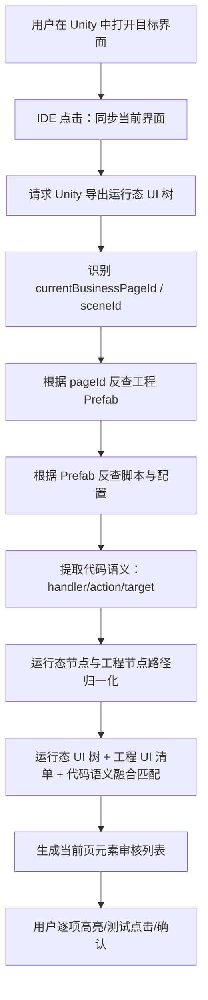

# AutoSmoke IDE 功能精简整合与代码语义索引增强方案

更新时间：2026-06-17

## 1. 背景

当前 AutoSmoke IDE 已经具备较多能力：

- 环境配置。
- Unity 连接。
- 运行态 UI 树刷新。
- 工程 UI 清单导入。
- 元素映射草稿生成。
- 运行态匹配。
- 截图与高亮。
- 视觉确认。
- 点击确认。
- 用例执行。
- 阻塞检测。
- 结果报告。

但当前界面存在两个问题：

1. 功能按钮逐渐变多，入口分散，用户需要记住很多操作顺序。
2. 元素识别主要依赖 UI 树、运行态坐标、截图高亮，能够解决“在哪里”，但对“这个元素是干什么的”判断还不够强。

因此下一阶段目标不是继续堆功能，而是把现有能力整理成三条主流程，并新增“代码语义索引”作为匹配增强层。

## 2. 总体目标

IDE 最终保持三大页签：

```text
准备
执行
结果
```

每个页签只保留主流程入口，不再把所有调试按钮平铺出来。

核心目标：

- 减少用户需要理解的按钮数量。
- 把重复功能合并成“一键流程”。
- 把调试功能折叠到高级面板。
- 让元素映射从“结构 + 运行态 + 视觉”升级为“结构 + 运行态 + 视觉 + 代码语义”。
- 让背包界面已验证的能力推广到所有 UI、弹窗、主城、大地图、建筑、奖励、引导、Loading、重连等场景。

## 3. 现有功能归类

### 3.1 准备页

准备页负责“能不能测”和“测什么”。

应包含：

```text
环境配置
Unity 连接
工程数据导入
运行态数据同步
代码语义索引
元素映射审核
页面/场景识别配置
用例导入
```

应隐藏或合并：

```text
单独刷新 Bridge
单独截图测试
单独导入 Project
单独导入 Current
单独导入 Runtime
单独导入 Pages
单独扫描
单独匹配当前页
```

这些不再作为主按钮平铺，而是合并到更高层流程里。

### 3.2 执行页

执行页负责“怎么跑”。

应包含：

```text
执行配置
运行预检
单用例执行
批量执行
自动探索
阻塞处理策略
实时日志
当前步骤状态
失败现场截图
```

应隐藏或合并：

```text
单独阻塞检测
单独阻塞处理
单独截图
单独点击测试
单独状态检查
```

这些应合并到“运行预检”和“步骤后守卫”中。

### 3.3 结果页

结果页负责“看结果、定位问题、复现问题”。

应包含：

```text
报告列表
用例结果详情
失败步骤详情
页面关系图
异常分类统计
截图/高亮/日志证据
复跑入口
导出报告
```

应隐藏或合并：

```text
散落的截图查看
单独关系图查看
单独日志查看
单独错误列表
```

这些应统一到结果详情面板中。

## 4. 精简后的 IDE 主流程

### 4.1 准备页主流程

准备页只暴露 4 个一级动作：

```text
1. 初始化环境
2. 同步工程数据
3. 同步当前界面
4. 审核元素映射
```

#### 4.1.1 初始化环境

点击后自动执行：

```text
检查 Unity 项目路径
检查 AutoSmoke 根目录
检查 Poco SDK 路径
检查 Python 依赖
检查 Unity Editor 是否打开
检查 Bridge 文件夹
检查截图通道
检查运行态 UI 树通道
```

输出：

```text
环境状态：通过 / 阻塞 / 警告
阻塞项列表
一键修复建议
```

用户不再需要分别点：

```text
一键检查
依赖检查
脚本状态
刷新 Bridge
截图测试
```

这些归并到初始化环境。

#### 4.1.2 同步工程数据

点击后自动执行：

```text
导入 project_ui_inventory.json
导入 enhanced_ui_tree.json
导入 pages 数据
导入图标/精灵信息
导入配置表摘要
导入代码语义索引
生成或更新元素映射草稿
```

输出：

```text
工程节点数
可点击候选数
新增草稿数
更新草稿数
代码语义命中数
缺失数据提示
```

用户不再需要区分：

```text
导入 Project
导入 Current
导入 Runtime
导入 Pages
手工导入
快速导入 Pages
```

这些变成“同步工程数据”的子步骤。

#### 4.1.3 同步当前界面

点击后自动执行：

```text
刷新运行态 UI 树
刷新 Unity 直出截图
识别当前业务页
识别当前场景
匹配当前页元素
补充运行态发现元素
生成当前页匹配摘要
```

输出：

```text
当前业务页
原始 Unity pageId
运行态节点数
有效点击数
工程草稿匹配数
运行态补充数
冲突数
缺失数
```

用户不再需要分别点：

```text
刷新运行态UI树
匹配当前页
刷新截图并生成高亮
```

正常流程里“同步当前界面”先做运行态和匹配，用户选元素后再按需生成高亮。

#### 4.1.4 审核元素映射

审核面板保留，但重新分区：

```text
左侧：元素列表
中间：截图高亮/当前界面预览
右侧：元素详情与确认操作
```

元素列表只保留必要筛选：

```text
全部
待审
已匹配
视觉确认
点击确认
冲突
缺失
运行态发现
当前页
```

高级筛选折叠：

```text
P0/P1/P2/P3
高信度
低信度
按钮
图标
页签
格子
弹窗空白
滚动
拖拽
疑似测试
纯页面
```

默认不展示这些高级筛选，避免界面拥挤。

## 5. 代码语义索引增强方案

### 5.1 为什么需要代码语义索引

当前 UI 树和运行态树可以确定：

```text
元素路径
元素坐标
元素是否可见
元素是否可点击
截图高亮位置
```

但不能稳定确定：

```text
按钮点击后调用什么函数
道具点击后打开 tips 还是使用
页签切换哪个分类
建筑按钮进入哪个功能
确认按钮是购买、领取、关闭还是跳转
```

读取工程对应界面代码后，可以补充：

```text
点击绑定函数
业务动作
参数
页面跳转目标
状态前置条件
预期结果
异常风险
```

这样元素映射可以从“这个地方能点”升级为“这个地方代表什么业务功能”。

### 5.2 新增数据文件

建议生成：

```text
E:\zdcs\AutoSmoke\metadata\ui_code_semantics.json
```

结构示例：

```json
{
  "schemaVersion": "ui_code_semantics/v1",
  "generatedAt": "2026-06-17T12:00:00",
  "projectRoot": "E:/s1/k3client/client",
  "pages": {
    "UIShop": {
      "prefab": "Assets/k1/K1D1/Res/UI/Panel/Shop/UIShop.prefab",
      "scripts": [
        "Assets/.../UIShop.lua",
        "Assets/.../UIShop.cs"
      ],
      "elements": {
        "Root/Shop/Content/Bag/Buttom_Other/UsedBtn": {
          "nodeName": "UsedBtn",
          "handler": "OnClickUse",
          "businessAction": "use_selected_bag_item",
          "requiresState": ["selectedBagItem"],
          "expectedResult": ["open_use_dialog", "consume_item", "refresh_bag"],
          "risk": ["requires_item_selected", "may_open_confirm_popup"]
        }
      }
    }
  }
}
```

### 5.3 扫描范围

第一阶段扫描：

```text
Prefab 文件
Lua 文件
C# 文件
UI 配置表
图标/道具配置表
页面打开配置
功能入口配置
```

优先级：

```text
1. 页面同名脚本
2. Prefab 引用脚本
3. UI 管理器注册表
4. Button/EventTrigger 绑定信息
5. 配置表里的 functionId / openId / itemId
```

### 5.4 代码语义提取内容

每个元素尽量提取：

```text
pageId
nodePath
nodeName
boundHandler
handlerFile
handlerLine
businessAction
actionType
targetPage
targetPopup
requiresState
expectedResult
relatedConfigId
relatedItemId
risk
```

actionType 建议枚举：

```text
open_page
open_popup
close_popup
switch_tab
select_item
show_tips
use_item
buy
claim_reward
go_to
scroll
drag
blank_close
unknown
```

### 5.5 与元素映射合并

元素映射中新增字段：

```json
{
  "codeSemantic": {
    "status": "matched",
    "handler": "OnClickUse",
    "actionType": "use_item",
    "businessAction": "use_selected_bag_item",
    "expectedResult": ["open_use_dialog"],
    "sourceFiles": ["UIShop.lua"],
    "confidence": 0.9
  }
}
```

IDE 右侧详情新增“代码语义”区域：

```text
绑定函数
功能类型
业务动作
预期结果
前置条件
来源文件
可信度
```

### 5.6 匹配优先级升级

现有优先级建议调整为：

```text
P0_PATH       运行态路径精确匹配
P1_CODE       代码语义绑定匹配
P2_TARGET     clickTargetNode 匹配
P3_PREFAB     Prefab 路径匹配
P4_TEXT       文本匹配
P5_SPRITE     图标/精灵匹配
P6_VISUAL     截图模板/OCR 辅助匹配
P7_MANUAL     人工补充
```

代码语义不替代运行态匹配，而是增强“这个元素是什么功能”的判断。

## 6. IDE 根据当前 Unity 界面反查工程代码并融合匹配的详细方案

### 6.1 目标

用户在 Unity 中打开任意界面后，IDE 点击一次：

```text
同步当前界面
```

IDE 应自动完成：

```text
1. 从 Unity 获取当前运行态 UI 树。
2. 识别当前业务页或当前场景。
3. 根据当前业务页反查工程 Prefab。
4. 根据 Prefab 反查对应 Lua/C#/配置代码。
5. 从代码中提取元素绑定函数和业务语义。
6. 将运行态 UI 树、工程 UI 清单、代码语义三者融合。
7. 生成当前界面的可审核元素列表。
8. 对每个元素给出中文说明、点击目标、功能含义、预期结果和风险。
```

最终 IDE 不是只显示：

```text
UsedBtn
Root/Shop/Content/Bag/Buttom_Other/UsedBtn
```

而是显示：

```text
使用按钮
功能：使用当前选中的背包道具
点击目标：Root/Shop/Content/Bag/Buttom_Other/UsedBtn
绑定函数：OnClickUse
前置条件：已选中一个可使用道具
预期结果：打开使用确认弹窗或消耗道具并刷新背包
风险：未选中道具时可能无响应或置灰
```

### 6.2 IDE 操作流程

准备页建议提供一个主按钮：

```text
同步当前界面
```

点击后内部流程如下：



前端只展示一个动作，底层分步骤展示状态：

```text
同步当前界面
├── 运行态 UI 树：完成
├── 当前业务页：UIShop
├── 工程 Prefab：已找到
├── 代码文件：已找到 2 个
├── 代码语义：命中 18 个元素
├── 运行态匹配：30 个
├── 运行态补充：13 个
└── 待人工确认：19 个
```

### 6.3 当前界面识别

输入：

```text
runtime_ui_tree_current.json
Unity 当前场景名
Unity 当前截图
可选：scene_interaction_tree.json
```

输出：

```json
{
  "sceneId": "DemoLogo",
  "rawPageId": "BtnClose",
  "currentBusinessPageId": "UIShop(Clone)_UIShopPop [UIShopPop]",
  "normalizedPageId": "UIShop",
  "pageType": "fullscreen_ui",
  "confidence": 0.92
}
```

识别规则：

```text
1. 优先识别最高层弹窗或全屏业务 Root。
2. 如果 pageId 是 BtnClose/BG/View/Tab/ViewPort，则不能直接作为当前页。
3. 从 ownerPageId 中选择业务页。
4. UIMain 属于常驻 HUD，除非没有业务页打开，否则不能作为当前页。
5. 主城/大地图没有全屏 UI 时，进入 scene 模式，而不是 UI page 模式。
```

归一化规则：

```text
UIShop(Clone)_UIShopPop [UIShopPop] -> UIShop
UIGmWindow(Clone) [UIGmWindow] -> UIGmWindow
ui4109Widgets(Clone) [UIMapWidgets] -> UIMapWidgets
```

建议实现函数：

```python
def normalize_page_id(runtime_page_id: str) -> str:
    ...

def detect_current_context(runtime_tree: dict, scene_tree: dict = None) -> dict:
    ...
```

### 6.4 根据当前页面反查工程 Prefab

输入：

```text
normalizedPageId = UIShop
project_ui_inventory.json
enhanced_ui_tree.json
Unity AssetDatabase 可选查询结果
```

查找顺序：

```text
1. enhanced_ui_tree.json 中 pageId == UIShop 的节点。
2. project_ui_inventory.json 中 prefab 名称 == UIShop.prefab。
3. Unity AssetDatabase 搜索 UIShop.prefab。
4. 模糊匹配 EXPORT_UIShop / UIShopPop / UIShop(Clone)。
5. 如果多个候选，按路径优先级选择业务目录。
```

Prefab 候选排序：

```text
Assets/k1/K1D1/Res/UI/Panel/**      高
Assets/NewGameDemo/Res/UI/Prefab/** 中
Assets/Framework/Debug/**           排除
Editor/Debug/Gm/Test                排除
```

输出：

```json
{
  "pageId": "UIShop",
  "prefabPath": "Assets/k1/K1D1/Res/UI/Panel/Shop/UIShop.prefab",
  "prefabRoot": "UIShop",
  "confidence": 0.95,
  "source": "enhanced_ui_tree"
}
```

IDE 右上角可以显示：

```text
当前工程页面：UIShop
Prefab：Assets/k1/K1D1/Res/UI/Panel/Shop/UIShop.prefab
```

### 6.5 根据 Prefab 反查代码文件

输入：

```text
pageId = UIShop
prefabPath = Assets/k1/K1D1/Res/UI/Panel/Shop/UIShop.prefab
```

查找来源：

```text
Lua 脚本
C# 脚本
UI 注册表
页面配置表
模块配置表
资源配置表
```

查找策略：

```text
1. 同名查找：
   UIShop.lua
   UIShop.cs
   UIShopView.lua
   UIShopPanel.lua
   UIShopCtrl.lua
   UIShopController.cs

2. 目录邻近：
   Prefab 在 Panel/Shop/UIShop.prefab
   优先搜索 Lua/Shop、Scripts/Shop、UI/Shop 等目录。

3. 引用查找：
   全工程搜索字符串 UIShop
   搜索 OpenUI("UIShop")
   搜索 Register("UIShop")
   搜索 require("UIShop")

4. Prefab 组件引用：
   如果 Prefab 上挂有 MonoBehaviour，读取 m_Script GUID。
   通过 .meta 反查脚本路径。

5. 配置表查找：
   页面配置表中 pageId == UIShop。
   功能入口配置中 targetPage == UIShop。
```

输出：

```json
{
  "pageId": "UIShop",
  "codeFiles": [
    {
      "path": "Assets/.../UIShop.lua",
      "type": "lua",
      "confidence": 0.95,
      "reason": "same_name"
    },
    {
      "path": "Assets/.../UIShopController.cs",
      "type": "csharp",
      "confidence": 0.75,
      "reason": "contains_page_id"
    }
  ]
}
```

### 6.6 从代码中提取元素绑定关系

需要扫描常见绑定模式。

Lua 常见模式示例：

```lua
self:AddClick(self.UsedBtn, self.OnClickUse)
self.UsedBtn.onClick:AddListener(function() self:OnClickUse() end)
UIEventListener.Get(self.UsedBtn).onClick = handler(self, self.OnClickUse)
self:RegisterClick("UsedBtn", self.OnClickUse)
```

C# 常见模式示例：

```csharp
UsedBtn.onClick.AddListener(OnClickUse);
btnClose.onClick.AddListener(() => Close());
UIEventListener.Get(UsedBtn).onClick = OnClickUse;
```

提取字段：

```json
{
  "nodeName": "UsedBtn",
  "nodePathHint": "Root/Shop/Content/Bag/Buttom_Other/UsedBtn",
  "handler": "OnClickUse",
  "handlerFile": "Assets/.../UIShop.lua",
  "handlerLine": 238,
  "bindPattern": "AddClick",
  "confidence": 0.9
}
```

如果代码里只有变量名，没有完整路径，则用这些信息反推节点：

```text
UsedBtn -> 所有 nodeName == UsedBtn 的节点
结合当前显示区域 / ownerPageId / runtimePath / 可见性再消歧
```

### 6.7 从处理函数中推断业务语义

绑定函数只能告诉“点击后调用什么”，还需要进一步解析函数体。

函数语义推断规则：

```text
函数名包含 Close/Back/Cancel       -> close_popup / back
函数名包含 Use                    -> use_item
函数名包含 Buy/Purchase/Pay        -> buy
函数名包含 Claim/Get/Reward        -> claim_reward
函数名包含 Go/Goto/Jump            -> go_to
函数名包含 Tab/Switch/SelectType   -> switch_tab
函数体调用 OpenUI/OpenPanel        -> open_page/open_popup
函数体调用 Close/Hide/Destroy      -> close_popup
函数体发送网络协议                 -> server_action
函数体读取 itemId/propId           -> item_related
```

输出：

```json
{
  "handler": "OnClickUse",
  "actionType": "use_item",
  "businessAction": "use_selected_bag_item",
  "requiresState": ["selectedBagItem"],
  "expectedResult": ["open_use_dialog", "refresh_bag_or_show_tip"],
  "risk": ["requires_selected_item", "may_be_disabled"],
  "confidence": 0.82
}
```

### 6.8 工程节点、运行态节点、代码语义三方融合

每个候选元素需要合并三类证据。

#### 6.8.1 输入 A：工程节点

```json
{
  "pageId": "UIShop",
  "path": "UIShop/Root/Shop/Content/Bag/Buttom_Other/UsedBtn",
  "nodeName": "UsedBtn",
  "clickable": true
}
```

#### 6.8.2 输入 B：运行态节点

```json
{
  "ownerPageId": "UIShop(Clone)_UIShopPop [UIShopPop]",
  "runtimePath": "Root/Shop/Content/Bag/Buttom_Other/UsedBtn",
  "screenRect": [380, 2376, 790, 2527],
  "effectiveClickable": true,
  "clickTargetNode": "Root/Shop/Content/Bag/Buttom_Other/UsedBtn"
}
```

#### 6.8.3 输入 C：代码语义

```json
{
  "nodeName": "UsedBtn",
  "handler": "OnClickUse",
  "actionType": "use_item",
  "businessAction": "use_selected_bag_item"
}
```

#### 6.8.4 输出：融合元素

```json
{
  "pageId": "UIShop",
  "displayName": "使用按钮",
  "runtimePath": "Root/Shop/Content/Bag/Buttom_Other/UsedBtn",
  "clickTargetNode": "Root/Shop/Content/Bag/Buttom_Other/UsedBtn",
  "screenRect": [380, 2376, 790, 2527],
  "codeSemantic": {
    "handler": "OnClickUse",
    "actionType": "use_item",
    "businessAction": "use_selected_bag_item"
  },
  "matchEvidence": {
    "pathScore": 1.0,
    "runtimeScore": 1.0,
    "codeScore": 0.9,
    "visualScore": 0.0
  },
  "confidence": 0.95,
  "reviewStatus": "runtime_matched"
}
```

### 6.9 融合匹配评分

建议评分模型：

```text
路径精确匹配        +0.40
当前业务页一致      +0.20
运行态可见可点击    +0.15
代码绑定函数命中    +0.15
业务语义命中        +0.05
文本/图标辅助命中   +0.05
```

扣分规则：

```text
跨当前业务页                     -1.00
Debug/Gm/Test                    -1.00
运行态不可见                     -0.50
只是 Quality/Icon/Text 子节点     -0.30
同一 clickTarget 已有更优节点      -0.30
大面积 BG/Content/Panel           -0.40
代码语义与元素类型冲突             -0.30
```

匹配等级：

```text
P0_RUNTIME_PATH   运行态路径精确
P1_CODE_BINDING   代码绑定函数命中
P2_CLICK_TARGET   点击目标一致
P3_PREFAB_PATH    工程 Prefab 路径一致
P4_TEXT_SPRITE    文本/图标辅助
P5_RUNTIME_ONLY   运行态发现，待人工确认
```

### 6.10 IDE 界面展示

元素详情右侧新增“代码语义”区：

```text
代码语义
├── 绑定函数：OnClickUse
├── 功能类型：use_item
├── 业务动作：使用当前选中道具
├── 前置条件：selectedBagItem
├── 预期结果：打开使用确认弹窗 / 刷新背包
├── 来源文件：UIShop.lua:238
└── 可信度：0.82
```

元素列表新增列或 hover 信息：

```text
功能
绑定函数
语义可信度
```

筛选新增：

```text
有代码语义
无代码语义
打开页面
关闭弹窗
切换页签
使用道具
领取奖励
购买
跳转
```

### 6.11 IDE 接口设计

#### 6.11.1 同步当前界面

```text
POST /api/prepare/sync_current_page
```

内部调用：

```text
1. /api/runtime_ui/refresh
2. /api/capture
3. /api/code_semantics/query_current_page
4. /api/mapping/runtime_match
5. /api/mapping/runtime_discover
```

返回：

```json
{
  "success": true,
  "context": {
    "sceneId": "DemoLogo",
    "currentBusinessPageId": "UIShop(Clone)_UIShopPop [UIShopPop]",
    "normalizedPageId": "UIShop",
    "pageType": "fullscreen_ui"
  },
  "project": {
    "prefabPath": "Assets/k1/K1D1/Res/UI/Panel/Shop/UIShop.prefab",
    "codeFiles": 2
  },
  "match": {
    "runtimeNodes": 626,
    "effectiveClickable": 141,
    "projectMatched": 30,
    "runtimeDiscovered": 13,
    "codeSemanticMatched": 18,
    "conflicts": 2
  }
}
```

#### 6.11.2 查询当前页代码语义

```text
POST /api/code_semantics/query_current_page
```

请求：

```json
{
  "pageId": "UIShop",
  "prefabPath": "Assets/k1/K1D1/Res/UI/Panel/Shop/UIShop.prefab"
}
```

返回：

```json
{
  "success": true,
  "pageId": "UIShop",
  "prefabPath": "Assets/k1/K1D1/Res/UI/Panel/Shop/UIShop.prefab",
  "codeFiles": [],
  "elementSemantics": []
}
```

#### 6.11.3 重建全工程代码语义索引

```text
POST /api/code_semantics/rebuild
```

用于“同步工程数据”阶段，不建议每次同步当前界面都全量扫描。

#### 6.11.4 查询单元素语义

```text
POST /api/code_semantics/query_element
```

请求：

```json
{
  "pageId": "UIShop",
  "nodeName": "UsedBtn",
  "runtimePath": "Root/Shop/Content/Bag/Buttom_Other/UsedBtn"
}
```

返回：

```json
{
  "handler": "OnClickUse",
  "actionType": "use_item",
  "businessAction": "use_selected_bag_item",
  "confidence": 0.82
}
```

### 6.12 文件模块设计

建议新增：

```text
E:\zdcs\AutoSmoke\元数据\code_semantic_indexer.py
E:\zdcs\AutoSmoke\元数据\current_page_code_resolver.py
E:\zdcs\AutoSmoke\元数据\semantic_fusion_matcher.py
E:\zdcs\AutoSmoke\metadata\ui_code_semantics.json
E:\zdcs\AutoSmoke\metadata\current_page_semantics.json
E:\zdcs\AutoSmoke\config\code_semantic_rules.json
```

职责：

```text
code_semantic_indexer.py
  全工程扫描，生成 ui_code_semantics.json

current_page_code_resolver.py
  根据当前 pageId/prefabPath 快速查询对应代码语义

semantic_fusion_matcher.py
  将工程节点、运行态节点、代码语义融合评分

code_semantic_rules.json
  函数名语义、绑定模式、排除目录、页面类型规则
```

### 6.13 性能策略

不能每次点击“同步当前界面”都全工程扫描代码。

分两级：

```text
同步工程数据：
  全量扫描工程代码，生成 ui_code_semantics.json。

同步当前界面：
  只根据当前 pageId 从 ui_code_semantics.json 查询。
  如果当前页索引缺失，再增量扫描当前页相关目录。
```

缓存策略：

```text
以文件路径 + mtime + size 判断是否需要重扫。
ui_code_semantics.json 记录每个源文件的 hash/mtime。
```

### 6.14 背包页示例

当前 Unity 打开背包页。

#### 运行态识别

```text
currentBusinessPageId = UIShop(Clone)_UIShopPop [UIShopPop]
normalizedPageId = UIShop
```

#### Prefab 反查

```text
Assets/k1/K1D1/Res/UI/Panel/Shop/UIShop.prefab
```

#### 代码反查

```text
UIShop.lua
UIShopController.cs
ShopConfig
ItemConfig
```

#### 融合结果

```text
特殊页签
  runtimePath: Root/Shop/Tab/Tab/View/Content/0
  actionType: switch_tab
  expectedResult: 切换到特殊分类

道具格子 1
  runtimePath: Root/Shop/Content/Bag/.../PropItem_1/ClickContent
  actionType: select_item/show_tips
  expectedResult: 选中道具或打开道具 tips

ResItem_1 加号
  runtimePath: Root/TopRes/ResItem_1/add
  actionType: go_to/buy/open_popup
  expectedResult: 打开资源获取/购买弹窗

使用按钮
  runtimePath: Root/Shop/Content/Bag/Buttom_Other/UsedBtn
  actionType: use_item
  expectedResult: 使用当前选中道具
```

### 6.15 验收标准

当前界面代码查询验收：

```text
打开 UIShop 后，IDE 能自动识别 normalizedPageId = UIShop。
IDE 能找到 UIShop.prefab。
IDE 能列出 UIShop 相关代码文件。
IDE 能至少识别 UsedBtn、页签、关闭按钮的绑定函数。
IDE 能把绑定函数显示到元素详情。
```

融合匹配验收：

```text
UiMain 常驻元素不会进入 UIShop 当前页匹配。
多个 UsedBtn 只保留当前可见且路径匹配的一个。
道具格子只保留实际点击目标，不显示 Quality/Icon 父子重复。
资源加号保留 add，不显示资源 Icon 重复。
页签显示中文分类名。
每个元素详情中能看到运行态证据 + 工程证据 + 代码语义证据。
```

推广到其它界面验收：

```text
奖励弹窗：确认按钮识别为 close_popup/claim_reward。
购买弹窗：购买按钮识别为 buy。
建筑菜单：功能按钮识别为 open_page/go_to。
主城场景：建筑对象来自 scene_interaction_tree，不和 UiMain 混淆。
大地图场景：地图对象和右侧 HUD 分离。
Loading：识别为状态页，不进入普通点击匹配。
重连：识别为阻塞状态，不进入普通点击匹配。
```

## 7. 全界面适配方案

### 6.1 当前背包页经验沉淀为通用规则

背包页已经暴露出这些通用问题：

```text
原始 pageId 可能是 ViewPort/BG/Tab/BtnClose
工程路径和运行态路径可能不一致
tab1/tab2 运行态可能变成 0/1
一个视觉元素会有多层子节点
Icon/Quality/ClickContent 可能都被识别成可点击
常驻 UiMain 不能混入弹窗页匹配
```

这些不能只为 UIShop 写死，需要抽象成通用规则：

```text
ownerPageId 归属页
currentBusinessPageId 当前业务页
runtimePath 归一化
tab 路径别名
点击目标分组
运行态发现去重
常驻 HUD 降权
业务页硬约束
```

### 6.2 页面类型分类

所有界面先分为：

```text
主界面 HUD
全屏页面
普通弹窗
奖励弹窗
确认弹窗
列表页面
背包/道具页面
建筑详情浮层
建筑功能呼出菜单
主城场景
大地图场景
Loading
重连
引导
Debug/GM
```

不同类型使用不同匹配策略。

例如：

```text
全屏页面：业务页硬约束
弹窗：最高层弹窗优先
主城/大地图：场景对象 + UI 覆盖层并行
奖励弹窗：文本 + 奖励格子 + 确认按钮
引导：手指/箭头/遮罩/目标区域
Loading：进度条 + 页面状态，不做点击
重连：状态识别 + 等待/恢复，不做普通遍历
```

### 6.3 当前业务页识别规则

当前业务页识别不再只看 Unity 返回的 `pageId`。

综合判断：

```text
最高层 Canvas
Root 路径
页面面积
可点击密度
弹窗遮罩
代码语义页面注册
运行态 ownerPageId
截图视觉特征
```

优先级：

```text
显式弹窗 > 全屏业务页 > 引导/Loading/重连 > 主城/大地图 > 常驻 HUD
```

### 6.4 运行态发现去重规则

运行态发现不能把所有有效点击节点都加入列表。

通用原则：

```text
一个实际点击目标只保留一个审核项
优先保留 clickTargetNode
有 Button/Toggle/EventTrigger 优先组件节点
道具格子优先 ClickContent 或格子根节点
资源加号保留 add，不保留 Icon
页签保留 tab 根节点，不保留 On/Off/Text
过滤 Quality/Icon/Text/Effect/Particle
过滤父级大容器 Item(Clone)/Content/BG
```

## 8. 精简后的界面布局

### 7.1 准备页布局

```text
准备
├── 环境状态卡片
├── 数据同步卡片
├── 当前界面卡片
└── 元素映射工作台
```

环境状态卡片：

```text
状态：通过 / 阻塞 / 警告
Unity 项目
AutoSmoke 根目录
Poco SDK
Bridge 状态
截图通道
运行态 UI 树通道
```

数据同步卡片：

```text
同步工程数据
生成代码语义索引
生成/更新映射草稿
```

当前界面卡片：

```text
同步当前界面
当前业务页
运行态节点数
有效点击数
匹配数
运行态发现数
冲突数
```

元素映射工作台：

```text
左：元素列表
中：截图高亮
右：详情/语义/确认
```

### 7.2 执行页布局

```text
执行
├── 执行配置
├── 用例选择
├── 运行控制
├── 实时步骤
└── 阻塞与异常
```

主按钮只保留：

```text
运行预检
运行当前用例
批量运行
停止
复跑失败
```

### 7.3 结果页布局

```text
结果
├── 概览
├── 用例结果
├── 失败详情
├── 页面关系图
└── 报告导出
```

主按钮只保留：

```text
查看报告
查看失败现场
复跑
导出
```

## 9. 旧功能合并清单

| 旧功能 | 新入口 | 说明 |
|---|---|---|
| 一键检查 | 准备/初始化环境 | 合并依赖、脚本、路径检查 |
| 依赖检查 | 准备/初始化环境 | 不再单独展示 |
| 脚本状态 | 准备/初始化环境 | 作为环境详情 |
| 刷新 Bridge | 准备/同步当前界面 | 自动执行 |
| 截图测试 | 准备/同步当前界面 | 自动执行或高级按钮 |
| 导入 Project | 准备/同步工程数据 | 合并 |
| 导入 Current | 准备/同步工程数据 | 合并 |
| 导入 Runtime | 准备/同步当前界面 | 合并 |
| 导入 Pages | 准备/同步工程数据 | 合并 |
| 手工导入 | 准备/同步工程数据/高级 | 折叠 |
| 扫描 | 准备/同步工程数据 | 合并 |
| 刷新运行态 UI 树 | 准备/同步当前界面 | 合并 |
| 匹配当前页 | 准备/同步当前界面 | 合并 |
| 刷新截图并生成高亮 | 元素详情 | 仅选中元素时出现 |
| 测试点击 | 元素详情 | 仅已匹配元素出现 |
| 视觉确认 | 元素详情 | 保留 |
| 点击确认 | 元素详情 | 保留 |
| 阻塞检测 | 执行/运行预检 | 合并 |
| 阻塞处理 | 执行/步骤后守卫 | 合并 |
| 查看关系图 | 结果/页面关系图 | 合并 |
| 查看日志 | 结果/失败详情 | 合并 |

## 10. 实施阶段

### 阶段 1：界面整理，不改核心逻辑

目标：

```text
减少按钮数量
合并入口
保留原接口
降低用户操作复杂度
```

实施：

```text
1. 准备页新增四个主按钮：
   初始化环境
   同步工程数据
   同步当前界面
   审核元素映射

2. 将旧按钮折叠到“高级工具”。

3. 元素映射筛选只默认显示常用筛选。

4. 右侧详情按信息类型分区：
   基础信息
   运行态匹配
   截图高亮
   代码语义
   审核动作
```

验收：

```text
普通用户不需要理解 Project/Current/Runtime/Pages 的区别
完成一次背包页审核不超过 4 个主动作
旧功能仍可在高级工具中找到
```

### 阶段 2：同步当前界面一键流程

目标：

```text
把刷新运行态、截图、当前页识别、匹配当前页、运行态发现合并
```

实施：

```text
1. 新增 /api/prepare/sync_current_page
2. 内部调用：
   /api/runtime_ui/refresh
   /api/capture
   /api/mapping/runtime_match
3. 返回统一摘要
4. 前端只展示一个“同步当前界面”按钮
```

验收：

```text
点击一次即可看到当前业务页
点击一次即可完成元素匹配
运行态发现不会出现重复 Quality/Icon/父容器
```

### 阶段 3：代码语义索引

目标：

```text
生成 ui_code_semantics.json
```

实施：

```text
1. 扫描 UI Prefab 和脚本文件。
2. 建立 pageId -> prefab -> script 的关系。
3. 提取 Button/EventTrigger/Toggle 绑定函数。
4. 解析 Lua/C# 中常见点击绑定模式。
5. 解析 open page / close / switch tab / use item / claim reward 等函数名语义。
6. 输出 ui_code_semantics.json。
```

验收：

```text
UIShop UsedBtn 能识别为 use_item
UIShop 页签能识别为 switch_tab
关闭按钮能识别为 close_popup
奖励按钮能识别为 claim_reward
```

### 阶段 4：代码语义合并到映射

目标：

```text
元素详情可以展示功能含义
匹配可以借助代码语义减少误判
```

实施：

```text
1. 元素映射新增 codeSemantic 字段。
2. runtime_matcher 增加 P1_CODE 评分层。
3. IDE 详情区展示代码语义。
4. 冲突列表中优先显示语义冲突原因。
```

验收：

```text
同名 Button 可以根据 handler 区分
多个 UsedBtn 可以根据当前可见区域和 handler 区分
道具图标可区分 show_tips / use_item / select_item
```

### 阶段 5：全界面/场景策略化

目标：

```text
背包页规则推广到所有页面和场景
```

实施：

```text
1. 建立 page_type_rules.json。
2. 每类页面定义：
   当前页识别规则
   可点击提取规则
   去重规则
   阻塞处理规则
   点击后预期
3. 主城/大地图接入 scene_interaction_tree。
4. 引导/Loading/重连接入状态识别。
```

验收：

```text
背包、奖励弹窗、确认弹窗、建筑菜单、主城、大地图至少各通过一个样例
UiMain 常驻元素不会污染弹窗页
场景对象和 UI 对象能分别审核
```

## 11. 验收标准

### 10.1 界面精简验收

```text
准备页默认可见主按钮不超过 4 个
执行页默认可见主按钮不超过 5 个
结果页默认可见主按钮不超过 4 个
高级工具默认折叠
用户能按从上到下流程完成操作
```

### 10.2 元素映射验收

```text
当前页只匹配当前业务页元素
常驻 UiMain 不污染弹窗页
同一点击目标不重复出现多个审核项
运行态发现项有中文说明
每个已匹配元素能生成高亮
每个正式执行元素必须 click_confirmed
```

### 10.3 代码语义验收

```text
至少覆盖 80% 有绑定函数的按钮
至少覆盖常见动作类型：
open_page
open_popup
close_popup
switch_tab
select_item
show_tips
use_item
buy
claim_reward
go_to
```

### 10.4 全界面验收

```text
背包页：道具、页签、资源加号、使用按钮正确
奖励弹窗：奖励格子、确认按钮正确
确认弹窗：确认、取消、空白关闭正确
建筑菜单：建筑按钮和呼出功能按钮正确
主城：场景对象和 HUD 分离
大地图：场景对象和 UI 覆盖层分离
Loading：识别状态，不误点击
重连：识别状态，不误判为空页面
引导：识别目标区域，按引导策略点击
```

## 12. 风险与处理

### 11.1 代码格式复杂

风险：

```text
Lua/C# 绑定方式不统一，静态扫描可能漏掉。
```

处理：

```text
先做规则扫描，再允许人工补语义。
IDE 中保留“人工设置 actionType / expectedResult”。
```

### 11.2 运行态和工程态路径不一致

风险：

```text
tab1 -> 0
Item -> Item(Clone)
Prefab 路径和 runtimePath 不一致
```

处理：

```text
维护 runtime_path_alias_rules.json。
所有别名规则集中配置，不写死在散落代码中。
```

### 11.3 运行态发现过多

风险：

```text
Quality/Icon/Text/Effect 被当作可点击。
```

处理：

```text
按点击目标分组。
只保留最高优先级节点。
过滤视觉子节点。
```

### 11.4 当前页识别错误

风险：

```text
常驻 UIMain 节点数量多，可能抢当前页。
```

处理：

```text
弹窗/业务 Root 优先。
UIMain 降权。
当前业务页硬约束。
主城/大地图使用场景类型，不走普通弹窗页规则。
```

## 13. 推荐下一步

优先顺序：

```text
1. 先做 IDE 界面精简，把操作入口收拢。
2. 再做“同步当前界面”一键流程。
3. 然后做代码语义索引器。
4. 最后把代码语义接入匹配评分和元素详情。
```

建议先实现的文件：

```text
E:\zdcs\AutoSmoke\元数据\code_semantic_indexer.py
E:\zdcs\AutoSmoke\metadata\ui_code_semantics.json
E:\zdcs\AutoSmoke\config\runtime_path_alias_rules.json
E:\zdcs\AutoSmoke\config\page_type_rules.json
```

IDE 侧建议新增接口：

```text
POST /api/prepare/init_environment
POST /api/prepare/sync_project_data
POST /api/prepare/sync_current_page
POST /api/prepare/build_code_semantics
GET  /api/prepare/summary
```

最终用户只需要理解：

```text
准备：先同步数据并确认元素
执行：选择用例并运行
结果：查看报告并定位问题
```

