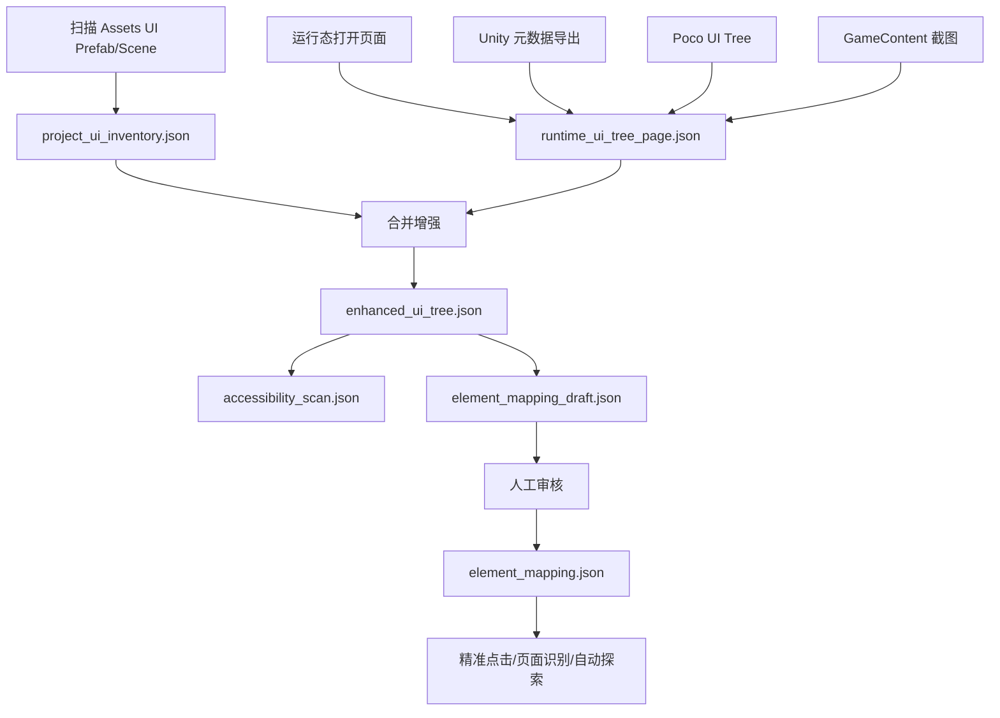

# AutoSmoke UI 树与元素资料完整提取执行方案

## 1. 目标

本方案用于解决：

```text
如何从 Unity 游戏工程中完整提取 UI 树与元素资料，
并服务于自动点击、页面识别、弹窗遍历、元素映射、业务断言和报告输出。
```

最终目标：

- 自动发现工程中所有 UI 页面、弹窗、按钮、文本、列表、输入框。
- 运行时采集当前真实界面的 UI 树、坐标、可见性、可交互性。
- 合并工程态和运行态数据。
- 自动生成元素映射草稿。
- 支撑精准点击和页面关系图生成。
- 支撑后续 IDE 内元素查看、搜索、反查、确认。

## 2. 核心结论

“完整 UI 树与元素资料”不能只靠 Poco，也不能只靠工程 prefab 扫描。

必须拆成三层：

| 层级 | 名称 | 作用 |
|---|---|---|
| 工程态 | Project UI Inventory | 扫描工程中所有 UI prefab / scene，知道有哪些页面和按钮 |
| 运行态 | Runtime UI Tree | 采集当前真实显示界面，知道元素坐标、可见性、可点击性 |
| 映射态 | Element Mapping | 将元素转换成 testId / semanticId / pageId / role |

最终链路：

```text
工程态扫描所有 UI 资源
  + 运行态采集真实 UI 树
    + 截图/坐标/文本/组件增强
      -> enhanced_ui_tree.json
        -> element_mapping_draft.json
          -> 人工确认
            -> element_mapping.json
```

## 3. 为什么不能只用 Poco

Poco 只能拿到：

```text
当前运行时已经实例化的节点
```

拿不到：

- 没打开过的页面。
- 未实例化的 prefab。
- ScrollView 未加载的列表项。
- 没进入过的弹窗。
- 资源目录里的全部按钮。

而且当前 Poco UI 树存在：

```text
clickable 大量 False
type 大量 Node
命名规范混乱
```

因此 Poco 只能作为运行态真实坐标来源之一，不能作为完整元素资料来源。

## 4. 总体架构



## 5. 输出目录规划

建议统一输出到：

```text
E:\zdcs\AutoSmoke\runtime\ui_tree\
```

目录结构：

```text
runtime/ui_tree/
├── project_ui_inventory.json
├── current_ui_tree.json
├── enhanced_ui_tree.json
├── accessibility_scan.json
├── element_mapping_draft.json
├── element_mapping.json
├── pages/
│   ├── MainCity.json
│   ├── WorldMap.json
│   ├── BagPanel.json
│   ├── RewardPopup.json
│   └── BuildingMenu.json
├── screenshots/
│   ├── MainCity.png
│   ├── BagPanel.png
│   └── RewardPopup.png
└── reports/
    ├── ui_inventory_report.html
    └── accessibility_report.html
```

## 6. 工程态扫描方案

### 6.1 目标

扫描 Unity 工程资源，发现所有可能存在的 UI 页面和元素。

### 6.2 扫描范围

```text
Assets/**/*.prefab
Assets/**/*.unity
Assets/**/*.asset
```

优先扫描目录：

```text
Assets/UI/
Assets/Resources/
Assets/AddressableAssets/
Assets/Bundle/
Assets/Game/UI/
Assets/HotUpdate/
```

实际目录可通过配置指定。

### 6.3 扫描对象

| 类型 | 组件 |
|---|---|
| 页面/面板 | Canvas、Panel、Dialog、Window、View |
| 按钮 | Button、EventTrigger、自定义点击脚本 |
| 文本 | Text、TMP_Text、TextMeshProUGUI |
| 图片 | Image、RawImage |
| 图标 | 道具图标、奖励图标、资源图标、建筑图标、活动图标 |
| 输入 | InputField、TMP_InputField |
| 开关 | Toggle |
| 滑动 | Slider、Scrollbar |
| 列表 | ScrollRect、GridLayoutGroup、VerticalLayoutGroup |
| 遮罩 | Mask、RectMask2D、CanvasGroup |
| 自定义脚本 | MonoBehaviour |

### 6.4 Unity 脚本

新增：

```text
Assets/AutoSmoke/Editor/AutoSmokeUIPrefabScanner.cs
```

菜单：

```text
AutoSmoke/UI/Scan All UI Prefabs
AutoSmoke/UI/Scan All Scenes
AutoSmoke/UI/Export Project UI Inventory
```

### 6.5 输出字段

```json
{
  "schemaVersion": 1,
  "timestamp": "2026-06-15T19:00:00",
  "projectPath": "E:/project/client",
  "prefabs": [
    {
      "assetPath": "Assets/UI/Bag/BagPanel.prefab",
      "guid": "xxxx",
      "rootName": "BagPanel",
      "category": "panel",
      "nodes": [
        {
          "path": "BagPanel/Bottom/ButtonUse",
          "name": "ButtonUse",
          "components": ["RectTransform", "Button", "Image", "TMP_Text"],
          "text": "使用",
          "clickableByComponent": true,
          "customScripts": ["BagUseButton"],
          "rectTransform": {
            "anchorMin": [0.5, 0],
            "anchorMax": [0.5, 0],
            "pivot": [0.5, 0.5],
            "sizeDelta": [240, 80]
          }
        }
      ]
    }
  ]
}
```

### 6.6 工程态能解决什么

可以发现：

- 所有 UI prefab。
- 所有按钮。
- 所有文本。
- 命名规范问题。
- Missing Script。
- Missing Reference。
- 没有 testId 的节点。
- 没有文本或语义的按钮。
- 所有图标资源引用，例如 spriteName、atlasName、textureName。
- 图标所在 prefab、父节点、可能的业务绑定关系。

不能解决：

- 运行时是否可见。
- 当前屏幕坐标。
- 动态列表实际数据。
- Clone 实例路径。
- 被遮挡状态。
- 图标当前代表的具体运行时数据，例如当前奖励里的 itemId/count。

## 6.7 图标资源工程态扫描

图标不能只当作普通 `Image` 处理。

在 SLG 游戏中，很多图标具备交互行为：

```text
点击道具图标 -> 打开道具 Tips
点击奖励图标 -> 打开奖励详情
点击建筑头顶图标 -> 呼出建筑菜单
点击活动图标 -> 进入活动界面
点击资源图标 -> 打开获取更多或来源说明
```

因此工程态扫描需要单独收集图标类元素。

### 6.7.1 需要识别的图标类型

| 图标类型 | 示例 | 是否可能点击 |
|---|---|---|
| 道具图标 | 高级招募券、加速道具 | 是 |
| 奖励图标 | 奖励弹窗中的物品 | 是 |
| 资源图标 | 金币、粮食、钻石 | 可能 |
| 建筑图标 | 建筑头顶状态图标 | 是 |
| 活动图标 | 右侧活动入口 | 是 |
| Tips 图标 | Tips 内图标 | 可能 |
| 装饰图标 | 分割线、小装饰 | 否 |

### 6.7.2 工程态图标字段

工程态扫描 Image / RawImage 时，建议额外导出：

```json
{
  "path": "BagPanel/ItemCell/Icon",
  "name": "Icon",
  "component": "Image",
  "spriteName": "icon_item_1001",
  "atlasName": "item_icons",
  "textureName": "",
  "materialName": "",
  "raycastTarget": true,
  "parentClickable": true,
  "possibleIconType": "item",
  "possibleClickAction": "open_item_tips",
  "prefabPath": "Assets/UI/Bag/ItemCell.prefab"
}
```

### 6.7.3 图标与配置表关联

如果项目有道具、资源、活动、建筑配置表，建议建立关联：

```text
itemId -> itemName -> iconName -> quality -> itemType
buildingId -> buildingName -> iconName
activityId -> activityName -> iconName
```

这样可以从图标资源反推业务含义。

示例：

```json
{
  "itemId": 1001,
  "itemName": "高级招募券",
  "iconName": "icon_item_1001",
  "quality": 4,
  "itemType": "recruit_ticket"
}
```

## 7. 运行态采集方案

### 7.1 目标

在 Unity Play Mode 中采集当前真实界面的 UI 树。

### 7.2 采集内容

| 字段 | 说明 |
|---|---|
| `path` | GameObject 路径 |
| `name` | 节点名 |
| `activeInHierarchy` | 是否激活 |
| `visible` | 是否可见 |
| `interactable` | 是否可交互 |
| `clickable` | 是否可点击 |
| `components` | 组件列表 |
| `text` | Text/TMP 文本 |
| `screenRect` | 屏幕坐标 |
| `gameContentRect` | GameContent 坐标 |
| `normalizedRect` | 归一化坐标 |
| `canvas` | 所属 Canvas |
| `sortingOrder` | 层级 |
| `siblingIndex` | 同级顺序 |
| `raycastTarget` | 是否接收射线 |
| `buttonInteractable` | Button 是否可用 |
| `canvasGroupAlpha` | CanvasGroup alpha |
| `prefabSource` | 对应 prefab 来源 |
| `iconInfo` | 图标资源和业务对象信息 |
| `visualNode` | 实际显示图标的节点 |
| `clickTargetNode` | 实际接收点击的节点 |

### 7.3 Unity 脚本

新增：

```text
Assets/AutoSmoke/Editor/AutoSmokeUITreeExporter.cs
```

菜单：

```text
AutoSmoke/UI/Export Current UI Tree
AutoSmoke/UI/Export Current UI Tree With Screenshot
AutoSmoke/UI/Start UI Tree Bridge
AutoSmoke/UI/Stop UI Tree Bridge
```

### 7.4 运行态输出

```json
{
  "schemaVersion": 1,
  "timestamp": "2026-06-15T19:10:00",
  "scene": "MainCity",
  "pageId": "BagPanel",
  "gameResolution": {
    "width": 1170,
    "height": 2532
  },
  "nodes": [
    {
      "path": "DeepUI/DialogUI/BagPanel/ButtonUse",
      "name": "ButtonUse",
      "activeInHierarchy": true,
      "visible": true,
      "interactable": true,
      "clickable": true,
      "components": ["RectTransform", "Button", "Image", "TMP_Text"],
      "text": "使用",
      "screenRect": {
        "x": 465,
        "y": 2180,
        "width": 240,
        "height": 80
      },
      "normalizedRect": {
        "x": 0.397,
        "y": 0.861,
        "width": 0.205,
        "height": 0.032
      },
      "roleGuess": "primary_button"
    }
  ]
}
```

### 7.5 可见性判断

可见性不能只看 `activeInHierarchy`。

需要综合：

```text
activeInHierarchy
RectTransform size > 0
CanvasGroup alpha > 0.01
CanvasGroup interactable
Image/Text alpha > 0.01
是否在 GameContent 范围内
是否被上层遮挡
```

### 7.6 可点击性判断

可点击性来源：

```text
Button.interactable
Toggle.interactable
InputField.interactable
EventTrigger
IPointerClickHandler
自定义点击脚本
raycastTarget
```

如果 Poco 的 clickable 不准，以 Unity 组件判断为主。

### 7.7 图标运行态采集

运行态需要采集当前界面上真实出现的图标实例。

尤其是以下场景：

- 背包道具格子。
- 奖励领取弹窗。
- 获取更多列表。
- 活动入口。
- 建筑头顶图标。
- 任务奖励图标。
- 商店商品图标。

运行态图标输出示例：

```json
{
  "pageId": "RewardPopup",
  "icons": [
    {
      "iconId": "RewardPopup.ItemIcon.1001",
      "iconType": "item",
      "itemId": 1001,
      "itemName": "高级招募券",
      "count": 2,
      "spriteName": "icon_item_1001",
      "visualNode": "RewardPopup/RewardList/Item_0/Icon",
      "clickTargetNode": "RewardPopup/RewardList/Item_0",
      "clickable": true,
      "clickAction": "open_item_tips",
      "tipsTarget": "ItemTipsPanel",
      "screenRect": {
        "x": 95,
        "y": 320,
        "width": 80,
        "height": 80
      },
      "clickTargetRect": {
        "x": 80,
        "y": 305,
        "width": 110,
        "height": 110
      }
    }
  ]
}
```

### 7.8 visualNode 与 clickTargetNode

图标类元素经常存在：

```text
看到的是 Icon
真正接收点击的是父节点 ItemCell
```

例如：

```text
ItemCell
  ├── Bg
  ├── Icon
  ├── Count
  └── QualityFrame
```

此时应记录：

```json
{
  "visualNode": "ItemCell/Icon",
  "clickTargetNode": "ItemCell"
}
```

自动点击时应点击 `clickTargetNode`，不是盲目点击 `visualNode`。

### 7.9 图标是否可点击的判断规则

判断优先级：

| 优先级 | 规则 | 说明 |
|---|---|---|
| P0 | 图标或父节点挂 Button / Toggle | 明确可点击 |
| P0 | 图标或父节点挂 EventTrigger | 明确可点击 |
| P1 | 实现 `IPointerClickHandler` / `IPointerDownHandler` | 可点击 |
| P1 | 父节点为 ItemCell / RewardCell / ActivityEntry | 高概率可点击 |
| P2 | 自定义脚本名包含 Item / Reward / Icon / Tips / Click | 可能可点击 |
| P3 | 自动探索点击后出现 TipsPanel | 确认可点击 |
| P4 | 无事件、无变化 | 纯展示图标 |

图标最终分类：

```text
interactive_icon
display_icon
unknown_icon
```

## 8. 页面级采集流程

### 8.1 人工打开采集

第一阶段建议人工打开页面后导出。

流程：

```text
1. 手动打开主城
2. 点击 AutoSmoke/UI/Export Current UI Tree With Screenshot
3. 保存 MainCity.json + MainCity.png
4. 手动打开背包
5. 导出 BagPanel.json + BagPanel.png
6. 手动打开弹窗
7. 导出 RewardPopup.json + RewardPopup.png
```

### 8.2 用例驱动采集

第二阶段由用例打开页面。

流程：

```text
1. 执行步骤：点击底部背包按钮
2. 等待 BagPanel 出现
3. 自动导出 BagPanel UI 树
4. 执行步骤：点击使用按钮
5. 等待 RewardPopup 出现
6. 自动导出 RewardPopup UI 树
```

### 8.3 自动探索采集

第三阶段通过可点击元素自动探索页面关系。

流程：

```text
1. 导出当前页面 UI 树
2. 找出可点击元素
3. 逐个点击
4. 检测页面变化
5. 新页面导出 UI 树
6. 返回上一页面
7. 记录页面关系图
```

## 9. 工程态与运行态合并

### 9.1 合并目标

将工程态和运行态数据合并成：

```text
enhanced_ui_tree.json
```

该文件同时包含：

- prefab 来源。
- 运行时路径。
- 运行时坐标。
- 组件信息。
- 文本。
- 可见性。
- 可点击性。
- 语义推断。

### 9.2 合并依据

匹配规则：

| 优先级 | 匹配依据 |
|---|---|
| P0 | prefab instance id / source prefab |
| P1 | GameObject path suffix |
| P2 | 节点名 + 组件组合 |
| P3 | 文本 + 位置 |
| P4 | 人工绑定 |

### 9.3 输出示例

```json
{
  "pageId": "BagPanel",
  "nodes": [
    {
      "runtimePath": "DeepUI/DialogUI/BagPanel/ButtonUse",
      "prefabPath": "Assets/UI/Bag/BagPanel.prefab",
      "prefabNodePath": "BagPanel/Bottom/ButtonUse",
      "name": "ButtonUse",
      "text": "使用",
      "clickable": true,
      "visible": true,
      "screenRect": {},
      "components": ["Button", "Image", "TMP_Text"],
      "semanticGuess": "背包.使用按钮",
      "confidence": 0.88
    }
  ]
}
```

## 10. 元素映射草稿生成

### 10.1 目标

自动生成：

```text
element_mapping_draft.json
```

供人工审核。

### 10.2 语义推断规则

| 信号 | 示例 | 权重 |
|---|---|---|
| 页面名 | `BagPanel` | 高 |
| 节点名 | `ButtonUse` | 高 |
| 文本 | `使用` | 高 |
| 父节点 | `Bottom` | 中 |
| 组件 | `Button` | 中 |
| 位置 | 底部主按钮 | 中 |
| 图标资源名 | `icon_use` | 中 |
| 自定义脚本名 | `BagUseButton` | 高 |
| 图标资源名 | `icon_item_1001` | 中 |
| 配置表关联 | `itemId=1001` | 高 |

### 10.3 输出示例

```json
{
  "drafts": [
    {
      "draftId": "draft_0001",
      "pageId": "BagPanel",
      "suggestedTestId": "Bag.UseButton",
      "suggestedSemanticId": "背包.使用按钮",
      "displayName": "使用按钮",
      "chineseDescription": "背包界面底部的黄色【使用】按钮，用于使用当前选中的道具。",
      "reviewHint": "截图中位于背包界面底部中间，按钮文字为“使用”。",
      "runtimePath": "DeepUI/DialogUI/BagPanel/ButtonUse",
      "prefabPath": "Assets/UI/Bag/BagPanel.prefab",
      "text": "使用",
      "role": "primary_action_button",
      "confidence": 0.88,
      "evidence": {
        "pageName": "BagPanel",
        "nodeName": "ButtonUse",
        "text": "使用",
        "component": "Button",
        "position": "bottom_center"
      },
      "reviewStatus": "pending"
    }
  ]
}
```

### 10.4 中文描述字段要求

映射草稿必须包含人工可读的中文描述，否则无法高效审核。

每个草稿至少包含：

| 字段 | 是否必填 | 示例 | 说明 |
|---|:---:|---|---|
| `displayName` | 是 | `使用按钮` | 简短中文名称 |
| `chineseDescription` | 是 | `背包界面底部的黄色【使用】按钮，用于使用当前选中的道具。` | 详细中文描述 |
| `reviewHint` | 是 | `截图中位于底部中间，按钮文字为“使用”。` | 人工核对提示 |
| `suggestedSemanticId` | 是 | `背包.使用按钮` | 语义 ID |
| `suggestedTestId` | 是 | `Bag.UseButton` | 建议 testId |
| `evidence` | 是 | `{ text, nodeName, component, position }` | 自动推断依据 |
| `screenshotRef` | 建议 | `screenshots/BagPanel.png` | 对应截图 |
| `highlightRect` | 建议 | `{x,y,width,height}` | 截图高亮区域 |

中文描述生成规则：

```text
页面中文名 + 位置 + 外观/文本 + 元素类型 + 作用
```

示例：

```text
背包界面底部中间的黄色【使用】按钮，用于使用当前选中的道具。
奖励弹窗中部的高级招募券图标，点击后应打开道具详情 Tips。
主城右侧的【孤岛试炼】活动入口按钮，点击后进入孤岛试炼活动界面。
建筑菜单中兵营下方的绿色升级按钮，用于进入兵营升级流程。
```

### 10.5 中文描述生成依据

自动生成中文描述时，按以下优先级提取信息：

| 优先级 | 来源 | 示例 |
|---|---|---|
| P0 | 文本组件 | `使用`、`确定`、`前往` |
| P0 | 页面名映射 | `BagPanel -> 背包界面` |
| P0 | 配置表 | `itemId=1001 -> 高级招募券` |
| P1 | 节点名 | `ButtonUse -> 使用按钮` |
| P1 | 图标资源名 | `icon_item_1001 -> 高级招募券图标` |
| P1 | 组件类型 | `Button -> 按钮`、`Image -> 图标` |
| P2 | 位置 | `bottom_center -> 底部中间` |
| P2 | 父节点 | `RewardList -> 奖励列表` |
| P3 | 人工补充 | 审核时手动填写 |

### 10.6 页面中文名映射

建议维护页面中文名字典：

```json
{
  "MainCity": "主城界面",
  "WorldMap": "大地图界面",
  "BagPanel": "背包界面",
  "RewardPopup": "奖励弹窗",
  "ItemTipsPanel": "道具详情弹窗",
  "BuildingMenu": "建筑功能菜单"
}
```

### 10.7 role 中文名映射

建议维护 role 中文名字典：

```json
{
  "primary_action_button": "主操作按钮",
  "confirm_button": "确认按钮",
  "close_button": "关闭按钮",
  "interactive_item_icon": "可点击道具图标",
  "activity_entry": "活动入口",
  "building_action_button": "建筑功能按钮",
  "tab_button": "页签按钮"
}
```

### 10.8 图标映射草稿

图标如果可点击，也应生成映射草稿。

示例：

```json
{
  "draftId": "draft_icon_0001",
  "pageId": "RewardPopup",
  "suggestedTestId": "RewardPopup.ItemIcon.1001",
  "suggestedSemanticId": "奖励弹窗.道具图标.高级招募券",
  "displayName": "高级招募券图标",
  "chineseDescription": "奖励弹窗中的【高级招募券】道具图标，数量为 2，点击后应打开高级招募券的道具详情 Tips。",
  "reviewHint": "截图中位于奖励弹窗奖励列表内，图标为金色招募券，右下角数量显示 2。",
  "role": "interactive_item_icon",
  "iconType": "item",
  "dataId": 1001,
  "dataName": "高级招募券",
  "visualNode": "RewardPopup/RewardList/Item_0/Icon",
  "clickTargetNode": "RewardPopup/RewardList/Item_0",
  "clickAction": "open_item_tips",
  "expectedTarget": "ItemTipsPanel",
  "confidence": 0.86,
  "evidence": {
    "itemId": 1001,
    "itemName": "高级招募券",
    "spriteName": "icon_item_1001",
    "count": 2,
    "expectedAfterClick": "ItemTipsPanel"
  },
  "reviewStatus": "pending"
}
```

正式映射中应保留：

```json
{
  "RewardPopup.ItemIcon.1001": {
    "testId": "RewardPopup.ItemIcon.1001",
    "semanticId": "奖励弹窗.道具图标.高级招募券",
    "pageId": "RewardPopup",
    "role": "interactive_item_icon",
    "data": {
      "type": "item",
      "id": 1001,
      "name": "高级招募券"
    },
    "locator": {
      "type": "clickTargetNode",
      "value": "RewardPopup/RewardList/Item_0"
    },
    "visualNode": "RewardPopup/RewardList/Item_0/Icon",
    "click": {
      "method": "unity_event_system",
      "safePoint": "center",
      "expectedAfterClick": "ItemTipsPanel"
    }
  }
}
```

## 11. 人工审核与确认

### 11.1 审核状态

| 状态 | 含义 |
|---|---|
| `pending` | 待审核 |
| `confirmed` | 确认使用 |
| `modified` | 人工修改 |
| `ignored` | 暂不处理 |
| `rejected` | 错误候选 |

### 11.2 IDE 功能

IDE 中应提供：

- 元素列表。
- 默认展示中文名称 `displayName`。
- 默认展示中文描述 `chineseDescription`。
- 默认展示核对提示 `reviewHint`。
- 展示自动推断依据 `evidence`。
- 按页面筛选。
- 按 role 筛选。
- 按文本搜索。
- 截图中高亮元素区域。
- 点击截图区域反查元素。
- 编辑 `testId / semanticId / role / pageId`。
- 保存正式映射。

### 11.3 人工审核列表推荐列

| 列 | 示例 | 说明 |
|---|---|---|
| 状态 | `pending` | 审核状态 |
| 中文名称 | `使用按钮` | 人最先看的字段 |
| 中文描述 | `背包界面底部的黄色【使用】按钮...` | 判断是否正确 |
| 页面 | `背包界面` | 页面中文名 |
| 类型 | `主操作按钮` | role 中文名 |
| 文本 | `使用` | UI 文本 |
| 建议 testId | `Bag.UseButton` | 可编辑 |
| 建议 semanticId | `背包.使用按钮` | 可编辑 |
| 置信度 | `0.88` | 自动推断可信度 |
| 路径 | `DeepUI/DialogUI/...` | 技术定位信息 |

审核操作：

```text
确认
修改
忽略
拒绝
截图高亮
反查相邻元素
打开所在页面截图
```

### 11.4 正式映射输出

```json
{
  "Bag.UseButton": {
    "testId": "Bag.UseButton",
    "semanticId": "背包.使用按钮",
    "displayName": "使用按钮",
    "chineseDescription": "背包界面底部的黄色【使用】按钮，用于使用当前选中的道具。",
    "pageId": "BagPanel",
    "role": "primary_action_button",
    "locator": {
      "type": "runtimePath",
      "value": "DeepUI/DialogUI/BagPanel/ButtonUse"
    },
    "fallbackLocators": [
      {
        "type": "text",
        "value": "使用"
      }
    ],
    "click": {
      "method": "unity_event_system",
      "safePoint": "center"
    }
  }
}
```

## 12. 可测试性扫描

### 12.1 扫描项

| 问题 | 说明 |
|---|---|
| 缺少 testId | 自动化定位不稳定 |
| clickable 不明确 | 点击目标不可靠 |
| 文本为空 | 无法语义识别 |
| 重名节点 | 容易误点 |
| Missing Reference | 运行风险 |
| Missing Script | 工程风险 |
| Button 无响应脚本 | 点击无效风险 |
| RectTransform 尺寸为 0 | 不可见 |
| 被遮挡 | 不可点击 |

### 12.2 输出

```json
{
  "score": 78,
  "issues": [
    {
      "severity": "high",
      "pageId": "BagPanel",
      "path": "BagPanel/Bottom/ButtonUse",
      "issue": "missing_test_id",
      "suggestion": "Add testId Bag.UseButton"
    }
  ]
}
```

## 13. 场景对象补充扫描

主城和大地图中有很多对象不是 UI。

需要新增：

```text
AutoSmokeSceneObjectExporter.cs
```

采集：

- 建筑
- 资源点
- 船
- NPC
- 怪物
- 岛屿
- 引导目标

输出：

```json
{
  "scene": "MainCity",
  "objects": [
    {
      "objectId": "Building.Barracks",
      "name": "Barracks",
      "path": "MainCityRoot/Buildings/Barracks",
      "worldPosition": [10, 0, 20],
      "screenRect": {},
      "clickable": true
    }
  ]
}
```

## 14. 与自动点击的关系

UI 树与元素资料用于：

```text
用例目标 -> element_mapping -> Unity GameObject -> EventSystem 注入点击
```

点击不依赖截图坐标。

截图只用于：

- 元素高亮。
- 人工审核。
- 报告留证。
- OCR/模板兜底。

## 15. 与页面关系图的关系

每次自动探索记录：

```json
{
  "fromPage": "MainCity",
  "action": "click",
  "element": "MainCity.BagButton",
  "toPage": "BagPanel"
}
```

最终生成：

```text
page_graph.json
page_graph.html
```

用于展示：

- 页面入口。
- 弹窗关系。
- 返回路径。
- 死路页面。
- 危险操作入口。

## 16. 执行步骤

### 阶段一：工程态扫描

输出：

```text
project_ui_inventory.json
```

验收：

- 能扫描出 UI prefab。
- 能识别 Button/Text/TMP。
- 能识别 Missing Script/Reference。

### 阶段二：运行态导出

输出：

```text
pages/MainCity.json
pages/BagPanel.json
pages/RewardPopup.json
```

验收：

- 能导出真实坐标。
- 能判断可见性。
- 能判断可交互性。

### 阶段三：合并增强

输出：

```text
enhanced_ui_tree.json
```

验收：

- runtimePath 和 prefabPath 可关联。
- 每个按钮有 roleGuess。
- 每个可点击元素有 screenRect/normalizedRect。

### 阶段四：生成映射草稿

输出：

```text
element_mapping_draft.json
```

验收：

- 背包使用按钮能自动推断。
- 奖励确认按钮能自动推断。
- 底部功能按钮能自动推断。

### 阶段五：IDE 审核

输出：

```text
element_mapping.json
```

验收：

- 可搜索元素。
- 可截图高亮。
- 可人工确认。
- 可保存正式映射。

### 阶段六：自动探索

输出：

```text
page_graph.json
```

验收：

- 能从主城打开背包。
- 能识别新页面。
- 能返回上一页面。
- 能记录页面关系。

### 阶段七：图标 Tips 探索

输出：

```text
icon_interaction_map.json
```

流程：

```text
1. 找出当前页面所有 unknown_icon / interactive_icon 候选
2. 记录点击前页面和弹窗栈
3. 点击图标的 clickTargetNode
4. 等待 1~2 帧
5. 如果出现 ItemTipsPanel / RewardTipsPanel / SourcePanel：
   - 记录 icon -> tips 关系
   - 标记 clickable=true
   - 标记 clickAction=open_tips
6. 如果没有变化：
   - 标记为 display_icon 或 unknown_icon
7. 关闭 Tips
8. 继续下一个图标
```

验收：

- 背包道具图标点击后能识别 ItemTipsPanel。
- 奖励弹窗道具图标点击后能识别 Tips。
- 纯展示图标不会进入可点击映射。

## 17. 验收标准

### 17.1 工程态扫描

| 编号 | 场景 | 通过标准 |
|---|---|---|
| UIE-001 | 扫描全部 prefab | 输出 project_ui_inventory.json |
| UIE-002 | 识别按钮 | Button 节点数量正确 |
| UIE-003 | 识别文本 | Text/TMP 文本可导出 |
| UIE-004 | Missing 检测 | Missing Script/Reference 可报告 |

### 17.2 运行态采集

| 编号 | 场景 | 通过标准 |
|---|---|---|
| UIR-001 | 主城 | 导出底部按钮、右侧活动、任务栏 |
| UIR-002 | 背包 | 导出道具卡片、tab、使用按钮 |
| UIR-003 | 奖励弹窗 | 导出确认按钮和奖励列表 |
| UIR-004 | 建筑菜单 | 导出呼出按钮 |

### 17.3 映射

| 编号 | 场景 | 通过标准 |
|---|---|---|
| UIM-001 | 背包使用按钮 | 生成 `Bag.UseButton` |
| UIM-002 | 奖励确认 | 生成 `RewardPopup.ConfirmButton` |
| UIM-003 | 活动入口 | 生成对应 Activity testId |
| UIM-004 | 人工审核 | 状态可从 pending 改为 confirmed |

### 17.4 图标采集

| 编号 | 场景 | 通过标准 |
|---|---|---|
| UII-001 | 背包道具图标 | 采集 itemId、itemName、spriteName、count |
| UII-002 | 奖励弹窗图标 | 采集奖励 itemId/count，并标记是否可点击 |
| UII-003 | 图标点击目标 | 正确区分 visualNode 和 clickTargetNode |
| UII-004 | 道具 Tips | 点击道具图标后记录 `open_item_tips` 关系 |
| UII-005 | 纯展示图标 | 不进入可点击元素映射 |
| UII-006 | 活动图标 | 能生成活动入口 testId/semanticId |

## 18. 风险与处理

| 风险 | 处理 |
|---|---|
| 动态 UI 不在 prefab 中 | 运行态采集补充 |
| ScrollView 只实例化可见项 | 支持滚动采集 |
| Clone 路径和 prefab 不一致 | 使用多规则匹配 |
| 节点命名混乱 | 语义推断 + 人工审核 |
| 自定义点击脚本无法识别 | 扫描 IPointerClickHandler / MonoBehaviour |
| 场景对象非 UI | 增加 SceneObjectExporter |
| UI 被遮挡 | 运行态遮挡检测 |
| 图标显示节点不可点 | 记录 clickTargetNode，点击父节点 |
| 图标无 itemId | 通过 spriteName + 配置表反查 |
| 图标点击无变化 | 标记 display_icon，不纳入点击目标 |

## 19. 最终建议

完整提取 UI 树和元素资料，应采用：

```text
工程态扫描 + 运行态采集 + 元素映射审核
```

不要只依赖 Poco，也不要只依赖 prefab 扫描。

最终产物要服务于：

```text
精准点击
自动页面发现
弹窗遍历
业务断言
报告高亮
IDE 元素管理
```
