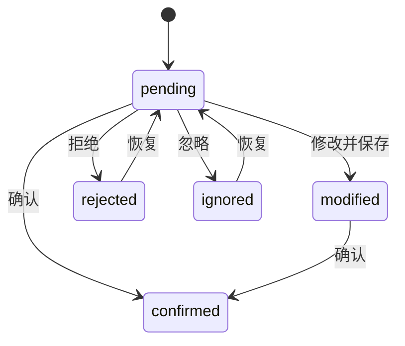

# AutoSmoke 元素映射草稿审核面板详细方案

## 1. 目标

元素映射草稿 `element_mapping_draft.json` 不能只以 JSON 文件形式交给人工审核。

原因：

```text
路径、节点名、组件名对测试人员不直观。
如果没有中文描述和截图高亮，很难判断映射是否正确。
```

因此需要在 AutoSmoke IDE 中提供：

```text
元素映射草稿审核面板
```

目标：

- 以中文名称、中文描述、页面、类型、置信度展示草稿。
- 点击草稿后，在截图中高亮对应元素。
- 支持查看 visualNode 和 clickTargetNode。
- 支持编辑 testId、semanticId、role、中文描述。
- 支持确认、修改、拒绝、忽略、标记纯展示图标。
- 支持测试点击。
- 审核后生成正式 `element_mapping.json`。

## 2. 总体界面结构

推荐三栏布局：

```text
┌──────────────────────────────────────────────────────────────┐
│ 元素映射审核                                                  │
├───────────────────┬────────────────────────┬─────────────────┤
│ 左：草稿列表        │ 中：页面截图 + 高亮       │ 右：详情与编辑    │
│                   │                        │                 │
│ 筛选/搜索          │ 当前页面截图              │ 中文名称          │
│ 草稿表格            │ 元素红框                 │ 中文描述          │
│ 批量操作            │ 点击区域黄框              │ testId           │
│                   │ 图标显示区域蓝框          │ semanticId       │
│                   │                        │ 审核按钮          │
└───────────────────┴────────────────────────┴─────────────────┘
```

## 3. 左侧：草稿列表

### 3.1 列表默认展示字段

| 字段 | 示例 | 说明 |
|---|---|---|
| 状态 | `pending` | 待审核/已确认/已拒绝 |
| 中文名称 | `使用按钮` | 人工最先看的字段 |
| 页面 | `背包界面` | 页面中文名 |
| 类型 | `主操作按钮` | role 中文名 |
| 文本 | `使用` | UI 文本 |
| 置信度 | `0.88` | 自动推断可信度 |
| 建议 testId | `Bag.UseButton` | 可编辑 |

列表示例：

```text
状态      中文名称          页面      类型            置信度
待审核    使用按钮          背包界面  主操作按钮       0.88
待审核    高级招募券图标    奖励弹窗  可点击道具图标   0.86
已确认    确认按钮          奖励弹窗  确认按钮         0.94
已拒绝    装饰图标          主城界面  纯展示图标       0.42
```

### 3.2 筛选条件

必须支持：

| 筛选 | 示例 |
|---|---|
| 页面 | 背包界面 / 奖励弹窗 / 主城界面 |
| 状态 | pending / confirmed / modified / rejected / ignored |
| 类型 | 按钮 / 图标 / 弹窗 / 页签 / 场景对象 |
| 是否可点击 | clickable / display_only / unknown |
| 置信度 | `<0.6`、`0.6~0.85`、`>0.85` |

### 3.3 搜索

支持搜索：

```text
中文名称
中文描述
testId
semanticId
节点路径
文本
itemId
spriteName
```

### 3.4 批量操作

支持：

```text
批量确认高置信度
批量忽略纯展示图标
批量标记为待补充
批量导出审核结果
```

批量确认需要限制：

```text
confidence >= 0.9
且有 screenshot/highlightRect
且 role 不为 unknown
```

## 4. 中间：截图高亮区

### 4.1 展示内容

中间区域展示当前草稿所属页面截图。

来源：

```text
runtime/ui_tree/screenshots/{pageId}.png
或 screenshots/run_xxx/game_content.png
```

### 4.2 高亮规则

| 高亮颜色 | 含义 |
|---|---|
| 红框 | 当前审核元素最终区域 |
| 黄框 | 实际点击目标 `clickTargetNode` |
| 蓝框 | 图标显示节点 `visualNode` |
| 绿框 | 父容器 / 面板区域 |
| 灰框 | 被遮挡或不可点击区域 |

### 4.3 图标场景展示

图标类元素必须同时展示：

```text
visualNode：图标显示区域
clickTargetNode：实际点击区域
```

例如：

```text
蓝框：RewardPopup/RewardList/Item_0/Icon
黄框：RewardPopup/RewardList/Item_0
```

这样人工可以判断：

```text
看到的图标是否正确
实际点击的父节点是否正确
```

### 4.4 交互能力

截图区支持：

- 鼠标悬停显示元素摘要。
- 点击截图区域反查候选元素。
- 缩放截图。
- 拖动查看。
- 显示/隐藏所有元素框。
- 只显示可点击元素。
- 只显示当前页面弹窗层。

### 4.5 反查结果

点击截图区域后，返回：

```json
{
  "point": [520, 1880],
  "matchedElements": [
    {
      "testId": "Bag.UseButton",
      "displayName": "使用按钮",
      "path": "DeepUI/DialogUI/BagPanel/ButtonUse",
      "zOrder": 120,
      "clickable": true
    }
  ]
}
```

## 5. 右侧：详情与编辑

### 5.1 基础信息

展示：

```text
中文名称 displayName
中文描述 chineseDescription
核对提示 reviewHint
页面 pageId / 页面中文名
类型 role / 类型中文名
置信度 confidence
审核状态 reviewStatus
```

### 5.2 定位信息

展示：

```text
runtimePath
prefabPath
prefabNodePath
locator.type
locator.value
fallbackLocators
```

### 5.3 图标信息

如果是图标，展示：

```text
iconType
itemId / activityId / buildingId
itemName / activityName / buildingName
spriteName
atlasName
visualNode
clickTargetNode
clickAction
expectedAfterClick
```

### 5.4 推断依据 evidence

展示自动推断依据：

```json
{
  "pageName": "BagPanel",
  "nodeName": "ButtonUse",
  "text": "使用",
  "component": "Button",
  "position": "bottom_center",
  "customScript": "BagUseButton"
}
```

IDE 中用中文展示：

```text
页面：BagPanel -> 背包界面
节点名：ButtonUse -> 推断为使用按钮
文本：使用
组件：Button
位置：底部中间
```

### 5.5 可编辑字段

允许编辑：

| 字段 | 说明 |
|---|---|
| `displayName` | 中文名称 |
| `chineseDescription` | 中文描述 |
| `reviewHint` | 核对提示 |
| `testId` | 测试 ID |
| `semanticId` | 语义 ID |
| `role` | 元素类型 |
| `pageId` | 所属页面 |
| `locator` | 定位方式 |
| `clickTargetNode` | 实际点击节点 |
| `clickAction` | 点击动作 |
| `expectedAfterClick` | 点击后期望 |

### 5.6 审核按钮

支持：

```text
确认
保存修改
拒绝
忽略
标记为纯展示图标
标记为可点击图标
合并重复项
测试点击
```

## 6. 审核状态流转



状态说明：

| 状态 | 含义 |
|---|---|
| `pending` | 待审核 |
| `confirmed` | 已确认，可进入正式映射 |
| `modified` | 人工修改过，待确认或已确认 |
| `rejected` | 错误候选 |
| `ignored` | 暂不纳入自动化 |

## 7. 测试点击能力

### 7.1 目的

人工审核时可以点击“测试点击”，验证映射是否真的能命中目标。

### 7.2 流程

```text
1. 用户点击测试点击
2. IDE 构造 click_request
3. Unity 执行 EventSystem 注入点击
4. 等待 1~2 帧
5. 导出 click_result
6. IDE 展示点击结果
```

### 7.3 成功标准

```text
eventReceiver == targetGameObject
```

如果设置了 `expectedAfterClick`，还要验证：

```text
点击后出现 ItemTipsPanel / BagPanel / RewardPopup 等预期页面
```

### 7.4 测试点击结果展示

```json
{
  "success": true,
  "method": "unity_event_system",
  "targetGameObject": "RewardPopup/RewardList/Item_0",
  "eventReceiver": "RewardPopup/RewardList/Item_0",
  "expectedAfterClick": "ItemTipsPanel",
  "postCheck": {
    "passed": true
  }
}
```

## 8. 草稿数据结构

### 8.1 通用草稿

```json
{
  "draftId": "draft_0001",
  "reviewStatus": "pending",
  "displayName": "使用按钮",
  "chineseDescription": "背包界面底部的黄色【使用】按钮，用于使用当前选中的道具。",
  "reviewHint": "截图中位于背包界面底部中间，按钮文字为“使用”。",
  "suggestedTestId": "Bag.UseButton",
  "suggestedSemanticId": "背包.使用按钮",
  "pageId": "BagPanel",
  "pageDisplayName": "背包界面",
  "role": "primary_action_button",
  "roleDisplayName": "主操作按钮",
  "runtimePath": "DeepUI/DialogUI/BagPanel/ButtonUse",
  "prefabPath": "Assets/UI/Bag/BagPanel.prefab",
  "text": "使用",
  "confidence": 0.88,
  "highlightRect": {
    "x": 465,
    "y": 2180,
    "width": 240,
    "height": 80
  },
  "screenshotRef": "runtime/ui_tree/screenshots/BagPanel.png",
  "evidence": {
    "pageName": "BagPanel",
    "nodeName": "ButtonUse",
    "text": "使用",
    "component": "Button",
    "position": "bottom_center"
  }
}
```

### 8.2 图标草稿

```json
{
  "draftId": "draft_icon_0001",
  "reviewStatus": "pending",
  "displayName": "高级招募券图标",
  "chineseDescription": "奖励弹窗中的【高级招募券】道具图标，数量为 2，点击后应打开高级招募券的道具详情 Tips。",
  "reviewHint": "截图中位于奖励列表内，图标为金色招募券，右下角数量显示 2。",
  "suggestedTestId": "RewardPopup.ItemIcon.1001",
  "suggestedSemanticId": "奖励弹窗.道具图标.高级招募券",
  "pageId": "RewardPopup",
  "pageDisplayName": "奖励弹窗",
  "role": "interactive_item_icon",
  "roleDisplayName": "可点击道具图标",
  "iconType": "item",
  "dataId": 1001,
  "dataName": "高级招募券",
  "spriteName": "icon_item_1001",
  "visualNode": "RewardPopup/RewardList/Item_0/Icon",
  "clickTargetNode": "RewardPopup/RewardList/Item_0",
  "clickAction": "open_item_tips",
  "expectedAfterClick": "ItemTipsPanel",
  "confidence": 0.86,
  "highlightRect": {
    "x": 95,
    "y": 320,
    "width": 80,
    "height": 80
  },
  "clickTargetRect": {
    "x": 80,
    "y": 305,
    "width": 110,
    "height": 110
  },
  "screenshotRef": "runtime/ui_tree/screenshots/RewardPopup.png"
}
```

## 9. 正式映射输出

审核通过后生成：

```text
element_mapping.json
```

示例：

```json
{
  "Bag.UseButton": {
    "testId": "Bag.UseButton",
    "semanticId": "背包.使用按钮",
    "displayName": "使用按钮",
    "chineseDescription": "背包界面底部的黄色【使用】按钮，用于使用当前选中的道具。",
    "pageId": "BagPanel",
    "role": "primary_action_button",
    "locator": {
      "type": "runtimePath",
      "value": "DeepUI/DialogUI/BagPanel/ButtonUse"
    },
    "click": {
      "method": "unity_event_system",
      "safePoint": "center"
    },
    "review": {
      "status": "confirmed",
      "reviewedAt": "2026-06-15T19:30:00"
    }
  }
}
```

## 10. IDE API 设计

### 10.1 获取草稿列表

```text
GET /api/mapping/drafts
```

参数：

```text
pageId
status
role
keyword
minConfidence
```

### 10.2 获取草稿详情

```text
GET /api/mapping/drafts/{draftId}
```

### 10.3 保存草稿修改

```text
POST /api/mapping/drafts/{draftId}/save
```

### 10.4 确认草稿

```text
POST /api/mapping/drafts/{draftId}/confirm
```

### 10.5 拒绝草稿

```text
POST /api/mapping/drafts/{draftId}/reject
```

### 10.6 测试点击

```text
POST /api/mapping/drafts/{draftId}/test_click
```

### 10.7 截图反查元素

```text
GET /api/mapping/reverse_lookup?x=520&y=1880&pageId=BagPanel
```

### 10.8 新增人工元素

```text
POST /api/mapping/manual/create
```

用于补充自动扫描未识别到的元素。

### 10.9 验证人工元素

```text
POST /api/mapping/manual/validate
```

用于验证手动输入的路径、区域或业务对象是否可定位。

### 10.10 合并人工元素与自动候选

```text
POST /api/mapping/manual/merge
```

当后续扫描发现与人工元素相似的自动候选时，用于合并信息。

## 11. 未扫描到元素的人工补充

### 11.1 目标

自动扫描不可能 100% 覆盖所有元素。

可能遗漏：

- 动态生成的 UI。
- ScrollView 未加载项。
- 特殊自定义点击区域。
- 图标父节点点击区域。
- 建筑 / 地图对象。
- 引导遮罩高亮区域。
- 没有 Button 组件但能响应点击的节点。

因此 IDE 必须提供：

```text
人工补充元素
```

能力。

补充后的元素直接进入正式：

```text
element_mapping.json
```

并标记：

```json
{
  "source": "manual",
  "reviewStatus": "confirmed"
}
```

### 11.2 新增入口

IDE 中增加按钮：

```text
元数据 → 元素映射审核 → 新增元素
```

新增方式：

| 方式 | 适用场景 |
|---|---|
| 从截图点选 | 界面可见但扫描没识别 |
| 从 Unity 当前选择 | Unity Hierarchy 能选中目标 |
| 从路径输入 | 已知 Poco path / runtime path |
| 从业务对象创建 | 建筑、道具、活动、场景对象 |

### 11.3 方式一：截图点选补充

适合：

```text
界面上看得到，但 UI 树或草稿里没有。
```

流程：

```text
1. 打开对应页面
2. IDE 展示当前 GameContent 截图
3. 用户点击或框选目标区域
4. IDE 根据点击点反查附近 UI 节点 / Poco 节点 / Unity 节点
5. 如果找到候选，用户选择候选
6. 如果没有候选，创建 manualRect 元素
7. 用户填写中文名称、中文描述、pageId、role、semanticId/testId
8. 保存到 element_mapping.json
```

manualRect 示例：

```json
{
  "Bag.CustomIcon.1001": {
    "source": "manual",
    "testId": "Bag.CustomIcon.1001",
    "semanticId": "背包.道具图标.高级招募券",
    "displayName": "高级招募券图标",
    "chineseDescription": "背包界面中的高级招募券道具图标，点击后打开道具详情 Tips。",
    "pageId": "BagPanel",
    "role": "interactive_item_icon",
    "locator": {
      "type": "manualRect",
      "value": {
        "normalizedRect": {
          "x": 0.12,
          "y": 0.35,
          "width": 0.08,
          "height": 0.04
        }
      }
    },
    "click": {
      "method": "unity_event_system_or_mouse_fallback",
      "safePoint": "center",
      "expectedAfterClick": "ItemTipsPanel"
    },
    "review": {
      "status": "confirmed",
      "reviewedAt": "2026-06-15T20:00:00"
    }
  }
}
```

注意：

```text
manualRect 只能作为兜底。
如果能反查到 Unity 节点，应优先绑定 runtimePath / clickTargetNode。
```

### 11.4 方式二：Unity 当前选中对象补充

适合：

```text
截图点选不准，但 Unity Hierarchy 能找到目标 GameObject。
```

流程：

```text
1. 在 Unity Hierarchy 中选中目标 GameObject
2. 点击 AutoSmoke/UI/Export Selected Element
3. Unity 输出 selected_element.json
4. IDE 读取 selected_element.json
5. 自动填入 path、components、RectTransform、screenRect
6. 用户补中文名称、semanticId、role
7. 保存映射
```

selected_element.json 示例：

```json
{
  "name": "ButtonUse",
  "path": "DeepUI/DialogUI/BagPanel/ButtonUse",
  "components": ["RectTransform", "Button", "Image", "TMP_Text"],
  "text": "使用",
  "screenRect": {
    "x": 465,
    "y": 2180,
    "width": 240,
    "height": 80
  },
  "prefabPath": "Assets/UI/Bag/BagPanel.prefab"
}
```

### 11.5 方式三：手动路径补充

适合：

```text
开发人员知道 Poco path / runtimePath / prefabPath。
```

流程：

```text
1. 点击新增元素
2. locator 类型选择 pocoPath / runtimePath / prefabPath
3. 输入路径
4. 点击“验证定位”
5. 验证成功后填写中文描述和 testId
6. 保存映射
```

示例：

```json
{
  "locator": {
    "type": "runtimePath",
    "value": "DeepUI/DialogUI/BagPanel/ButtonUse"
  }
}
```

### 11.6 方式四：业务对象补充

适合：

```text
建筑、道具、活动入口、场景对象等不一定是普通 UI Button 的目标。
```

流程：

```text
1. 新增元素
2. 类型选择 item / activity / building / sceneObject
3. 填写 dataId
4. 选择点击动作
5. 选择期望结果
6. 保存映射
```

示例：

```json
{
  "Building.Barracks": {
    "source": "manual",
    "testId": "Building.Barracks",
    "semanticId": "主城.建筑.兵营",
    "displayName": "兵营建筑",
    "chineseDescription": "主城中的兵营建筑，点击后呼出兵营功能菜单。",
    "pageId": "MainCity",
    "role": "scene_building",
    "data": {
      "type": "building",
      "id": "Barracks"
    },
    "locator": {
      "type": "sceneObject",
      "value": "Building.Barracks"
    },
    "click": {
      "method": "unity_scene_object_click",
      "expectedAfterClick": "BuildingMenu"
    }
  }
}
```

### 11.7 人工补充必填字段

| 字段 | 是否必填 | 说明 |
|---|:---:|---|
| `displayName` | 是 | 中文名称 |
| `chineseDescription` | 是 | 中文描述 |
| `pageId` | 是 | 所属页面 |
| `role` | 是 | 元素类型 |
| `locator` | 是 | 定位方式 |
| `click.method` | 是 | 点击方式 |
| `source` | 是 | 固定为 `manual` |
| `review.status` | 是 | 固定为 `confirmed` |

建议填写：

| 字段 | 说明 |
|---|---|
| `testId` | 推荐 |
| `semanticId` | 推荐 |
| `reviewHint` | 审核提示 |
| `clickAction` | 点击动作 |
| `expectedAfterClick` | 点击后期望 |
| `screenshotRef` | 参考截图 |
| `highlightRect` | 高亮区域 |

### 11.8 重新扫描后的合并规则

重新扫描生成新草稿时，不能覆盖人工补充。

优先级：

```text
manual confirmed > confirmed > modified > draft pending
```

如果后续自动扫描发现疑似同一个元素，IDE 应提示：

```text
发现可能匹配的自动候选，是否合并到人工映射？
```

合并时：

- 保留人工填写的中文名称和 semanticId。
- 补充自动扫描得到的 runtimePath、prefabPath、screenRect。
- 保留 `source = manual+auto`。

示例：

```json
{
  "source": "manual+auto",
  "manualCreatedAt": "2026-06-15T20:00:00",
  "autoMatchedAt": "2026-06-16T10:00:00"
}
```

### 11.9 人工补充验收

| 编号 | 场景 | 通过标准 |
|---|---|---|
| MAN-001 | 截图点选新增 | 能创建 manualRect 元素 |
| MAN-002 | Unity 选中新增 | 能读取 selected_element.json 并保存 |
| MAN-003 | 路径新增 | 输入 runtimePath 后能验证定位 |
| MAN-004 | 业务对象新增 | 能新增 sceneObject / item / building |
| MAN-005 | 重新扫描 | 人工映射不被覆盖 |
| MAN-006 | 合并候选 | 可将自动候选合并到人工映射 |

## 12. 最小可用版本

第一版可以先实现：

```text
1. 草稿列表表格
2. 中文名称/中文描述展示
3. 页面截图展示
4. 当前元素红框高亮
5. 右侧编辑 testId/semanticId/displayName
6. 确认/拒绝/忽略
7. 保存 element_mapping.json
8. 新增元素：支持截图点选 + 手动路径
```

暂时不做：

```text
批量确认
测试点击
截图反查
多框显示
```

## 13. 完整版本

完整版本应支持：

- 三栏审核布局。
- 截图缩放拖拽。
- 多颜色高亮。
- visualNode / clickTargetNode 同时显示。
- 测试点击。
- 反查元素。
- 批量确认。
- 重复项合并。
- 高置信度自动确认建议。
- 审核历史。
- 映射版本管理。
- 人工补充四种入口。
- 人工映射与自动候选合并。

## 14. 验收标准

| 编号 | 场景 | 通过标准 |
|---|---|---|
| MAP-001 | 查看草稿 | 能显示中文名称、中文描述、页面、类型 |
| MAP-002 | 截图高亮 | 点击草稿后截图中红框高亮正确元素 |
| MAP-003 | 图标审核 | 能区分 visualNode 蓝框和 clickTargetNode 黄框 |
| MAP-004 | 编辑保存 | 修改 testId/semanticId 后能保存 |
| MAP-005 | 确认映射 | confirmed 草稿进入 element_mapping.json |
| MAP-006 | 拒绝映射 | rejected 草稿不进入正式映射 |
| MAP-007 | 测试点击 | eventReceiver 等于 targetGameObject |
| MAP-008 | 反查元素 | 点击截图坐标能返回候选元素 |
| MAP-009 | 人工补充 | 未扫描元素可手动新增并进入正式映射 |
| MAP-010 | 人工映射保护 | 重新扫描不会覆盖人工映射 |

## 15. 最终建议

映射草稿应以：

```text
带截图高亮的可编辑中文审核面板
```

展现给用户。

JSON 只是底层存储，不应该作为主要审核方式。

人工审核时最重要的三个信息：

```text
中文描述
截图高亮
实际点击节点
```

只要这三项清楚，映射确认效率会高很多。
