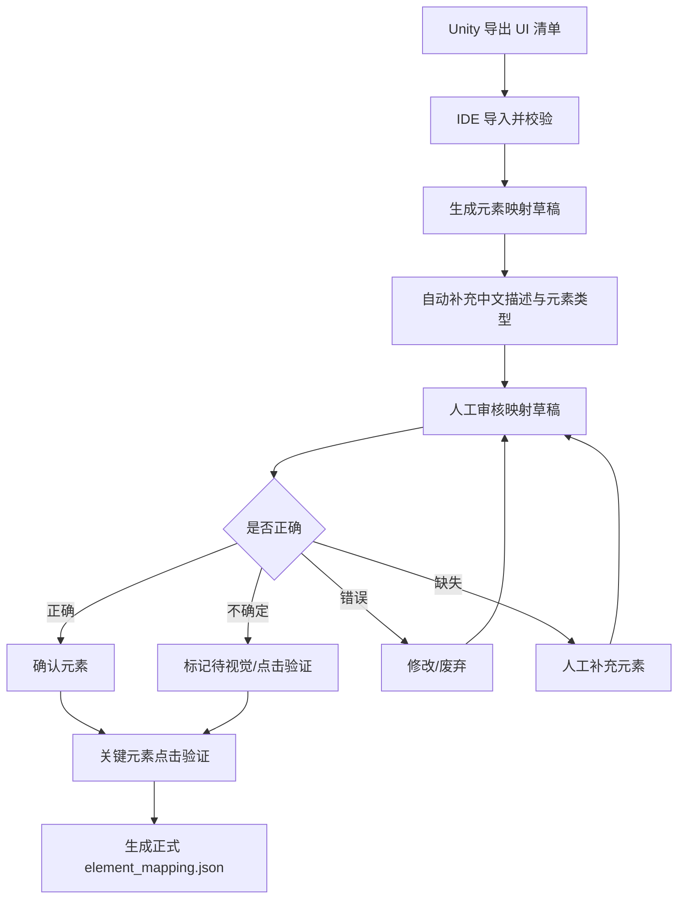

# AutoSmoke 所有元素正确映射优先落地方案

## 1. 当前最紧急目标

当前阶段先不追求完整自动测试闭环，也不优先处理截图、报告、业务断言、页面关系图等后续能力。

本阶段唯一核心目标是：

```text
把 Unity 导出的 UI 清单，整理成 IDE 可审核、可修改、可补充、可验证的正式元素映射库。
```

最终产物是：

```text
element_mapping.json
```

这个文件后续会作为自动点击、用例执行、页面识别、异常恢复、测试报告的基础数据。

如果元素映射不准确，后续所有自动化都会不稳定。因此本阶段验收标准不是“能生成草稿”，而是：

```text
关键元素能被人看懂
关键元素能被正确确认
关键元素能被自动点击命中
缺失元素能被补充
错误元素能被修正或废弃
```

## 2. 本阶段不解决什么

为了先把最紧急问题做准，本阶段暂时不把以下内容作为主目标：

```text
不要求所有页面都有截图
不要求所有元素都完成视觉确认
不要求所有元素都完成点击验证
不要求先接入完整运行态 Bridge
不要求先完成业务断言系统
不要求先完成最终测试报告系统
```

但是方案必须为这些能力预留字段和状态，避免后面推倒重来。

## 3. 总体流程



## 4. IDE 中需要导入什么文件

### 4.1 当前最推荐导入文件

当前阶段优先只让 IDE 导入一个目录，不让用户理解太多单独按钮。

推荐目录：

```text
E:\zdcs\AutoSmoke\元数据
```

IDE 点击“选择 Unity 导出目录”后自动扫描该目录下的文件。

### 4.2 导入优先级

IDE 扫描后按以下优先级自动选择数据源：

| 优先级 | 文件 | 用途 | 是否推荐 |
|---|---|---|---|
| 1 | `enhanced_ui_tree.json` | 已增强 UI 树，包含节点、路径、文本、坐标、组件、推断类型 | 当前首选 |
| 2 | `pages/*.json` | 按页面导出的运行态 UI 树 | 推荐 |
| 3 | `project_ui_inventory.json` | 工程态 UI 清单，适合发现 prefab、按钮、图标、文本 | 推荐 |
| 4 | `current_ui_tree.json` | 当前运行态 UI 树快照 | 可用 |
| 5 | `icon_inventory.json` | 图标、道具、奖励、活动入口等图标资料 | 推荐补充 |
| 6 | `scene_objects.json` | 主城/外城建筑、资源点、NPC 等场景对象 | 后续补充 |
| 7 | `screenshots/*.png` | 页面截图，用于视觉审核和高亮 | 有最好，没有也能先做结构审核 |

### 4.3 最小可运行输入

如果当前只有：

```text
enhanced_ui_tree.json
```

也可以进入第一阶段：

```text
生成映射草稿 -> 结构审核 -> 人工修改补充 -> 输出 element_mapping.json
```

但是此时只能确认到：

```text
structure_confirmed
```

不能直接等同于视觉确认或点击确认。

## 5. IDE 导入界面应简化成什么样

当前界面里有多个按钮：

```text
导入Project
导入Current
导入Runtime
导入Pages
仅扫描UI树
仅扫描Prefab
查看导入报告
快速导入Pages
```

这些功能可以保留，但不应该全部暴露在主路径上。

### 5.1 推荐主界面

主界面只保留 4 个核心动作：

```text
1. 选择 Unity 导出目录
2. 扫描文件
3. 导入并生成映射草稿
4. 进入审核
```

高级按钮折叠到：

```text
高级导入
```

### 5.2 页面结构

```text
准备
  └─ UI树与元素映射
      ├─ 数据导入
      ├─ 映射草稿
      ├─ 映射审核
      ├─ 手工补充
      └─ 正式映射
```

### 5.3 导入后立即显示的摘要

导入完成后，顶部必须显示一行人能看懂的结果：

```text
导入成功：
数据源：enhanced_ui_tree.json
节点数：560
生成草稿：266
可点击候选：82
弹窗按钮：15
图标元素：64
缺中文描述：37
缺点击目标：12
待审核：266
```

这样用户可以马上知道下一步应该审什么。

## 6. 元素映射草稿如何生成

### 6.1 草稿生成原则

不是 UI 树里的每个节点都应该变成自动点击元素。

草稿生成时应优先抽取这些元素：

```text
按钮
页签
关闭按钮
确认按钮
取消按钮
返回按钮
底部主入口
右侧活动入口
弹窗功能按钮
可点击道具格子
可点击奖励图标
可点击建筑功能按钮
可点击建筑或场景对象
引导点击目标
Loading/重连/阻塞状态识别元素
```

以下节点默认不进入正式映射，除非被人工指定：

```text
纯装饰图片
纯背景
布局容器
遮罩容器
无业务意义的空 Panel
重复生成的临时 clone 节点
不可见节点
坐标异常节点
```

### 6.2 每个草稿元素必须包含的字段

```json
{
  "semanticId": "bag.use_button",
  "displayName": "背包-使用按钮",
  "chineseDescription": "背包界面底部的黄色使用按钮，用于使用当前选中的道具",
  "pageId": "BagPanel",
  "elementType": "button",
  "role": "confirm_action",
  "source": "auto_draft",
  "reviewStatus": "pending",
  "confidence": 0.86,
  "runtimePath": "Root/DeepUI/DialogUI/BagPanel/Bottom/UseButton",
  "prefabPath": "Assets/xxx/BagPanel.prefab",
  "nodeName": "UseButton",
  "text": "使用",
  "spriteName": "btn_yellow",
  "clickTargetNode": "Root/DeepUI/DialogUI/BagPanel/Bottom/UseButton",
  "visualNode": "Root/DeepUI/DialogUI/BagPanel/Bottom/UseButton",
  "evidence": [
    "text=使用",
    "nodeName=UseButton",
    "component=Button",
    "parent=BagPanel"
  ],
  "risk": []
}
```

### 6.3 中文描述自动生成规则

映射草稿必须让用户看得懂，不能只显示：

```text
[Panel] cont1
Root/BG/cont1
screenRect [...]
```

IDE 需要根据以下信息自动生成中文描述：

| 信息来源 | 说明 |
|---|---|
| `text` | 节点上可见文字，例如“使用”“确定”“领取” |
| `nodeName` | 节点名，例如 `UseButton`、`CloseBtn`、`RewardItem` |
| `parentPath` | 父级路径判断属于哪个界面 |
| `pageId` | 页面名，例如背包、奖励弹窗、主城 |
| `spriteName` | 图标名、按钮皮肤名 |
| `component` | Button、Toggle、Image、Text、TMP 等 |
| `position` | 顶部、底部、左侧、右侧、中间 |
| `同级文本` | 图标旁边的标题或说明文字 |

示例：

```text
节点：Root/DeepUI/DialogUI/RewardPopup/ConfirmBtn
文本：确定
自动描述：奖励领取弹窗底部的“确定”按钮
```

```text
节点：Root/DeepUI/LayerUI/RightTop/IceBreak/Stone
文本：无
spriteName：icon_activity_icebreak
自动描述：主界面右上角活动入口图标，疑似“破冰”活动入口
```

## 7. 审核状态设计

不要只有“已映射/未映射”，需要分级。

| 状态 | 含义 | 是否可用于正式用例点击 |
|---|---|---|
| `pending` | 自动生成，未审核 | 否 |
| `structure_confirmed` | 通过路径、文字、组件、父级结构确认 | 谨慎使用 |
| `visual_confirmed` | 通过截图高亮确认位置正确 | 可以 |
| `click_confirmed` | Unity 注入点击验证命中正确对象 | 最推荐 |
| `modified` | 人工修改过，需要再次确认 | 视确认级别 |
| `manual_added` | 人工补充的元素 | 需要确认 |
| `ignored` | 明确忽略，不参与自动化 | 否 |
| `rejected` | 草稿错误，废弃 | 否 |

当前没有截图时，最高只能批量做到：

```text
structure_confirmed
```

关键元素必须后续做到：

```text
click_confirmed
```

## 8. 审核界面怎么让用户看懂元素

### 8.1 左侧列表

左侧不要只显示节点名，应显示：

```text
[按钮] 背包-使用按钮
页面：BagPanel
文本：使用
状态：待审核
置信度：86%
风险：无截图
```

### 8.2 中间区域

如果有截图：

```text
显示截图 + 高亮框 + 元素编号
```

如果没有截图：

```text
显示结构卡片，不显示空白截图区
```

结构卡片内容：

```text
元素中文名：背包-使用按钮
页面：BagPanel
元素类型：button
节点路径：Root/DeepUI/DialogUI/BagPanel/Bottom/UseButton
可见文字：使用
组件：Button, Image, Text
同级文本：无
父级：Bottom
推断依据：text=使用 + component=Button + parent=BagPanel
当前结论：结构上高度可信，但未视觉确认
```

### 8.3 右侧编辑区

右侧必须允许修改：

```text
semanticId
中文名称
中文描述
页面归属
元素类型
业务分类
点击目标节点
视觉节点
是否参与自动点击
是否参与页面识别
是否参与异常识别
审核状态
备注
```

## 9. 当前没有截图时怎么审核

无截图时采用“结构审核模式”。

### 9.1 可以直接确认的元素

满足以下条件的元素，可以标记为 `structure_confirmed`：

```text
有明确中文文字
组件是 Button 或 Toggle
父级页面明确
路径中包含明确业务名
无重复冲突
点击目标和视觉目标相同或父子关系明确
```

示例：

```text
文本=确定，父级=RewardPopup，组件=Button
=> 奖励弹窗-确定按钮
```

```text
文本=使用，父级=BagPanel，组件=Button
=> 背包-使用按钮
```

### 9.2 不能直接确认的元素

以下元素不能直接确认，需要标记为待补充或待验证：

```text
只有 Panel 名称
只有 cont1、item、node、clone 等通用名
没有文字
没有 spriteName
没有 Button 组件
路径中缺少页面名
同名元素大量重复
screenRect 异常
clickTargetNode 为空
visualNode 与 clickTargetNode 不明确
```

### 9.3 对不确定元素的处理

不确定元素不要删除，先分类：

```text
待截图确认
待运行态确认
待人工命名
待点击验证
疑似装饰
疑似容器
疑似重复
```

## 10. 审核优先级

不需要一上来审核所有 266 个草稿。

第一轮只审核能支撑真实用例执行的关键元素。

### 10.1 第一优先级：通用阻塞处理元素

```text
关闭按钮
返回按钮
确定按钮
取消按钮
领取按钮
使用按钮
前往按钮
跳过按钮
重试按钮
重新连接按钮
弹窗空白关闭区域
```

这些元素决定自动化能不能继续跑。

### 10.2 第二优先级：主流程入口

```text
底部主入口
右侧活动入口
背包入口
商店入口
邮件入口
任务入口
联盟入口
建筑入口
大地图入口
主城入口
```

### 10.3 第三优先级：可交互内容

```text
道具图标
奖励图标
道具格子
活动卡片
建筑图标
建筑功能按钮
资源点
NPC
引导点击目标
```

### 10.4 第四优先级：页面识别元素

```text
页面标题
弹窗标题
唯一图标
页签文本
固定资源栏
Loading 进度条
重连提示
```

这些不一定点击，但用于判断当前处于哪个界面。

## 11. 如何人工补充漏扫元素

IDE 必须提供“新增映射”能力。

### 11.1 新增入口

```text
准备 -> UI树与元素映射 -> 手工补充 -> 新增元素
```

### 11.2 新增方式

第一阶段支持三种方式即可：

| 方式 | 用途 |
|---|---|
| 从已有 UI 树选择节点 | 最推荐，避免手填路径错误 |
| 手动输入节点路径 | 用于草稿里没有但 UI 树里存在的节点 |
| 手动创建虚拟元素 | 用于弹窗空白关闭区域、场景点击区域等非单一 UI 节点 |

### 11.3 手工补充字段

```json
{
  "semanticId": "popup.blank_close_area",
  "displayName": "通用弹窗-空白关闭区域",
  "chineseDescription": "点击弹窗外部的半透明遮罩区域，用于关闭当前通用弹窗",
  "pageId": "CommonPopup",
  "elementType": "virtual_click_area",
  "role": "close_popup",
  "source": "manual_added",
  "reviewStatus": "structure_confirmed",
  "clickStrategy": "safe_blank_area",
  "clickTargetNode": null,
  "visualNode": "Root/DeepUI/DialogUI/CommonMask",
  "avoidRegions": [
    "popup_content",
    "buttons",
    "building",
    "scene_object"
  ]
}
```

## 12. 图标元素怎么映射

图标一定要纳入映射，因为道具图标、奖励图标、活动图标、建筑图标都可能可点击。

### 12.1 图标分两类

| 类型 | 说明 | 是否点击 |
|---|---|---|
| 展示图标 | 只是显示资源、装饰、奖励预览 | 通常不点击 |
| 交互图标 | 点击后打开 Tips、进入活动、选择道具、领取奖励 | 需要映射 |

### 12.2 图标映射必须区分视觉节点和点击节点

很多图标本身不是 Button，真正可点击的是父级格子。

因此字段必须分开：

```text
visualNode：图标图片节点
clickTargetNode：可点击的父级按钮或格子节点
```

示例：

```json
{
  "semanticId": "bag.item.gold_coin",
  "displayName": "背包-金币道具图标",
  "chineseDescription": "背包中的金币道具图标，点击后打开道具说明或选中该道具",
  "pageId": "BagPanel",
  "elementType": "item_icon",
  "visualNode": "BagPanel/List/Item_001/Icon",
  "clickTargetNode": "BagPanel/List/Item_001",
  "itemName": "金币",
  "itemId": "gold_coin",
  "expectedAfterClick": "item_tip_or_selected_state"
}
```

## 13. 关键元素点击验证

结构审核只能说明“看起来是它”，不能保证点击绝对命中。

关键元素必须做点击验证。

### 13.1 点击验证原则

点击验证不依赖截图坐标。

推荐链路：

```text
semanticId
 -> element_mapping.json
 -> clickTargetNode
 -> Unity 内部查找 GameObject
 -> Unity EventSystem 注入点击
 -> 校验 eventReceiver 是否等于目标对象
```

### 13.2 点击验证结果

每次验证写入：

```json
{
  "semanticId": "bag.use_button",
  "testClickStatus": "passed",
  "lastVerifiedAt": "2026-06-16 14:30:00",
  "hitGameObject": "UseButton",
  "expectedGameObject": "UseButton",
  "eventReceiverMatched": true,
  "afterClickPageChanged": true,
  "screenshotSaved": false
}
```

### 13.3 什么时候标记为 click_confirmed

满足以下条件才可以：

```text
Unity 找到目标 GameObject
目标对象可见
目标对象可交互
注入点击命中目标对象
没有被其它弹窗遮挡
点击后出现预期 UI 变化或事件日志
```

## 14. 自动生成映射草稿的置信度规则

IDE 应为每个草稿生成置信度，帮助用户优先审核。

### 14.1 加分项

```text
有 Button 组件：+30
有明确中文文字：+25
父级页面明确：+15
节点名包含业务词：+10
spriteName 有业务含义：+10
坐标在可见区域：+5
无同名冲突：+5
```

### 14.2 减分项

```text
节点名为 cont/item/node/clone：-20
没有文字：-10
没有 Button 组件：-15
同名重复：-15
坐标异常：-20
父级页面不明确：-20
clickTargetNode 为空：-30
```

### 14.3 置信度分级

| 分数 | 级别 | 处理建议 |
---|---|---|
| 85-100 | 高 | 可优先结构确认 |
| 60-84 | 中 | 人工查看依据后确认 |
| 30-59 | 低 | 需要截图或运行态验证 |
| 0-29 | 风险 | 默认不进入正式映射 |

## 15. 正式映射文件结构

正式输出：

```text
E:\zdcs\AutoSmoke\metadata\element_mapping.json
```

推荐结构：

```json
{
  "schemaVersion": "1.0",
  "project": "DemoLogo",
  "generatedAt": "2026-06-16 14:30:00",
  "sourceFiles": [
    "enhanced_ui_tree.json"
  ],
  "summary": {
    "total": 266,
    "pending": 120,
    "structureConfirmed": 80,
    "visualConfirmed": 30,
    "clickConfirmed": 20,
    "manualAdded": 16
  },
  "elements": []
}
```

## 16. IDE 当前界面的具体改造建议

### 16.1 导入区

把多个导入按钮合并成：

```text
[选择目录] [扫描] [导入并生成草稿] [进入审核]
```

保留“高级导入”，展开后才显示：

```text
导入 Project
导入 Current
导入 Runtime
导入 Pages
仅扫描 UI 树
仅扫描 Prefab
快速导入 Pages
```

### 16.2 草稿列表区

增加快捷筛选：

```text
全部
待审核
高置信度
缺中文描述
缺点击目标
关键按钮
弹窗按钮
图标
页签
容器疑似误判
人工补充
```

### 16.3 审核动作区

每个元素需要有这些按钮：

```text
结构确认
修改后确认
标记待截图
标记待点击验证
忽略
废弃
复制为新元素
```

批量操作只允许用于低风险场景：

```text
批量结构确认高置信度按钮
批量忽略纯装饰节点
批量标记缺截图
```

## 17. 第一轮实际执行步骤

### 第一步：导入当前已有文件

```text
选择 Unity 导出目录
扫描
确认 IDE 识别到 enhanced_ui_tree.json
导入并生成草稿
```

### 第二步：先处理高置信度按钮

筛选：

```text
元素类型 = button
置信度 >= 85
状态 = pending
```

人工快速确认：

```text
页面归属是否正确
中文名称是否看得懂
clickTargetNode 是否是按钮自身或正确父级
```

确认后标记：

```text
structure_confirmed
```

### 第三步：处理通用弹窗按钮

筛选：

```text
文本 包含 确定/取消/关闭/领取/使用/前往/返回
或 role in close/confirm/cancel/reward/use/go/back
```

这些元素是自动化续跑的关键，优先补齐。

### 第四步：处理主界面入口

重点确认：

```text
底部菜单
右侧活动入口
背包
商店
邮件
任务
联盟
主城/大地图切换
```

### 第五步：处理图标和道具格子

重点区分：

```text
图标节点是不是视觉节点
父级格子是不是点击节点
点击后是打开 Tips、选中、进入页面，还是领取
```

### 第六步：人工补充缺失元素

如果审核时发现：

```text
草稿中没有该按钮
草稿中文描述看不出来
点击目标为空
弹窗空白关闭区域没有节点
建筑呼出按钮没有映射
```

立即新增人工映射，不等后续统一处理。

### 第七步：导出第一版正式映射

第一版正式映射不要求 100% 全确认，但必须包含第一条用例链路。

例如“背包使用道具”至少包含：

```text
打开背包入口
背包页签
道具格子
使用按钮
奖励弹窗确认按钮
关闭按钮
通用弹窗空白关闭区域
```

## 18. 第一阶段验收标准

### 18.1 数据导入验收

```text
能导入 enhanced_ui_tree.json
能显示节点总数
能显示草稿数量
能显示导入错误
能重复导入不破坏人工确认结果
```

### 18.2 草稿质量验收

```text
每个草稿有中文名称
每个草稿有中文描述
每个草稿有页面归属
每个草稿有元素类型
每个可点击元素有 clickTargetNode
每个图标元素区分 visualNode 和 clickTargetNode
高风险元素有 risk 标记
```

### 18.3 审核流程验收

```text
能筛选待审核元素
能修改中文名称和描述
能修改 semanticId
能修改 clickTargetNode
能标记结构确认
能标记待截图/待点击验证
能忽略或废弃错误元素
能手工新增元素
```

### 18.4 映射输出验收

```text
能生成 element_mapping.json
再次导入时保留人工修改
人工确认优先级高于自动草稿
废弃元素不会重新进入正式映射
输出文件能被自动点击模块读取
```

### 18.5 首条用例验收

至少选一条真实用例进行映射闭环验证：

```text
从用例步骤读取 semanticId
在 element_mapping.json 中找到元素
找到 clickTargetNode
Unity 内部定位 GameObject
注入点击命中目标
点击后页面或状态变化符合预期
```

## 19. 风险与处理

| 风险 | 表现 | 处理 |
|---|---|---|
| 没有截图 | 无法视觉判断元素位置 | 先结构确认，关键元素后续点击验证 |
| 节点命名混乱 | 中文描述不准 | 引入父级、文本、sprite、同级文本综合推断 |
| 大量重复 clone | 草稿很多重复项 | 按 pageId + path + role 去重 |
| 图标不是按钮 | 点击失败 | 区分 visualNode 和 clickTargetNode |
| 弹窗遮挡 | 点击目标存在但不可点 | 点击前检查当前 top modal |
| 元素动态生成 | 工程态扫描不到 | 运行态 UI 树补充 |
| 人工修改被覆盖 | 重新导入丢失审核结果 | 合并时以人工确认版本优先 |

## 20. 推荐当前立即执行顺序

```text
1. 保留当前 enhanced_ui_tree.json 作为第一版输入
2. 简化 IDE 导入入口，只走“选择目录 -> 扫描 -> 导入并生成草稿”
3. 进入草稿审核页
4. 先审核高置信度按钮
5. 再审核通用弹窗按钮
6. 再审核底部入口和右侧活动入口
7. 再审核图标、道具格子、奖励格子
8. 对缺失元素立即手工补充
9. 导出第一版 element_mapping.json
10. 选一条用例做 click_confirmed 验证
```

## 21. 结论

当前最正确的推进方式是：

```text
先把所有关键元素映射做准，而不是先追求自动化跑全。
```

第一阶段可以没有截图，但不能没有：

```text
中文可读描述
明确页面归属
明确元素类型
明确 clickTargetNode
明确审核状态
人工可修改补充能力
正式 element_mapping.json 输出
```

当第一版映射能支撑一条真实用例稳定点击后，再逐步扩展到更多页面、更多图标、更多场景对象和完整自动测试流程。
