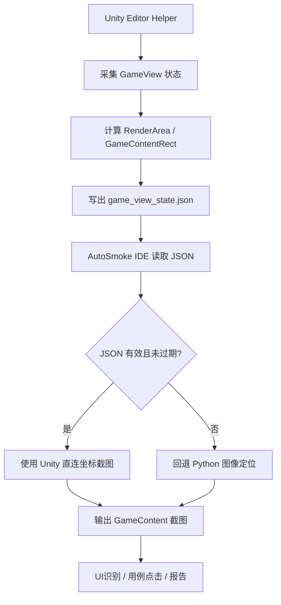

# AutoSmoke Unity 直连获取 GameView 完整游戏界面区域方案

## 1. 目标

当前 AutoSmoke 通过 Python 截图后识别 Unity GameView 中的 `GameContent` 区域。

该方式已经可以基本定位，但仍然会受到以下因素影响：

- Unity GameView 顶部工具栏高度变化
- `Display / Resolution / Scale / Play Focused` 控制栏高度识别不准
- Game 窗口上下左右拉伸
- GameView 左右或上下黑边
- Windows DPI 缩放
- Unity 主题色差异
- 截图区域不完整
- PIL 超范围裁剪补黑
- 图像扫描将工具栏误认为游戏内容

本方案目标是：

```text
优先从 Unity Editor 侧直接获取 GameView / RenderArea / GameContent 的真实几何信息，
Python IDE 只负责读取这些坐标并截图裁剪，
图像定位算法仅作为兜底。
```

最终效果：

- 切换分辨率后仍能准确截取完整游戏画面。
- 拉伸 Game 窗口后仍能准确截取完整游戏画面。
- 不再依赖顶部工具栏图像识别。
- 不再在 `top=22` 和 `top=57` 之间来回调试。
- 不修改游戏业务运行代码。
- 只增加 Unity Editor 工具层能力，便于其它电脑和其它项目复用。

## 2. 当前问题回顾

### 2.1 Python 图像定位的问题

当前截图链路大致是：

```text
全屏截图
  -> 定位 Unity GameViewPanel
    -> 检测 toolbarHeight
      -> 计算 GameRenderArea
        -> 计算 GameContent
          -> 裁剪截图
```

问题在于：

```text
GameViewPanel 内部结构不是纯游戏画面，
它上方还有 Unity GameView 工具栏和控制栏。
```

例如顶部可能包含：

```text
Game
Display 1
1170x2532
Scale
0.29x
Play Focused
```

如果工具栏识别偏小：

```text
contentTop 太小
Unity 工具栏被截进 GameContent
```

如果工具栏识别偏大：

```text
contentTop 太大
游戏顶部 UI 被截掉
```

### 2.2 已出现的典型现象

#### 情况一：top = 57

现象：

```text
顶部游戏 UI 被裁掉一小段
```

原因：

```text
detect_content_top() 的扫描起点过低，
导致真实游戏顶部无法被检测到。
```

#### 情况二：top = 22

现象：

```text
Unity GameView 工具栏被截入截图。
```

原因：

```text
toolbarHeight 只识别到了部分 GameView 顶部区域，
没有包含完整的 Display / Resolution / Scale 控制栏。
```

#### 情况三：底部黑边

现象：

```text
GameContent 底部出现黑色补边。
```

原因：

```text
game_content_rect.bottom > game_view_image.height，
PIL crop 超出原图后自动用黑色补齐。
```

### 2.3 结论

继续依赖图像识别可以修，但会越来越复杂。

更稳的方案是：

```text
Unity Editor 直接告诉 AutoSmoke：
GameView 在哪里，
真实游戏渲染区域在哪里，
当前分辨率是多少，
缩放是多少，
GameContent 在 GameView 内的 rect 是多少。
```

## 3. 总体方案

### 3.1 架构图



### 3.2 优先级

坐标来源优先级：

| 优先级 | 来源 | 用途 |
|---|---|---|
| P0 | Unity Editor Helper 导出的真实 GameView 状态 | 主方案 |
| P1 | Python aspect-fit 定位算法 | Unity 状态不可用时兜底 |
| P2 | 图像黑边 / 顶部扫描 | 辅助校正 |
| P3 | 手动配置 | 最后兜底 |

## 4. Unity 侧能力设计

### 4.1 文件位置

建议 Unity Editor Helper 放在项目内：

```text
Assets/AutoSmoke/Editor/AutoSmokeGameViewBridge.cs
```

原因：

- `Editor` 目录下的脚本只在 Unity Editor 中生效。
- 不会进入游戏运行包。
- 不修改游戏业务代码。
- 可以随项目复制。
- 适配其它电脑时只需要重新指定输出路径。

### 4.2 Unity 菜单

建议提供菜单：

```text
AutoSmoke/Export GameView State
AutoSmoke/Start GameView Bridge
AutoSmoke/Stop GameView Bridge
AutoSmoke/Open State File
```

说明：

| 菜单 | 作用 |
|---|---|
| Export GameView State | 手动导出一次 GameView 状态 |
| Start GameView Bridge | 开启定时导出 |
| Stop GameView Bridge | 停止定时导出 |
| Open State File | 打开导出的 JSON 文件 |

### 4.3 Unity 侧需要采集的数据

Unity 侧建议导出：

```json
{
  "schemaVersion": 1,
  "timestamp": "2026-06-15T16:30:00.000+08:00",
  "unity": {
    "version": "2022.3.62f3",
    "projectPath": "E:/project/client",
    "editorDpiScale": 1.0
  },
  "gameView": {
    "screenX": 309,
    "screenY": 73,
    "width": 703,
    "height": 804,
    "focused": true
  },
  "gameViewGui": {
    "toolbarHeight": 43,
    "renderAreaX": 0,
    "renderAreaY": 43,
    "renderAreaWidth": 703,
    "renderAreaHeight": 761
  },
  "gameResolution": {
    "width": 1170,
    "height": 2532,
    "source": "GameView.selectedSize"
  },
  "gameContentRectInGameView": {
    "x": 181,
    "y": 43,
    "width": 341,
    "height": 739,
    "right": 522,
    "bottom": 782
  },
  "gameContentRectOnScreen": {
    "x": 490,
    "y": 116,
    "width": 341,
    "height": 739,
    "right": 831,
    "bottom": 855
  },
  "scale": {
    "x": 0.2915,
    "y": 0.2919
  }
}
```

### 4.4 坐标字段解释

| 字段 | 说明 |
|---|---|
| `gameView.screenX/screenY` | Unity GameViewPanel 在屏幕上的左上角 |
| `gameView.width/height` | GameViewPanel 屏幕尺寸 |
| `gameViewGui.toolbarHeight` | GameView 内部工具栏完整高度 |
| `gameViewGui.renderAreaY` | 真实渲染区域在 GameView 内的起点 |
| `gameResolution.width/height` | 当前 GameView 分辨率 |
| `gameContentRectInGameView` | GameContent 相对 GameView 截图的 rect |
| `gameContentRectOnScreen` | GameContent 相对屏幕的 rect |
| `scale.x/scale.y` | GameContent 像素与设计分辨率的缩放 |

## 5. Unity 获取 GameView 的方式

### 5.1 获取 GameView EditorWindow

Unity 没有公开完整 GameView API，因此需要使用 Editor 反射。

示例思路：

```csharp
var gameViewType = typeof(Editor).Assembly.GetType("UnityEditor.GameView");
var gameView = EditorWindow.GetWindow(gameViewType);
var position = gameView.position;
```

`position` 可以拿到 GameView 在 Unity Editor 内部的矩形：

```text
x, y, width, height
```

注意：

```text
EditorWindow.position 不是最终屏幕坐标，
它通常是 Unity Editor GUI 坐标，
需要结合主窗口位置 / DPI 做屏幕坐标换算。
```

### 5.2 获取当前 GameView 分辨率

可选方案：

| 方案 | 说明 |
|---|---|
| 反射 GameView selectedSizeIndex | 获取当前选择的 GameView 尺寸 |
| 反射 GameView currentGameViewSize | 获取当前 GameViewSize |
| 读取工具栏显示文本 | 不推荐，作为兜底 |
| AutoSmoke 配置传入 | 作为兜底 |

推荐顺序：

```text
currentGameViewSize > selectedSizeIndex > AutoSmoke 配置 > 默认 1170x2532
```

### 5.3 获取 GameView 缩放 Scale

可选方案：

- 反射 GameView 的 `m_ZoomArea`。
- 通过 GameContentRect 与 GameResolution 计算。

推荐：

```text
优先用最终 GameContentRect / GameResolution 计算 scale。
```

### 5.4 获取完整工具栏高度

这是当前问题的核心。

需要识别的是完整 GameView 内部控制区高度，而不是只识别第一段灰色条。

完整工具栏通常包含：

```text
Game 标签区域
Display 下拉
Resolution 下拉
Scale 控件
Play Focused
```

可选方案：

| 方案 | 说明 | 推荐级别 |
|---|---|---|
| 反射 GameView 内部 render area | 最准确 | 高 |
| GUI 坐标 + 已知工具栏高度 | 中等稳定 | 中 |
| Python 图像检测灰条 | 兜底 | 低 |

如果 Unity 内部 API 无法稳定拿到 render area，可以先使用配置化工具栏高度：

```json
{
  "gameViewToolbarHeight": 43
}
```

并在 IDE 中允许用户校准一次。

### 5.5 计算 GameContentRect

Unity 侧计算逻辑：

```text
renderRatio = renderAreaWidth / renderAreaHeight
targetRatio = gameResolutionWidth / gameResolutionHeight

if renderRatio > targetRatio:
    contentHeight = renderAreaHeight
    contentWidth = contentHeight * targetRatio
    contentX = renderAreaX + (renderAreaWidth - contentWidth) / 2
    contentY = renderAreaY
else:
    contentWidth = renderAreaWidth
    contentHeight = contentWidth / targetRatio
    contentX = renderAreaX
    contentY = renderAreaY + (renderAreaHeight - contentHeight) / 2
```

导出：

```text
gameContentRectInGameView
gameContentRectOnScreen
```

## 6. AutoSmoke IDE 侧改造方案

### 6.1 新增状态文件路径

建议固定路径：

```text
E:\zdcs\AutoSmoke\runtime\game_view_state.json
```

也可以允许在 IDE 配置中指定：

```json
{
  "unity_bridge": {
    "enabled": true,
    "state_file": "E:/zdcs/AutoSmoke/runtime/game_view_state.json",
    "max_age_ms": 2000
  }
}
```

### 6.2 IDE 读取逻辑

截图前执行：

```text
1. 检查 unity_bridge.enabled
2. 检查 state_file 是否存在
3. 检查 timestamp 是否未过期
4. 校验 schemaVersion
5. 校验 rect 是否有效
6. 如果全部通过，使用 Unity 直连坐标
7. 否则回退 Python 图像定位
```

有效性判断：

```text
state.timestamp 距当前时间 <= max_age_ms
gameView.width > 0
gameView.height > 0
gameContentRectInGameView.width > 0
gameContentRectInGameView.height > 0
gameResolution.width > 0
gameResolution.height > 0
```

### 6.3 配置写入

当 Unity state 有效时，IDE 写入：

```json
{
  "game_resolution": {
    "width": 1170,
    "height": 2532,
    "source": "unity_bridge"
  },
  "game_view_coords": {
    "left": 309,
    "top": 73,
    "right": 1012,
    "bottom": 877,
    "width": 703,
    "height": 804,
    "source": "unity_bridge"
  },
  "game_content_rect": {
    "left": 181,
    "top": 43,
    "right": 522,
    "bottom": 782,
    "width": 341,
    "height": 739,
    "source": "unity_bridge"
  }
}
```

### 6.4 截图链路

Unity 直连模式下：

```text
ImageGrab.grab(all_screens=True)
  -> crop game_view_coords
  -> crop game_content_rect
  -> save game_content.png
  -> save metadata.json
```

如果 `gameContentRectOnScreen` 可用，也可以直接：

```text
ImageGrab.grab(all_screens=True)
  -> crop gameContentRectOnScreen
  -> save game_content.png
```

推荐保留两种：

| 方式 | 用途 |
|---|---|
| 先裁 GameView 再裁 GameContent | 便于调试三层结构 |
| 直接裁屏幕 GameContent | 最少坐标转换 |

## 7. 不修改游戏业务代码的边界

本方案允许：

- 新增 Unity Editor 脚本。
- 新增 AutoSmoke 菜单。
- 导出 GameView 状态 JSON。
- 启动 Editor 内部 bridge。
- 读取 Unity Editor 窗口信息。

本方案不允许：

- 修改游戏业务逻辑。
- 修改游戏 UI 运行时代码。
- 修改战斗 / 主城 / 大地图逻辑。
- 修改线上包逻辑。
- 将测试代码打入正式包。

建议通过以下方式保证：

```text
所有 Unity 侧代码放入 Assets/AutoSmoke/Editor/
所有脚本使用 #if UNITY_EDITOR
构建前可自动检查 AutoSmoke Editor Helper 不进入 Runtime Assembly
```

## 8. 跨电脑与跨项目适配

### 8.1 需要动态配置的内容

| 配置 | 是否必须动态 |
|---|---|
| Unity 项目路径 | 是 |
| AutoSmoke 根目录 | 是 |
| JSON 输出路径 | 是 |
| GameView 分辨率 | 是 |
| Windows DPI | 是 |
| 多显示器偏移 | 是 |
| Unity 版本 | 是 |

### 8.2 推荐配置

Unity 项目内：

```json
{
  "autoSmokeRoot": "E:/zdcs/AutoSmoke",
  "stateFile": "E:/zdcs/AutoSmoke/runtime/game_view_state.json",
  "exportIntervalMs": 500,
  "toolbarHeightFallback": 43
}
```

AutoSmoke IDE 内：

```json
{
  "unity_project_path": "E:/project/client",
  "unity_bridge": {
    "enabled": true,
    "state_file": "E:/zdcs/AutoSmoke/runtime/game_view_state.json",
    "max_age_ms": 2000,
    "fallback_to_image_locator": true
  }
}
```

### 8.3 其它电脑使用流程

```text
1. 打开 AutoSmoke IDE
2. 选择 Unity 项目路径
3. IDE 自动复制或确认 Editor Helper
4. Unity 打开项目
5. 点击 AutoSmoke/Start GameView Bridge
6. IDE 检测 game_view_state.json
7. 点击一键校准
8. 输出 GameContent 截图
9. 用户确认通过
```

## 9. 兜底策略

### 9.1 Unity state 不存在

处理：

```text
回退 Python 图像定位
IDE 提示：未检测到 Unity Bridge 状态文件
```

### 9.2 Unity state 过期

处理：

```text
超过 max_age_ms 则视为不可用
回退 Python 图像定位
IDE 提示：Unity Bridge 状态过期
```

### 9.3 Unity 版本反射失败

处理：

```text
使用 fallback toolbarHeight
继续导出 GameView position 和 gameResolution
GameContentRect 由 AutoSmoke IDE 侧 aspect-fit 计算
```

### 9.4 多显示器 / DPI 异常

处理：

```text
metadata 记录 screenX/screenY/DPI
IDE 提供手动偏移校准 offsetX/offsetY
一次校准后保存到项目配置
```

### 9.5 GameView 未打开

处理：

```text
Unity Helper 自动打开 GameView
或提示用户打开 Window/Game
```

## 10. 验收标准

### 10.1 功能验收

| 编号 | 场景 | 通过标准 |
|---|---|---|
| UGV-001 | 默认分辨率 | GameContent 截图完整，无工具栏 |
| UGV-002 | 横向拉宽 Game 窗口 | 左右黑边不进入 GameContent |
| UGV-003 | 纵向拉高 Game 窗口 | 上下黑边不进入 GameContent |
| UGV-004 | Game 窗口变矮 | IDE 能识别高度不足或正确扩展截图 |
| UGV-005 | 切换分辨率 | `game_resolution` 自动更新 |
| UGV-006 | 重启 Unity | Bridge 能恢复导出 |
| UGV-007 | 重启 IDE | IDE 能读取最新 state |
| UGV-008 | state 文件过期 | 自动回退图像定位 |
| UGV-009 | Unity 反射失败 | fallback 可用 |

### 10.2 视觉验收

GameContent 截图必须包含：

- 顶部头像完整
- 顶部资源栏完整
- 右侧活动按钮完整
- 左侧功能按钮完整
- 任务栏完整
- 聊天按钮完整
- 底部功能栏完整
- Debug 标签完整

GameContent 截图不得包含：

- Unity GameView 标签栏
- `Display 1`
- `1170x2532`
- `Scale`
- `Play Focused`
- 左右黑边
- 底部 PIL 补黑

### 10.3 数据验收

metadata 必须包含：

```json
{
  "locator": {
    "source": "unity_bridge",
    "fallback": false,
    "state_age_ms": 123
  },
  "game_view_coords": {},
  "game_content_rect": {},
  "game_resolution": {},
  "ratio_check": {}
}
```

通过标准：

```text
game_content_rect.width / game_content_rect.height
≈ game_resolution.width / game_resolution.height
```

误差建议：

```text
<= 0.01
```

## 11. 实施阶段

### 阶段一：Unity Helper 原型

目标：

```text
能手动导出 game_view_state.json
```

输出：

- GameView position
- GameView size
- gameResolution
- fallback toolbarHeight
- GameContentRect

### 阶段二：IDE 读取 state

目标：

```text
IDE 截图前优先读取 Unity state
```

输出：

- 使用 Unity state 裁剪 GameContent
- metadata 标记 `source=unity_bridge`
- state 不可用时回退图像定位

### 阶段三：自动 bridge

目标：

```text
Unity 定时导出 state
```

输出：

- Start/Stop Bridge 菜单
- 定时刷新 JSON
- IDE 状态面板显示 bridge 状态

### 阶段四：跨电脑适配

目标：

```text
其它电脑无需手动改代码即可使用
```

输出：

- 项目路径配置
- JSON 输出路径配置
- DPI / 多屏校准
- 一键校准

### 阶段五：正式集成 IDE

目标：

```text
GameContent 定位能力封装进 AutoSmoke IDE
```

输出：

- IDE 定位状态面板
- 一键重新定位
- 一键截图
- 错误提示
- 验收报告

## 12. 最终推荐

最终方案应采用：

```text
Unity Bridge 直连定位为主
Python 图像定位为兜底
手动配置为最后兜底
```

不要继续把主要精力放在图像识别顶部工具栏上。

原因：

```text
顶部工具栏不是游戏内容，
它属于 Unity Editor UI，
最准确的信息应该由 Unity Editor 侧提供。
```

该方案能从根上解决当前问题：

```text
top=22 截进工具栏
top=57 裁掉游戏顶部
bottom 超出导致黑边
```

并且符合 AutoSmoke 的最终目标：

```text
所有能力封装到 IDE 中，
对测试人员暴露稳定的一键定位和一键截图能力。
```

