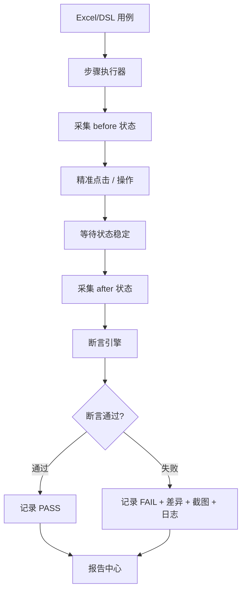

# AutoSmoke 业务状态采集与断言验证详细方案

## 1. 背景

当前 AutoSmoke 已经逐步形成以下能力：

- 自动定位 GameView / GameContent
- Unity 直出完整截图
- Poco / 元数据元素识别
- Unity EventSystem 精准点击
- 阻塞弹窗处理
- 用例步骤执行
- 报告输出

这些能力可以保证：

```text
能找到界面
能找到目标元素
能精准点击
能截图留证
能处理部分阻塞
```

但要实现真正的游戏自动化测试，还必须回答一个问题：

```text
点击之后，游戏逻辑结果是否正确？
```

例如：

- 点击领取奖励后，奖励是否真的到账？
- 点击升级建筑后，等级是否变化？
- 资源是否扣除正确？
- 背包道具数量是否减少？
- 活动进度是否增加？
- 任务是否从可领取变成已领取？
- 商店购买是否扣钻石并发物品？
- 重连后状态是否恢复正确？

这类验证不能只靠截图和点击结果完成，需要新增：

```text
业务状态采集层 + 业务断言层
```

## 2. 总体目标

本方案目标是补齐 AutoSmoke 的业务验证能力。

最终链路：

```text
用例步骤
  -> 点击/操作
    -> 采集 before 状态
      -> 执行动作
        -> 采集 after 状态
          -> 执行业务断言
            -> 输出报告
```

目标能力：

- 自动采集玩家、背包、建筑、任务、活动、场景等业务状态。
- 自动生成 before / after 状态快照。
- 支持 Excel / DSL 中编写业务断言。
- 支持资源增减、状态变化、对象出现/消失等断言。
- 支持业务规则库复用。
- 报告中清晰体现业务是否通过。
- 不修改游戏业务逻辑，只增加 Editor/Test Bridge 层读取能力。

## 3. 核心原则

### 3.1 点击精准不等于业务正确

精准点击只能证明：

```text
操作发给了正确元素
```

不能证明：

```text
游戏逻辑执行正确
```

因此每个关键步骤都要有业务断言。

### 3.2 业务验证优先读取游戏内部状态

验证优先级：

| 优先级 | 验证来源 | 说明 |
|:---:|---|---|
| P0 | Unity / 游戏内部状态导出 | 最准确 |
| P1 | 可测试性元数据 / UI 文本组件 | 准确 |
| P2 | Poco UI 树文本和值 | 可用 |
| P3 | 截图 OCR / 模板 | 兜底 |
| P4 | 人工确认 | 最后兜底 |

截图不应作为主要业务逻辑验证来源。

### 3.3 不修改游戏业务代码

允许：

- 新增 Editor 工具脚本。
- 新增只读状态导出 Bridge。
- 通过反射或已存在管理器读取状态。
- 导出 JSON 快照。

不允许：

- 修改主城、大地图、战斗、背包等业务逻辑。
- 为了测试改变游戏运行流程。
- 将测试逻辑打入正式包。

建议：

```text
所有 Unity 侧代码放入 Assets/AutoSmoke/Editor/
使用 #if UNITY_EDITOR 包裹
```

## 4. 总体架构



## 5. 状态采集范围

### 5.1 玩家基础状态

```json
{
  "player": {
    "uid": "100001",
    "name": "test_user",
    "level": 12,
    "vipLevel": 1,
    "power": 30500,
    "serverId": "dev_01"
  }
}
```

### 5.2 资源状态

```json
{
  "resources": {
    "gold": 168922,
    "food": 10200000,
    "wood": 500000,
    "stone": 300000,
    "diamond": 1000
  }
}
```

### 5.3 背包状态

```json
{
  "bag": {
    "items": [
      {
        "itemId": 1001,
        "name": "高级招募券",
        "count": 3
      },
      {
        "itemId": 2005,
        "name": "加速道具",
        "count": 10
      }
    ]
  }
}
```

### 5.4 建筑状态

```json
{
  "buildings": {
    "Barracks": {
      "id": "Barracks",
      "level": 5,
      "state": "idle",
      "upgradeEndTime": 0
    },
    "TownHall": {
      "id": "TownHall",
      "level": 12,
      "state": "upgrading",
      "upgradeEndTime": 1780000000
    }
  }
}
```

### 5.5 任务状态

```json
{
  "tasks": {
    "mainTaskId": 30102,
    "mainTaskProgress": "4/4",
    "canClaim": true,
    "claimedTasks": [30100, 30101]
  }
}
```

### 5.6 活动状态

```json
{
  "activities": {
    "IslandTrial": {
      "visible": true,
      "redPoint": true,
      "progress": 8,
      "rewardClaimable": true
    }
  }
}
```

### 5.7 场景状态

```json
{
  "scene": {
    "current": "MainCity",
    "cameraZoom": 1.2,
    "loading": false,
    "reconnecting": false
  }
}
```

### 5.8 UI 状态

```json
{
  "ui": {
    "currentPage": "BagPanel",
    "topPanels": ["BagPanel"],
    "popupStack": ["RewardPopup"],
    "guideActive": false
  }
}
```

## 6. Unity 状态导出 Bridge

### 6.1 推荐脚本

```text
Assets/AutoSmoke/Editor/AutoSmokeStateExporter.cs
Assets/AutoSmoke/Editor/AutoSmokeStateQueryBridge.cs
```

### 6.2 输出路径

```text
E:\zdcs\AutoSmoke\runtime\state\latest_state.json
E:\zdcs\AutoSmoke\runtime\state\state_{timestamp}.json
```

### 6.3 状态快照格式

```json
{
  "schemaVersion": 1,
  "timestamp": "2026-06-15T18:30:00.000+08:00",
  "frame": 123456,
  "unity": {
    "version": "2022.3.62f3",
    "projectPath": "E:/project/client",
    "playMode": true
  },
  "state": {
    "player": {},
    "resources": {},
    "bag": {},
    "buildings": {},
    "tasks": {},
    "activities": {},
    "scene": {},
    "ui": {}
  },
  "errors": []
}
```

### 6.4 采集方式

根据项目实际情况，状态采集可分三类：

| 方式 | 说明 | 推荐 |
|---|---|---|
| 调用已有 Manager 只读接口 | 如 PlayerManager、BagManager | 首选 |
| 反射读取字段/属性 | 无公开接口时使用 | 可用 |
| 读取 UI 文本/节点 | 状态无数据接口时兜底 | 兜底 |

### 6.5 采集失败处理

单个模块采集失败不能导致整个状态快照失败。

示例：

```json
{
  "state": {
    "player": {},
    "resources": {},
    "bag": null
  },
  "errors": [
    {
      "module": "bag",
      "error": "BagManager not found"
    }
  ]
}
```

## 7. before / after 快照

每个关键步骤执行前后都采集：

```text
before_state.json
after_state.json
before.png
after.png
unity_log_excerpt.txt
```

目录结构：

```text
screenshots/{case_id}/step_001/
├── before_state.json
├── after_state.json
├── before.png
├── after.png
├── diff.json
└── log_excerpt.txt
```

## 8. 断言 DSL

### 8.1 基础格式

```json
{
  "type": "businessAssert",
  "path": "resources.gold",
  "operator": "increasedBy",
  "value": 1000
}
```

### 8.2 支持的操作符

| 操作符 | 说明 | 示例 |
|---|---|---|
| `equals` | 等于 | `level == 5` |
| `notEquals` | 不等于 | `state != locked` |
| `greaterThan` | 大于 | `gold > 1000` |
| `lessThan` | 小于 | `diamond < 500` |
| `increasedBy` | 增加指定值 | `gold +1000` |
| `decreasedBy` | 减少指定值 | `item.count -1` |
| `increased` | 有增加 | `power increased` |
| `decreased` | 有减少 | `food decreased` |
| `exists` | 存在 | `RewardPopup exists` |
| `notExists` | 不存在 | `Loading not exists` |
| `contains` | 包含 | `claimedTasks contains 30102` |
| `changed` | 有变化 | `scene.current changed` |

### 8.3 路径表达

```text
resources.gold
bag.items[itemId=1001].count
buildings.Barracks.level
tasks.mainTaskProgress
activities.IslandTrial.rewardClaimable
ui.popupStack
scene.current
```

### 8.4 Excel 中的断言写法

| 动作 | 目标 | 操作符 | 期望值 |
|---|---|---|---|
| 断言业务 | `resources.gold` | `increasedBy` | `1000` |
| 断言业务 | `bag.items[itemId=1001].count` | `decreasedBy` | `1` |
| 断言业务 | `buildings.Barracks.level` | `equals` | `6` |
| 断言业务 | `ui.popupStack` | `notContains` | `RewardPopup` |

## 9. 业务规则库

### 9.1 作用

有些业务动作的期望结果固定，可以抽成规则。

例如：

- 使用招募券
- 领取任务奖励
- 升级建筑
- 商店购买
- 邮件领取

### 9.2 规则示例：领取任务奖励

```json
{
  "ruleId": "claim_main_task_reward",
  "name": "领取主线任务奖励",
  "preconditions": [
    {
      "path": "tasks.canClaim",
      "operator": "equals",
      "value": true
    }
  ],
  "action": {
    "type": "click",
    "target": "Task.ClaimButton"
  },
  "assertions": [
    {
      "path": "tasks.canClaim",
      "operator": "equals",
      "value": false
    },
    {
      "path": "resources.gold",
      "operator": "increased"
    }
  ]
}
```

### 9.3 规则示例：使用道具

```json
{
  "ruleId": "use_item",
  "params": {
    "itemId": 1001,
    "count": 1
  },
  "preconditions": [
    {
      "path": "bag.items[itemId=${itemId}].count",
      "operator": "greaterThanOrEqual",
      "value": "${count}"
    }
  ],
  "action": {
    "type": "click",
    "target": "Bag.UseButton"
  },
  "assertions": [
    {
      "path": "bag.items[itemId=${itemId}].count",
      "operator": "decreasedBy",
      "value": "${count}"
    }
  ]
}
```

## 10. 状态 Diff

### 10.1 Diff 输出

```json
{
  "changed": [
    {
      "path": "resources.gold",
      "before": 168922,
      "after": 169922,
      "delta": 1000
    },
    {
      "path": "tasks.canClaim",
      "before": true,
      "after": false
    }
  ],
  "unchanged": [],
  "missing": []
}
```

### 10.2 报告展示

报告中展示：

```text
资源变化：gold +1000
任务状态：canClaim true -> false
背包道具：高级招募券 3 -> 2
```

## 11. 与精准点击的集成

每个业务步骤建议执行：

```text
1. 采集 before_state
2. 点击前 preCheck
3. Unity EventSystem 注入点击
4. 等待状态稳定
5. 采集 after_state
6. 执行业务断言
7. 截图留证
8. 日志检查
```

精准点击证明：

```text
eventReceiver == targetGameObject
```

业务正确证明：

```text
after_state 满足 assertions
```

## 12. 等待状态稳定

点击后不能立即断言，需要等待业务状态稳定。

策略：

| 类型 | 等待方式 |
|---|---|
| 普通 UI 切换 | 等待 1~2 帧 |
| 网络请求 | 等待 loading/reconnecting 消失 |
| 奖励到账 | 轮询资源/背包状态 |
| 建筑升级 | 等待状态变 `upgrading` 或 `level + 1` |
| 场景跳转 | 等待 `scene.current` 变化且 loading=false |

默认轮询：

```text
timeout = 5000ms
interval = 200ms
```

## 13. 报告结构

```json
{
  "stepIndex": 1,
  "action": "click",
  "target": "Task.ClaimButton",
  "click": {
    "method": "unity_event_system",
    "success": true
  },
  "stateSnapshots": {
    "before": "step_001/before_state.json",
    "after": "step_001/after_state.json"
  },
  "stateDiff": {
    "resources.gold": {
      "before": 168922,
      "after": 169922,
      "delta": 1000
    }
  },
  "businessAssertions": [
    {
      "path": "resources.gold",
      "operator": "increasedBy",
      "expected": 1000,
      "actualDelta": 1000,
      "passed": true
    }
  ],
  "result": "PASS"
}
```

## 14. 失败分类

| 错误码 | 含义 |
|---|---|
| `STATE_EXPORT_FAILED` | 状态导出失败 |
| `STATE_PATH_NOT_FOUND` | 断言路径不存在 |
| `ASSERTION_FAILED` | 业务断言失败 |
| `STATE_NOT_STABLE` | 状态未稳定 |
| `PRECONDITION_FAILED` | 前置条件不满足 |
| `RULE_PARAM_MISSING` | 规则参数缺失 |
| `DATA_SOURCE_UNAVAILABLE` | 状态来源不可用 |

## 15. 示例：领取奖励

用例：

```text
点击 Task.ClaimButton
断言 resources.gold increasedBy 1000
断言 tasks.canClaim equals false
```

执行结果：

```text
点击命中：Task.ClaimButton
gold: 168922 -> 169922
canClaim: true -> false
结果：PASS
```

## 16. 示例：升级建筑

用例：

```text
点击 Building.Barracks.UpgradeButton
断言 resources.wood decreasedBy 5000
断言 buildings.Barracks.state equals upgrading
```

如果是秒升：

```text
断言 buildings.Barracks.level increasedBy 1
```

如果是进入升级中：

```text
断言 buildings.Barracks.state equals upgrading
```

## 17. 需要服务端 / GM 支持的场景

有些逻辑仅靠客户端状态不够：

- 充值到账
- 活动刷新
- 邮件发放
- 战斗结算
- 排行榜
- 跨服数据
- 时间推进

建议增加 GM / 服务端测试接口：

```text
设置资源
发放道具
完成任务
推进时间
清空背包
重置建筑
触发邮件
```

如果暂时没有服务端接口，可以先通过客户端只读状态验证 UI 和本地表现。

## 18. 验收标准

### 18.1 状态采集

| 编号 | 场景 | 通过标准 |
|---|---|---|
| BS-001 | 主城状态 | 能导出 player/resources/buildings/tasks |
| BS-002 | 背包界面 | 能导出 bag.items |
| BS-003 | 弹窗状态 | 能导出 ui.popupStack |
| BS-004 | 大地图 | 能导出 scene/current/cameraZoom |

### 18.2 业务断言

| 编号 | 场景 | 通过标准 |
|---|---|---|
| BA-001 | 资源增加 | increasedBy 校验准确 |
| BA-002 | 资源扣除 | decreasedBy 校验准确 |
| BA-003 | 状态变化 | equals/changed 校验准确 |
| BA-004 | 列表对象 | bag item 查询准确 |
| BA-005 | 断言失败 | 报告显示 expected/actual |

### 18.3 报告

报告必须展示：

- before / after 状态快照。
- 状态 diff。
- 每条断言 expected / actual。
- 失败原因。
- 截图和日志。

## 19. 分阶段实施

### 阶段一：状态导出原型

目标：

```text
导出 player/resources/ui/scene 基础状态。
```

### 阶段二：断言引擎

目标：

```text
支持 equals/increasedBy/decreasedBy/exists 等基础断言。
```

### 阶段三：Excel 接入

目标：

```text
Excel 用例可以写业务断言。
```

### 阶段四：业务规则库

目标：

```text
常见业务动作可复用规则。
```

### 阶段五：报告增强

目标：

```text
报告展示状态 diff 和业务断言结果。
```

## 20. 最终建议

AutoSmoke 最终应形成三条主线：

```text
精准操作：Unity EventSystem 注入点击
完整留证：Unity 直出 GameContent PNG
业务验证：Unity 状态导出 + 断言引擎
```

只有三者结合，才能从“能自动点”升级为：

```text
能自动验证游戏逻辑是否正确
```

