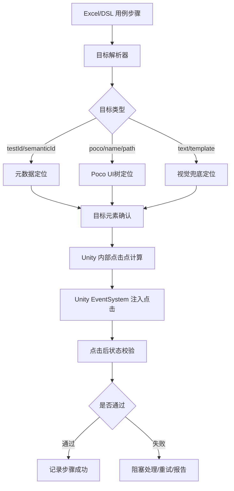

# AutoSmoke 自动点击绝对精准执行方案

## 1. 目标

本方案以：

```text
自动点击绝对精准
```

为第一目标。

这里的“精准”不是指截图像素裁剪足够准，而是指：

```text
测试步骤中声明要点击哪个游戏元素，
执行时就必须点击到 Unity 内部对应的真实元素，
不受 GameView 窗口位置、分辨率、缩放、DPI、多显示器、截图裁剪误差影响。
```

因此，最终点击链路不应依赖：

- Python 截图像素坐标
- Windows 屏幕坐标
- 鼠标真实点击
- GameView 工具栏高度
- GameView Scale
- 图片黑边识别

最终点击链路应优先依赖：

- Unity UI 元素自身信息
- Poco UI 树坐标
- RectTransform 世界坐标 / 屏幕坐标
- 元数据 testId / semanticId
- Unity EventSystem 注入点击

截图只承担：

- 报告记录
- 失败留痕
- OCR / 模板匹配兜底
- 人工核对
- 页面状态辅助识别

## 2. 核心结论

### 2.1 点击准确性的根本保障

要保证点击绝对精准，必须让点击目标来自 Unity 内部，而不是来自截图。

推荐主链路：

```text
用例步骤
  -> semanticId / testId
    -> Unity/Poco 查询真实元素
      -> 获取元素 RectTransform / bounds
        -> 计算元素中心点或安全点击点
          -> Unity EventSystem 注入点击
            -> 点击后状态校验
```

不推荐主链路：

```text
截图识别按钮
  -> 图片坐标
    -> 换算屏幕坐标
      -> Windows 鼠标点击
```

该链路会受以下因素影响：

- GameView 被拉伸
- 截图不完整
- DPI 缩放
- 多显示器偏移
- Unity GameView Scale
- 工具栏高度
- 截图与点击时画面不一致

### 2.2 推荐优先级

| 优先级 | 点击方式 | 精准度 | 用途 |
|---|---|---|---|
| P0 | Unity EventSystem 注入点击 + testId | 最高 | 主方案 |
| P1 | Poco 节点坐标 + Unity 注入点击 | 高 | 现阶段主方案 |
| P2 | 可测试性元数据 bounds + Unity 注入点击 | 高 | 长期增强 |
| P3 | Poco 坐标 + Windows 鼠标点击 | 中 | 兜底 |
| P4 | 图像识别坐标 + Windows 鼠标点击 | 低 | 最后兜底 |

## 3. 总体架构



## 4. 用例目标表达

### 4.1 推荐用例格式

用例中不建议写：

```text
点击坐标(230, 580)
```

而应写：

```text
点击 背包.使用按钮
点击 弹窗.确定按钮
点击 建筑.兵营.升级按钮
点击 活动入口.孤岛试炼
```

底层转换为：

```json
{
  "action": "click",
  "target": {
    "type": "semantic",
    "value": "bag.use_button"
  }
}
```

或：

```json
{
  "action": "click",
  "target": {
    "type": "testId",
    "value": "Bag.UseButton"
  }
}
```

### 4.2 支持的目标类型

| 类型 | 示例 | 优先级 |
|---|---|---|
| `testId` | `Bag.UseButton` | P0 |
| `semantic` | `背包.使用按钮` | P0 |
| `pocoPath` | `Root/Panel/ButtonUse` | P1 |
| `pocoName` | `ButtonUse` | P1 |
| `role` | `primary_confirm_button` | P2 |
| `text` | `确定` | P3 |
| `template` | `confirm_button.png` | P4 |
| `coordinate` | `content(500,2200)` | P5 |

## 5. 元素定位主方案

### 5.1 testId / semanticId

长期最稳定方式是每个可点击目标有稳定 ID：

```json
{
  "testId": "Bag.UseButton",
  "semanticId": "背包.使用按钮",
  "pageId": "BagPanel",
  "role": "primary_action",
  "clickable": true
}
```

自动化执行时：

```text
用例目标 -> testId -> Unity 元素 -> RectTransform -> 点击
```

优势：

- 不依赖节点名称混乱。
- 不依赖 OCR。
- 不依赖截图。
- 不受分辨率影响。

### 5.2 Poco UI 树定位

在现阶段，Poco 是主要可用来源。

但你已经发现：

```text
clickable 大量 False
type 大量 Node
命名混乱
```

因此不能只依赖 Poco 原始属性，需要增加语义映射层。

定位流程：

```text
目标 semanticId
  -> element_mapping.json
    -> Poco path / name / regex / parent path
      -> Poco 查询节点
        -> 获取 bounds / pos / size
```

示例：

```json
{
  "Bag.UseButton": {
    "semanticId": "背包.使用按钮",
    "pageId": "BagPanel",
    "locator": {
      "type": "pocoPath",
      "value": "DeepUI/DialogUI/BagPanel/ButtonUse"
    },
    "click": {
      "safePoint": "center"
    }
  }
}
```

### 5.3 自动生成初版映射

可以先自动扫描 UI 树生成草稿：

```text
Poco UI tree
  -> 节点名 / 文本 / 父子关系 / 坐标
    -> 自动推断 semanticId
      -> 生成 element_mapping_draft.json
        -> 人工确认
```

草稿字段：

```json
{
  "candidateId": "auto_001",
  "suggestedSemanticId": "背包.使用按钮",
  "pocoPath": "DeepUI/DialogUI/BagPanel/ButtonUse",
  "screenRect": [465, 730, 570, 798],
  "confidence": 0.82,
  "reviewStatus": "pending"
}
```

人工确认后进入正式映射：

```json
{
  "Bag.UseButton": {
    "reviewStatus": "confirmed"
  }
}
```

## 6. 点击执行主方案：Unity EventSystem 注入点击

### 6.1 为什么不用真实鼠标

真实鼠标点击依赖：

```text
屏幕坐标 = GameContent 屏幕坐标 + 目标归一化坐标 * GameContent 显示尺寸
```

该方式会受到：

- GameView 位置
- GameView 缩放
- DPI
- 多显示器
- 窗口遮挡
- 工具栏
- 裁剪误差

因此只能作为兜底。

主方案应使用 Unity 内部事件注入。

### 6.2 Unity 注入点击原理

Unity UI 点击本质上通过 EventSystem 派发：

```csharp
PointerDown
PointerUp
PointerClick
```

对于目标 GameObject，可以直接执行：

```csharp
ExecuteEvents.Execute(gameObject, pointerData, ExecuteEvents.pointerDownHandler);
ExecuteEvents.Execute(gameObject, pointerData, ExecuteEvents.pointerUpHandler);
ExecuteEvents.Execute(gameObject, pointerData, ExecuteEvents.pointerClickHandler);
```

这样点击直接作用于目标元素，不经过 Windows 鼠标。

### 6.3 点击请求协议

IDE 向 Unity Bridge 发送：

```json
{
  "requestId": "click_20260615_180000",
  "action": "click",
  "target": {
    "type": "testId",
    "value": "Bag.UseButton"
  },
  "options": {
    "safePoint": "center",
    "timeoutMs": 3000,
    "retry": 1,
    "waitAfterMs": 300
  }
}
```

Unity 返回：

```json
{
  "requestId": "click_20260615_180000",
  "success": true,
  "target": {
    "testId": "Bag.UseButton",
    "gameObjectPath": "DeepUI/DialogUI/BagPanel/ButtonUse",
    "activeInHierarchy": true,
    "interactable": true,
    "visible": true
  },
  "click": {
    "method": "event_system",
    "safePoint": "center",
    "screenPoint": [585, 2230],
    "normalizedPoint": [0.5, 0.5]
  },
  "stateAfter": {
    "frame": 123456,
    "time": 123.45
  }
}
```

### 6.4 Unity 点击执行步骤

```text
1. 接收点击请求
2. 根据 testId / semanticId / PocoPath 查找目标 GameObject
3. 校验目标 activeInHierarchy
4. 校验目标可见
5. 校验目标可交互
6. 计算安全点击点
7. 构造 PointerEventData
8. 派发 pointerDown
9. 派发 pointerUp
10. 派发 pointerClick
11. 等待 1~2 帧
12. 返回结果
```

## 7. 安全点击点计算

### 7.1 为什么不能永远点中心

有些 UI 元素中心可能被遮挡或不可点：

- 按钮文字区域不响应
- 按钮图标区域响应
- 道具卡片角标遮挡
- 建筑按钮扇形菜单
- 弹窗外空白关闭区
- 引导手指遮罩只允许点高亮区域

因此需要 `safePoint` 策略。

### 7.2 safePoint 类型

| 类型 | 说明 |
|---|---|
| `center` | 元素中心 |
| `visibleCenter` | 可见区域中心 |
| `innerCenter` | 向内收缩后的中心 |
| `anchor` | 指定锚点，例如 bottomRight |
| `relative` | 相对元素比例坐标 |
| `maskHoleCenter` | 引导遮罩洞中心 |
| `outsideModalBlank` | 弹窗外安全空白区域 |

### 7.3 元素内缩点击

为了避免点到边框或邻近元素，默认安全点建议：

```text
innerRect = rect shrink 15%
clickPoint = innerRect.center
```

如果元素很小：

```text
最小内缩 = 2px
最大内缩 = 10px
```

## 8. 点击前校验

点击前必须确认：

| 校验项 | 说明 |
|---|---|
| 元素存在 | 能找到目标 |
| 元素激活 | `activeInHierarchy = true` |
| 元素可见 | CanvasGroup / alpha / scale / rect 有效 |
| 元素未被遮挡 | 上层没有阻塞弹窗 |
| 元素可交互 | Button.interactable 或自定义可点规则 |
| 当前页面正确 | pageId / stateId 匹配 |
| 坐标合法 | 安全点在元素 rect 内 |

如果校验失败：

```text
不点击
返回明确失败原因
```

示例：

```json
{
  "success": false,
  "errorCode": "TARGET_OCCLUDED",
  "message": "目标 Bag.UseButton 被 RewardPopup 遮挡"
}
```

## 9. 点击后校验

点击不是发出去就算成功，必须验证结果。

### 9.1 校验方式

| 类型 | 示例 |
|---|---|
| 页面变化 | 点击背包后出现 BagPanel |
| 弹窗出现 | 点击领取后出现 RewardPopup |
| 元素消失 | 点击关闭后弹窗消失 |
| 数值变化 | 资源数量增加 |
| 状态变化 | 按钮变灰 / 任务完成 |
| 日志事件 | Unity 输出 click handled |
| 截图变化 | 视觉兜底 |

### 9.2 用例中的期望

```json
{
  "action": "click",
  "target": "Bag.UseButton",
  "expect": {
    "type": "elementVisible",
    "target": "RewardPopup.ConfirmButton",
    "timeoutMs": 3000
  }
}
```

### 9.3 无明确期望时

如果用例没有写期望，系统默认校验：

```text
点击事件被目标接收
当前没有崩溃
当前没有卡死
没有 MissingReferenceException
没有出现阻塞弹窗无法处理
```

## 10. 阻塞界面处理

自动点击过程中，可能出现：

- 奖励领取弹窗
- 获取更多弹窗
- 通用确认弹窗
- 网络重连中
- 引导遮罩
- Loading
- 建筑功能菜单

处理原则：

```text
每次点击前后都执行 blocker detection。
如果 blocker 存在，先处理 blocker，再继续原步骤。
```

示例：

```text
目标：点击 背包.使用按钮
实际：出现 奖励领取弹窗
处理：点击 RewardPopup.ConfirmButton
之后：继续判断原步骤是否完成
```

## 11. 场景类点击

主城 / 大地图中很多目标不是普通 UI Button，例如：

- 建筑
- 岛屿
- 资源点
- 怪物
- 船
- NPC
- 引导目标

这类目标不建议用截图坐标点击，而应走 Unity 对象定位。

### 11.1 场景对象定位

Unity Bridge 需要支持：

```json
{
  "target": {
    "type": "sceneObject",
    "value": "Building.Barracks"
  }
}
```

定位方式：

- testId 组件
- GameObject path
- prefab name
- tag/layer
- 自定义 metadata
- world position

### 11.2 场景对象点击

方式一：调用对象点击逻辑

```text
直接调用对象绑定的点击处理接口
```

方式二：EventSystem / Physics Raycast

```text
Camera.WorldToScreenPoint(worldCenter)
构造 PointerEventData
执行 Raycast
点击 raycast 命中的对象
```

方式三：真实鼠标点击兜底

```text
world -> screen -> GameView screen -> Windows mouse
```

## 12. 鼠标点击兜底方案

真实鼠标点击只作为兜底。

使用条件：

```text
Unity 注入点击不可用
目标不是 Unity UI
必须验证真实鼠标路径
```

兜底时必须使用 Unity Bridge 提供的：

```text
gameContentRectOnScreen
```

而不是 Python 猜测的截图区域。

映射：

```text
screenX = gameContentRectOnScreen.x + normalizedX * gameContentRectOnScreen.width
screenY = gameContentRectOnScreen.y + normalizedY * gameContentRectOnScreen.height
```

## 13. 截图在精准点击体系中的角色

截图不是点击精度来源。

截图用途：

- 点击前留图
- 点击后留图
- 失败报告
- OCR 兜底
- 模板匹配兜底
- 页面关系图可视化

截图要求：

```text
完整包含游戏界面即可
```

不要求：

```text
作为像素级点击基准
```

推荐截图来源：

```text
Unity 直接输出完整 GameContent PNG
```

## 14. 报告体现

每一步点击报告必须记录：

```json
{
  "stepIndex": 3,
  "action": "click",
  "target": "Bag.UseButton",
  "locator": {
    "source": "testId",
    "value": "Bag.UseButton",
    "confidence": 1.0
  },
  "click": {
    "method": "unity_event_system",
    "safePoint": "center",
    "success": true
  },
  "preCheck": {
    "exists": true,
    "visible": true,
    "interactable": true,
    "occluded": false
  },
  "postCheck": {
    "type": "elementVisible",
    "target": "RewardPopup.ConfirmButton",
    "success": true
  },
  "screenshots": {
    "before": "...",
    "after": "..."
  }
}
```

如果失败，报告必须体现：

- 找不到元素
- 元素不可见
- 元素被遮挡
- 元素不可交互
- 点击事件未被接收
- 点击后期望未达成
- 出现阻塞弹窗
- 出现崩溃 / 卡死 / MissingReference

## 15. 验收标准

### 15.1 UI 按钮点击验收

| 编号 | 场景 | 通过标准 |
|---|---|---|
| AC-001 | 点击背包使用按钮 | 事件由正确按钮接收 |
| AC-002 | 点击弹窗确定 | 弹窗关闭或进入预期状态 |
| AC-003 | 点击奖励确认 | 奖励弹窗关闭 |
| AC-004 | 点击右侧活动入口 | 打开对应活动面板 |
| AC-005 | 点击底部功能按钮 | 打开对应功能 |

### 15.2 环境变化验收

在以下情况下点击结果必须一致：

- GameView 横向拉伸
- GameView 纵向拉伸
- GameView Scale 改变
- 分辨率从 `1170x2532` 切换到其它竖屏分辨率
- Windows DPI 改变
- Unity Editor 移动到另一显示器

通过标准：

```text
P0/P1 点击不受上述变化影响。
```

### 15.3 精准性验收

每次点击必须证明：

```text
点击目标 GameObject == 用例声明目标 GameObject
```

报告中必须有：

```text
targetGameObjectPath
targetTestId
eventReceiver
clickMethod
```

如果 `eventReceiver != targetGameObject`，需要判定失败或记录为风险。

## 16. 分阶段实施

### 阶段一：Unity 点击 Bridge

目标：

```text
IDE 能发送 testId 点击请求，Unity 能执行 EventSystem 点击。
```

输出：

- click_request.json
- click_result.json
- Unity Editor 菜单
- 基础点击报告

### 阶段二：Poco / UI 树目标绑定

目标：

```text
支持 semanticId -> Poco 节点 -> Unity 点击。
```

输出：

- element_mapping.json
- 自动草稿映射
- 人工确认界面

### 阶段三：点击前后校验

目标：

```text
每一步点击都有可解释的通过/失败结果。
```

输出：

- preCheck
- postCheck
- blocker handling
- failure reason

### 阶段四：场景对象点击

目标：

```text
支持主城 / 大地图建筑、资源点、引导目标点击。
```

输出：

- sceneObject metadata
- world position click
- raycast click

### 阶段五：IDE 完整封装

目标：

```text
所有点击能力封装到 AutoSmoke IDE。
```

输出：

- 用例执行面板
- 元素映射面板
- 点击结果报告
- 失败截图
- 重试 / 阻塞处理

## 17. 最终推荐

最终架构应为：

```text
点击精准性：
  Unity EventSystem 注入点击 + testId / semanticId / Poco

截图完整性：
  Unity 直接输出完整 GameContent PNG

兜底：
  gameContentRectOnScreen + 鼠标点击
```

不要把截图像素坐标作为主点击依据。

真正的点击精准来自：

```text
目标元素身份准确
点击事件注入准确
点击前校验准确
点击后结果校验准确
```

